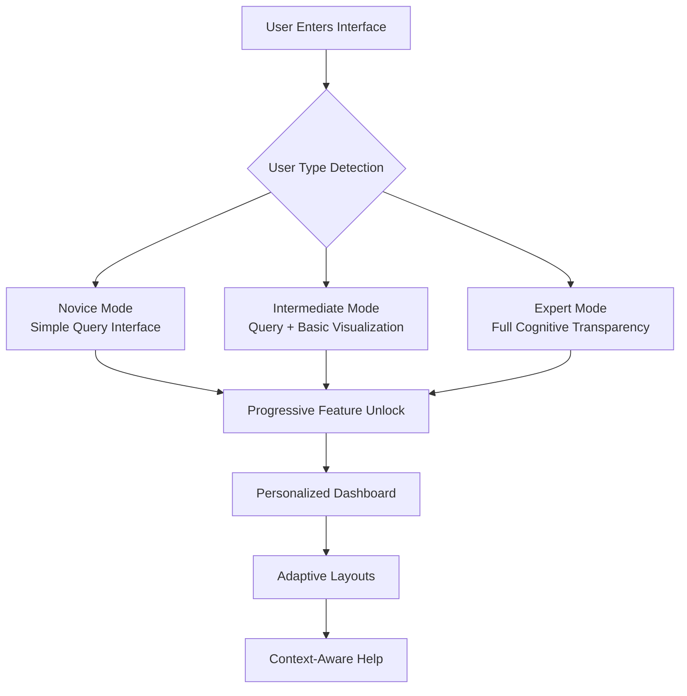
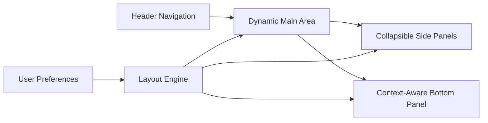
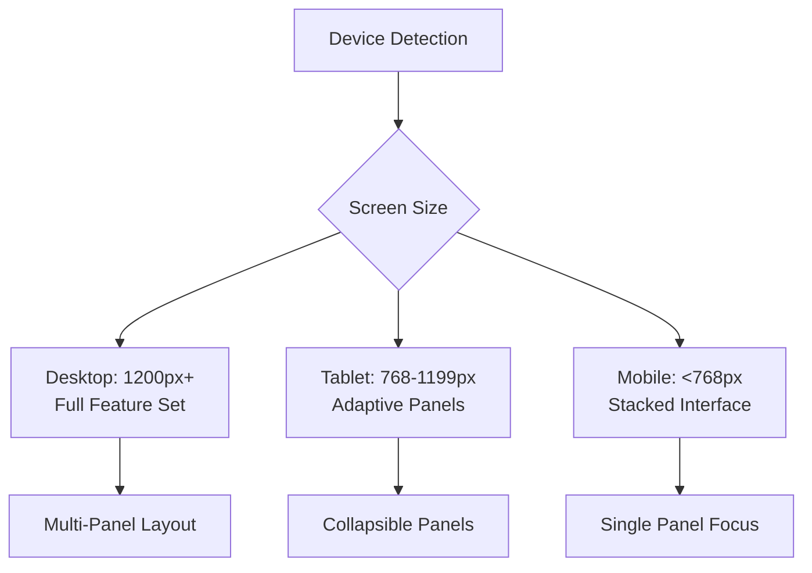
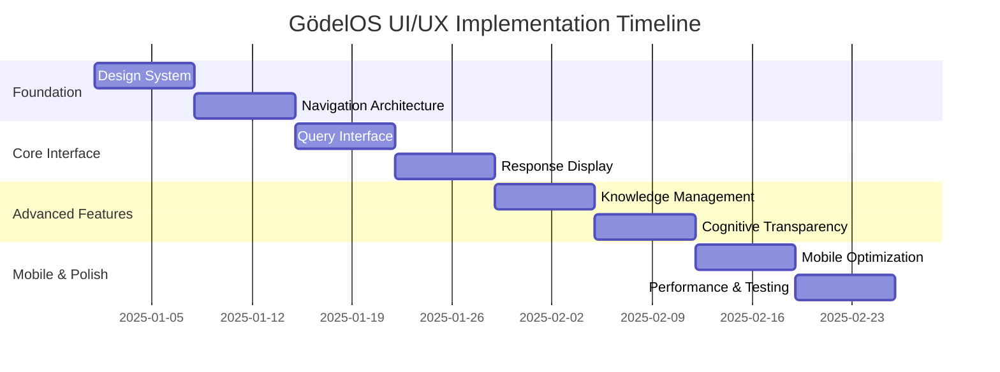

# GödelOS UI/UX Overhaul - Comprehensive Design Plan

## Executive Summary

This document outlines a complete UI/UX redesign for the GödelOS web interface, addressing critical usability issues while preserving the system's powerful cognitive architecture capabilities. The design emphasizes adaptive interface complexity, full responsive design, and accessibility improvements to serve both technical and non-technical users effectively.

## Current State Analysis

### Existing Strengths
- Rich functionality with query processing, knowledge management, and cognitive transparency
- Real-time WebSocket streaming for live cognitive updates
- Comprehensive visualization capabilities using D3.js knowledge graphs
- Well-structured FastAPI backend with robust API endpoints
- Educational onboarding system with guided tutorials

### Identified UX Problems
1. **Information Overload**: All panels (Query, Knowledge Graph, Cognitive Layers, Response) displayed simultaneously
2. **Poor Progressive Disclosure**: No complexity levels for different user types
3. **Limited Mobile Support**: Fixed grid layout not responsive to different screen sizes
4. **Steep Learning Curve**: Complex interface with no guided workflows for new users
5. **Performance Issues**: Heavy real-time updates without optimization causing lag
6. **No Personalization**: Static interface with no user preferences or customization
7. **Accessibility Gaps**: Limited support for screen readers and keyboard navigation

## Design Philosophy & Approach

### Core Principles

**Adaptive Interface Complexity**: Create a system that automatically adjusts complexity based on user experience level and preferences, supporting both novice and expert users seamlessly.

**Progressive Disclosure**: Layer functionality so users can start with simple interactions and gradually access more advanced features as needed.

**Mobile-First Responsive**: Design for all devices with adaptive feature sets that maintain core functionality across screen sizes.

**Accessibility-First**: Ensure WCAG 2.1 AA compliance from the ground up, not as an afterthought.

### User Flow Architecture



## Detailed Design Specifications

### 1. Interface Architecture & Navigation

#### Adaptive Layout System


#### Navigation Hierarchy
- **Primary Navigation**: Query, Explore, Learn, Manage
- **Secondary Navigation**: Context-sensitive based on current mode
- **Tertiary Navigation**: Advanced features and settings

#### Header Components
- Adaptive branding and title
- User profile and preferences
- Global search functionality
- Connection status indicators
- Help and documentation access

### 2. Progressive Disclosure System

#### Three Complexity Levels

**Level 1 - Simplified Mode (Default for new users)**
- Single query input with smart suggestions
- Simple response display with basic formatting
- Minimal knowledge visualization (simple concept maps)
- Guided tutorials and contextual help
- Essential features only

**Level 2 - Intermediate Mode**
- Query interface with type selection and parameters
- Interactive knowledge graph visualization
- Basic cognitive transparency (simplified layer view)
- Response analysis tools and export options
- Moderate feature set with guided discovery

**Level 3 - Expert Mode**
- Full cognitive architecture display with real-time monitoring
- Advanced query parameters and customization
- Complete cognitive transparency with all layers
- Professional analysis and debugging tools
- All features accessible with minimal guidance

#### Complexity Transition System
- Automatic progression based on usage patterns
- Manual level selection in user preferences
- Contextual prompts for feature discovery
- Reversible transitions with preference memory

### 3. Responsive Design Framework

#### Device-Specific Adaptations



**Desktop (1200px+)**
- Multi-panel layout with resizable sections
- Full cognitive transparency display
- Advanced visualizations with zoom and pan
- Complete feature access with keyboard shortcuts
- Multiple concurrent operations support

**Tablet (768-1199px)**
- Collapsible side panels with touch optimization
- Simplified but functional visualizations
- Touch-friendly controls and gestures
- Core functionality maintained with adaptive UI
- Landscape/portrait orientation support

**Mobile (<768px)**
- Single-panel focus with bottom navigation
- Swipe gestures for panel switching
- Voice input support for queries
- Essential features with progressive disclosure
- Optimized for thumb navigation

#### Interaction Patterns
- Touch-first design with mouse/keyboard fallbacks
- Gesture-based navigation where appropriate
- Voice input integration for accessibility
- Haptic feedback on supported devices

### 4. Component Design System

#### Design Tokens

```css
/* Color Palette */
:root {
  /* Primary Colors */
  --primary-gradient: linear-gradient(135deg, #667eea 0%, #764ba2 100%);
  --secondary-gradient: linear-gradient(135deg, #f093fb 0%, #f5576c 100%);
  
  /* Neutral Colors */
  --neutral-dark: #1a1d29;
  --neutral-medium: #2d3142;
  --neutral-light: #4f5d75;
  --neutral-lighter: #8892b0;
  --neutral-lightest: #ccd6f6;
  
  /* Accent Colors */
  --accent-blue: #4facfe;
  --accent-purple: #764ba2;
  --accent-cyan: #00f2fe;
  
  /* Semantic Colors */
  --success: #2ed573;
  --warning: #ffa502;
  --error: #ff4757;
  --info: #3742fa;
  
  /* Typography */
  --font-primary: 'Inter', -apple-system, BlinkMacSystemFont, sans-serif;
  --font-mono: 'JetBrains Mono', 'Fira Code', monospace;
  --font-display: 'Cal Sans', 'Inter', sans-serif;
  
  /* Font Sizes */
  --text-xs: 0.75rem;
  --text-sm: 0.875rem;
  --text-base: 1rem;
  --text-lg: 1.125rem;
  --text-xl: 1.25rem;
  --text-2xl: 1.5rem;
  --text-3xl: 1.875rem;
  --text-4xl: 2.25rem;
  
  /* Spacing Scale */
  --space-xs: 0.25rem;
  --space-sm: 0.5rem;
  --space-md: 1rem;
  --space-lg: 1.5rem;
  --space-xl: 2rem;
  --space-2xl: 3rem;
  --space-3xl: 4rem;
  
  /* Border Radius */
  --radius-sm: 0.375rem;
  --radius-md: 0.5rem;
  --radius-lg: 0.75rem;
  --radius-xl: 1rem;
  --radius-2xl: 1.5rem;
  
  /* Shadows */
  --shadow-sm: 0 1px 2px 0 rgba(0, 0, 0, 0.05);
  --shadow-md: 0 4px 6px -1px rgba(0, 0, 0, 0.1);
  --shadow-lg: 0 10px 15px -3px rgba(0, 0, 0, 0.1);
  --shadow-xl: 0 20px 25px -5px rgba(0, 0, 0, 0.1);
  
  /* Z-Index Scale */
  --z-dropdown: 1000;
  --z-sticky: 1020;
  --z-fixed: 1030;
  --z-modal: 1040;
  --z-popover: 1050;
  --z-tooltip: 1060;
}
```

#### Key Component Specifications

**1. Adaptive Query Interface**
- Smart input with auto-suggestions and query completion
- Contextual help and example queries
- Voice input support with speech-to-text
- Query history and favorites management
- Real-time validation and error prevention

**2. Dynamic Visualization Container**
- Responsive knowledge graphs with adaptive complexity
- Interactive cognitive layer displays with smooth animations
- Performance-optimized rendering using Canvas/WebGL
- Accessibility-compliant interactions with keyboard navigation
- Export capabilities for visualizations

**3. Progressive Response Display**
- Tabbed interface for different detail levels
- Expandable sections with smooth transitions
- Export and sharing capabilities
- Citation and source tracking
- Copy-to-clipboard functionality

**4. Cognitive Transparency Panel**
- Real-time cognitive layer monitoring
- Interactive reasoning trace visualization
- Performance metrics dashboard
- Educational explanations for cognitive processes
- Customizable detail levels

### 5. Accessibility Improvements

#### WCAG 2.1 AA Compliance Features

**Visual Accessibility**
- High contrast color schemes (4.5:1 minimum ratio)
- Scalable text up to 200% without horizontal scrolling
- Focus indicators with 3px minimum thickness
- Color-blind friendly palette with pattern/texture alternatives
- Reduced motion preferences support

**Motor Accessibility**
- Keyboard navigation for all interactive elements
- Large touch targets (44px minimum on mobile)
- Customizable keyboard shortcuts
- Voice control integration
- Switch navigation support

**Cognitive Accessibility**
- Clear, consistent navigation patterns
- Progressive disclosure to reduce cognitive load
- Plain language explanations for complex concepts
- Error prevention and clear error messages
- Undo/redo functionality for critical actions

#### Assistive Technology Support
- Comprehensive ARIA labels and descriptions
- Semantic HTML structure with proper heading hierarchy
- Skip navigation links for efficient browsing
- Screen reader optimized content structure
- Alternative text for all visualizations and images

#### Testing Strategy
- Automated accessibility testing with axe-core
- Manual testing with screen readers (NVDA, JAWS, VoiceOver)
- Keyboard-only navigation testing
- Color contrast validation
- User testing with disability community

### 6. User Personalization System

#### Preference Categories

**Interface Preferences**
- Complexity level (Novice/Intermediate/Expert)
- Theme selection (Dark/Light/Auto/High Contrast)
- Layout preferences (Panel arrangement, sizes)
- Animation preferences (Full/Reduced/None)
- Density settings (Compact/Comfortable/Spacious)

**Functional Preferences**
- Default query types and parameters
- Visualization preferences and complexity
- Notification settings and frequency
- Auto-save and backup preferences
- Privacy and data sharing settings

**Accessibility Preferences**
- Screen reader optimizations
- Keyboard navigation customization
- Voice control settings
- Motor accessibility adaptations
- Cognitive load preferences

#### Data Management
- Local storage for immediate preferences
- Optional cloud sync for cross-device consistency
- Export/import settings for backup
- Privacy-focused approach with minimal data collection
- GDPR compliance for European users

### 7. Performance Optimization

#### Real-time Update Strategy
- Debounced WebSocket messages to prevent flooding
- Selective component updates using React optimization
- Virtual scrolling for large datasets
- Progressive loading for complex visualizations
- Intelligent caching with cache invalidation

#### Loading and Rendering Optimization
- Code splitting for reduced initial bundle size
- Lazy loading of non-critical components
- Service worker for offline capability
- Image optimization and WebP support
- Critical CSS inlining for faster first paint

#### Memory Management
- Proper cleanup of event listeners and subscriptions
- Efficient data structures for large knowledge graphs
- Memory leak prevention in long-running sessions
- Garbage collection optimization
- Resource monitoring and alerting

### 8. Error Handling & Feedback

#### User-Friendly Error Management
- Contextual error explanations in plain language
- Suggested solutions and recovery actions
- Progressive error recovery with fallback options
- Graceful degradation when features are unavailable
- Error reporting with user consent

#### Feedback Mechanisms
- Loading states with progress indicators and time estimates
- Success confirmations with clear next steps
- Real-time validation with helpful hints
- Contextual help tooltips and guided tours
- User feedback collection for continuous improvement

#### Offline Capability
- Core functionality available offline
- Intelligent sync when connection is restored
- Clear offline status indicators
- Cached query results and responses
- Progressive Web App features

## Implementation Roadmap

### Phase 1: Foundation (Weeks 1-2)

**Week 1: Design System Setup**
- Create comprehensive design tokens and CSS variables
- Build component library foundation with Storybook
- Implement responsive grid system with CSS Grid/Flexbox
- Set up accessibility framework and testing tools
- Establish development workflow and tooling

**Week 2: Navigation Architecture**
- Redesign header navigation with adaptive complexity
- Implement progressive disclosure logic and state management
- Create user preference system with local storage
- Build adaptive layout engine with responsive breakpoints
- Develop routing system for different interface modes

### Phase 2: Core Interface (Weeks 3-4)

**Week 3: Query Interface Redesign**
- Simplified input with smart suggestions and autocomplete
- Implement adaptive complexity levels with smooth transitions
- Integrate voice input with speech-to-text API
- Optimize for mobile interactions with touch-friendly controls
- Add query history and favorites functionality

**Week 4: Response Display Overhaul**
- Progressive disclosure for responses with expandable sections
- Improve visualization performance with Canvas/WebGL
- Enhance accessibility features with ARIA and keyboard navigation
- Add export and sharing capabilities
- Implement citation and source tracking

### Phase 3: Advanced Features (Weeks 5-6)

**Week 5: Knowledge Management**
- Streamlined ingestion interface with drag-and-drop
- Visual knowledge organization with interactive graphs
- Enhanced search and filtering with faceted search
- Batch processing optimization with progress tracking
- Mobile-optimized knowledge browsing

**Week 6: Cognitive Transparency**
- Simplified cognitive layer display with educational explanations
- Interactive reasoning traces with step-by-step visualization
- Performance monitoring dashboard with real-time metrics
- Educational content for cognitive science concepts
- Customizable transparency levels

### Phase 4: Mobile & Polish (Weeks 7-8)

**Week 7: Mobile Optimization**
- Touch-friendly interactions with gesture support
- Gesture-based navigation with swipe controls
- Progressive Web App features (offline, install prompt)
- Voice interface optimization for mobile
- Performance optimization for mobile devices

**Week 8: Performance & Testing**
- Load time optimization with code splitting and lazy loading
- Comprehensive accessibility testing with real users
- Cross-browser compatibility testing and fixes
- User acceptance testing with target personas
- Performance monitoring and optimization

### Implementation Timeline



## Success Metrics & KPIs

### User Experience Metrics
- **Time to First Successful Query**: Target <30 seconds for new users
- **User Retention After First Session**: Target >60% return rate
- **Feature Discovery Rate**: Target >40% find advanced features within 5 sessions
- **Mobile Usage Satisfaction**: Target >4.0/5.0 rating
- **Task Completion Rate**: Target >85% for core workflows

### Performance Metrics
- **Page Load Time**: Target <2 seconds for initial load
- **Time to Interactive**: Target <3 seconds for full interactivity
- **Real-time Update Latency**: Target <100ms for cognitive updates
- **Memory Usage**: Target <200MB for extended sessions
- **Bundle Size**: Target <500KB initial, <2MB total

### Accessibility Metrics
- **WCAG 2.1 AA Compliance**: Target 100% automated test pass rate
- **Screen Reader Compatibility**: Target full functionality with major screen readers
- **Keyboard Navigation Coverage**: Target 100% of features accessible via keyboard
- **Color Contrast Ratios**: Target >4.5:1 for normal text, >3:1 for large text
- **User Testing with Disabilities**: Target >4.0/5.0 satisfaction score

### Business Impact Metrics
- **User Engagement**: Increased session duration and feature usage
- **Educational Effectiveness**: Improved learning outcomes for cognitive science concepts
- **Research Productivity**: Faster query-to-insight time for researchers
- **Platform Adoption**: Increased user base across different demographics
- **Support Ticket Reduction**: Decreased confusion-related support requests

## Technical Architecture

### Frontend Technology Stack
- **Framework**: React 18 with TypeScript for type safety
- **Styling**: Tailwind CSS with custom design system
- **State Management**: Zustand for lightweight state management
- **Visualization**: D3.js with Canvas/WebGL for performance
- **Accessibility**: React Aria for accessible components
- **Testing**: Jest, React Testing Library, and Playwright for E2E

### Performance Optimizations
- **Code Splitting**: Route-based and component-based splitting
- **Bundle Analysis**: Webpack Bundle Analyzer for optimization
- **Caching Strategy**: Service Worker with intelligent cache invalidation
- **Image Optimization**: WebP format with fallbacks
- **Critical Path**: Inline critical CSS and preload key resources

### Monitoring & Analytics
- **Performance Monitoring**: Web Vitals tracking and reporting
- **Error Tracking**: Comprehensive error logging and alerting
- **User Analytics**: Privacy-focused usage analytics
- **A/B Testing**: Feature flag system for gradual rollouts
- **Accessibility Monitoring**: Continuous accessibility testing

## Risk Assessment & Mitigation

### Technical Risks
- **Performance Degradation**: Mitigate with progressive enhancement and performance budgets
- **Browser Compatibility**: Address with comprehensive testing and polyfills
- **Accessibility Regression**: Prevent with automated testing and regular audits
- **Mobile Performance**: Optimize with device-specific testing and optimization

### User Experience Risks
- **Feature Discoverability**: Address with guided onboarding and contextual help
- **Learning Curve**: Mitigate with progressive disclosure and educational content
- **Mobile Usability**: Ensure with extensive mobile testing and optimization
- **Accessibility Barriers**: Prevent with inclusive design and user testing

### Business Risks
- **Development Timeline**: Manage with agile methodology and regular checkpoints
- **Resource Allocation**: Plan with cross-functional team collaboration
- **User Adoption**: Encourage with gradual rollout and feedback incorporation
- **Maintenance Overhead**: Minimize with clean architecture and documentation

## Conclusion

This comprehensive UI/UX overhaul plan addresses all identified usability issues while preserving the powerful functionality that makes GödelOS unique. The adaptive interface approach ensures that both novice and expert users can effectively use the system, while the responsive design guarantees accessibility across all devices.

The phased implementation approach allows for iterative improvement and user feedback incorporation, reducing risk while ensuring steady progress toward the final vision. Success will be measured through concrete metrics focusing on user experience, performance, and accessibility.

The plan balances ambitious improvements with practical implementation considerations, providing a clear roadmap for transforming GödelOS into a world-class cognitive architecture demonstration platform.

---

**Document Version**: 1.0  
**Last Updated**: 2025-05-27  
**Next Review**: Implementation Phase 1 Completion