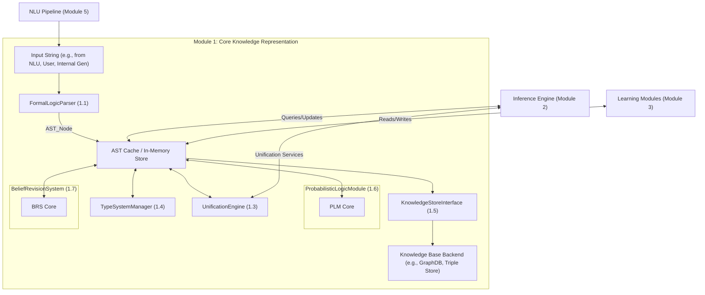
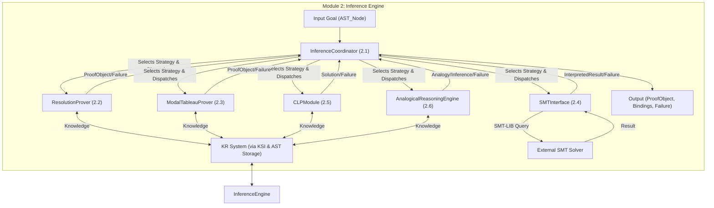
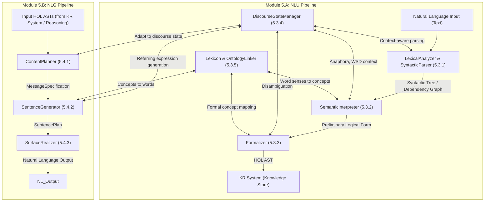
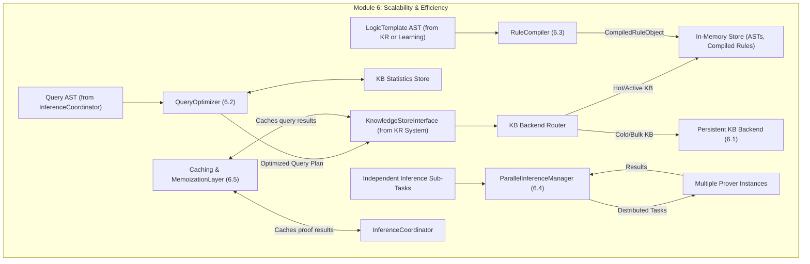
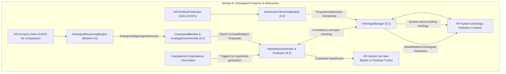
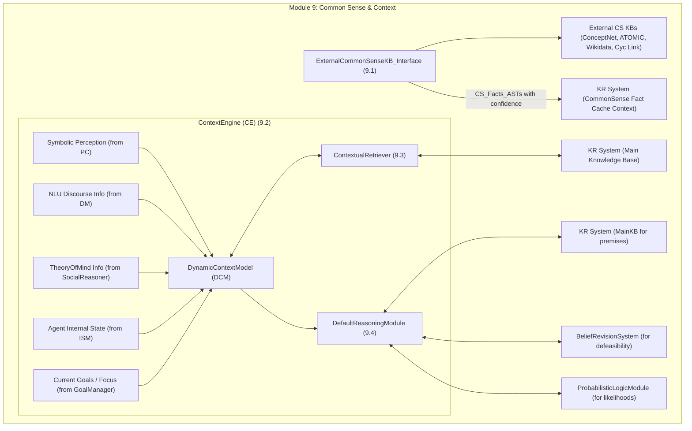

# GödelOS v21: Technical Architecture Specification (Blueprint)

**Document Version:** 0.1 (Blueprint)
**Date:** October 26, 2023 (Generated)
**System Version:** GödelOS v21

## Table of Contents

- **1. Introduction & System Overview**

- **2. Module 1: Core Knowledge Representation (KR) System**
   1. Overview
   2. KR System Architecture Diagram (ASCII)
   3. Component: `FormalLogicParser` (Module 1.1)
   4. Component: `AbstractSyntaxTree (AST)` Representation (Module 1.2)
   5. Component: `TypeSystemManager` (Module 1.4)
   6. Component: `KnowledgeStoreInterface (KSI)` (Module 1.5)
   7. Component: `UnificationEngine` (Module 1.3)
   8. Component: `ProbabilisticLogicModule (PLM)` (Module 1.6)
   9. Component: `BeliefRevisionSystem (BRS)` (Module 1.7)

- **3. Module 2: Inference Engine Architecture**
   1. Overview
   2. Inference Engine Architecture Diagram (ASCII)
   3. Component: `InferenceCoordinator` (Module 2.1)
   4. Component: `ProofObject` Data Structure
   5. Sub-Component: `ResolutionProver` (Module 2.2)
   6. Sub-Component: `ModalTableauProver` (Module 2.3)
   7. Sub-Component: `SMTInterface` (Satisfiability Modulo Theories Interface) (Module 2.4)
   8. Sub-Component: `ConstraintLogicProgrammingModule (CLP)` (Module 2.5)
   9. Sub-Component: `AnalogicalReasoningEngine (ARE)` (Module 2.6)

- **4. Module 3: Learning System**
   1. Overview
   2. Learning System Architecture Diagram (ASCII)
   3. Component: `ILPEngine` (Inductive Logic Programming Engine) (Module 3.1)
   4. Component: `ExplanationBasedLearner (EBL)` (Module 3.2)
   5. Component: `TemplateEvolutionModule (TEM)` (Module 3.3)
   6. Component: `MetaControlRLModule (MCRL)` (Module 3.4)

- **5. Module 4: Symbol Grounding System**
   1. Overview
   2. Symbol Grounding Architecture Diagram (ASCII)
   3. Component: `SimulatedEnvironment (SimEnv)` (Module 4.1)
   4. Component: `PerceptualCategorizer (PC)` (Module 4.2)
   5. Component: `ActionExecutor (AE)` (Module 4.3)
   6. Component: `SymbolGroundingAssociator (SGA)` (Module 4.4)
   7. Component: `InternalStateMonitor (ISM)` (Module 4.5)

- **6. Module 5: Natural Language Understanding (NLU) / Generation (NLG) System**
   1. Overview
   2. NLU/NLG System Architecture Diagram (ASCII)
   3. Module 5.A: NLU Pipeline
      1. Component: `LexicalAnalyzer & SyntacticParser (LAP)`
      2. Component: `SemanticInterpreter (SI)`
      3. Component: `Formalizer (F)`
      4. Component: `DiscourseStateManager (DM)`
      5. Component: `Lexicon & OntologyLinker (LOL)`
   4. Module 5.B: NLG Pipeline
      1. Component: `ContentPlanner (CP)`
      2. Component: `SentenceGenerator (SG)`
      3. Component: `SurfaceRealizer (SR)`

- **7. Module 6: Scalability & Efficiency System**
   1. Overview
   2. Scalability & Efficiency Architecture Diagram (ASCII)
   3. Component: `Persistent Knowledge Base (KB) Backend` (& Router) (Module 6.1)
   4. Component: `QueryOptimizer (QO)` (Module 6.2)
   5. Component: `RuleCompiler (RC)` (Module 6.3)
   6. Component: `ParallelInferenceManager (PIM)` (Module 6.4)
   7. Component: `Caching & MemoizationLayer (CML)` (Module 6.5)

- **8. Module 7: Metacognition & Self-Improvement System**
   1. Overview
   2. Metacognition Architecture Diagram (ASCII)
   3. Component: `SelfMonitoringModule (SMM)` (Module 7.1)
   4. Component: `MetaKnowledgeBase (MKB)` (Module 7.2)
   5. Component: `CognitiveDiagnostician (CD)` (Module 7.3)
   6. Component: `SelfModificationPlanner (SMP)` (Module 7.4)
   7. Component: `ModuleLibrary & Activator (MLA)` (Module 7.5)

- **9. Module 8: Ontological Creativity & Abstraction System**
   1. Overview
   2. Ontological Creativity & Abstraction Architecture Diagram (ASCII)
   3. Component: `OntologyManager (OM)` (Module 8.1)
   4. Component: `ConceptualBlender & AnalogyDrivenNovelty (CBAN)` (Module 8.2)
   5. Component: `HypothesisGenerator & Evaluator (HGE)` (Module 8.3)
   6. Component: `AbstractionHierarchyModule (AHM)` (Module 8.4)

- **10. Module 9: Common Sense & Context System**
   1. Overview
   2. Common Sense & Context Architecture Diagram (ASCII)
   3. Component: `ExternalCommonSenseKB_Interface (ECSKI)` (Module 9.1)
   4. Component: `ContextEngine (CE)` (Module 9.2)
   5. Component: `ContextualizedRetriever (CR)` (Module 9.3)
   6. Component: `DefaultReasoningModule (DRM)` (Module 9.4)

- **11. Conclusion & Future Directions**


## 1. Introduction & System Overview
GödelOS v21 aims to be a highly modular and extensible symbolic cognition engine. Its architecture is designed around a central Knowledge Representation system using Typed Higher-Order Logic (HOL) with extensions for modality, probability, and defeasibility. A multi-strategy Inference Engine operates on this knowledge, coordinated by a central unit that selects appropriate reasoning techniques. Learning, perception (grounding), NLU/NLG, and metacognition are distinct but deeply integrated subsystems. This document details the architecture of these systems.

---
## 2. Module 1: Core Knowledge Representation (KR) System

### 2.1. Overview
The KR system is the heart of GödelOS v21, responsible for representing, storing, and managing all forms of knowledge. It defines the syntax and semantics of the agent's internal language and provides foundational operations for knowledge manipulation.

### 2.2. KR System Architecture Diagram (ASCII)


### 2.3. Component: `FormalLogicParser` (Module 1.1)
*   **Responsibilities:**
    *   Convert textual representations of logical formulae into canonical Abstract Syntax Tree (AST) structures.
    *   Validate syntactic correctness according to GödelOS v21's defined HOL grammar with extensions (modal, probabilistic annotations, defeasible rules).
    *   Resolve basic lexical ambiguities and normalize terms where possible.
*   **Key Data Structures:**
    *   `TokenStream`: Input from lexer.
    *   `ParsingTable / GrammarRules`: Defines the language syntax (e.g., using BNF or EBNF).
    *   `SymbolTable` (shared with `TypeSystemManager`): For looking up predefined constants, types during parsing.
*   **Core Algorithms & Logic Flow:**
    1.  **Lexical Analysis (Lexing):** Input string -> `TokenStream`.
    2.  **Syntactic Analysis (Parsing):** `TokenStream` -> `AST_Node`. (e.g., ANTLR, LARK, or custom recursive descent/Pratt parser).
    3.  **Error Reporting:** Detailed error messages.
*   **Conceptual API:**
    ```python
    class FormalLogicParser:
        def __init__(self, type_system: 'TypeSystemManager'): # Forward reference
        def parse(self, expression_string: str) -> Tuple['AST_Node' | None, List['Error']]: ...
    ```

### 2.4. Component: `AbstractSyntaxTree (AST)` Representation (Module 1.2)
*   **Design Principles:** Immutable, Typed, Rich Metadata, Traversal Support.
*   **Core AST Node Types:**
    ```python
    # Forward declarations for type hints if needed
    # class Type: ... 
    # class VariableNode: ...

    class AST_Node:
        type: 'Type' # From TypeSystemManager
        metadata: Dict[str, Any] # e.g., probability, source_location
        def __eq__(self, other): ... # Structural equality based on content
        def __hash__(self): ...      # For use in sets/dicts, based on content

    class ConstantNode(AST_Node):
        name: str
        value: Any # Optional actual value if it's a literal (e.g., number, string)

    class VariableNode(AST_Node): # Also used for bound variables in quantifiers/lambda
        name: str # e.g., "?x", "v1" (canonicalized)
        var_id: int # Unique ID for this variable instance for alpha-equivalence

    class ApplicationNode(AST_Node): # Function or Predicate Application
        operator: AST_Node # e.g., PredicateNode, FunctionNode, or even a VariableNode (for HOL)
        arguments: List[AST_Node]

    class QuantifierNode(AST_Node): # For ∀, ∃
        quantifier_type: str # "FORALL", "EXISTS"
        bound_variables: List[VariableNode] # List of variables bound by this quantifier
        scope: AST_Node # The sub-formula governed by this quantifier

    class ConnectiveNode(AST_Node): # For ¬, ∧, ∨, ⇒, ≡
        connective_type: str # "NOT", "AND", "OR", "IMPLIES", "EQUIV"
        operands: List[AST_Node] # Unary for NOT, Binary for others (can be nested for n-ary)

    class ModalOpNode(AST_Node): # For K, B, P, O, F, etc.
        modal_operator: str # "KNOWS", "BELIEVES", "POSSIBLE_WORLD_TRUTH", "OBLIGATORY"
        agent_or_world: AST_Node | None # For epistemic/deontic operators, or world in Kripke semantics
        proposition: AST_Node

    class LambdaNode(AST_Node): # For HOL lambda abstractions (λx. P(x))
        bound_variables: List[VariableNode]
        body: AST_Node

    class DefinitionNode(AST_Node): # For defining constants, functions, predicates
        defined_symbol_name: str
        defined_symbol_type: 'Type'
        definition_body_ast: AST_Node # The expression defining the symbol
    ```

### 2.5. Component: `TypeSystemManager` (Module 1.4)
*   **Responsibilities:**
    *   Define and manage the type hierarchy (e.g., `Entity`, `Agent < Entity`, `Action < Event`, `Proposition: Type`). Primitive types like `Integer`, `Boolean`, `String`. Function types `(T1, T2) -> T3`.
    *   Perform type checking (ensure an expression conforms to expected type) and type inference (deduce the type of an expression) on ASTs.
    *   Store and manage type signatures for all defined constants, predicates, and functions.
    *   Support parametric polymorphism (type variables, e.g., `List[?T]`) and type constructors.
*   **Key Data Structures:**
    *   `Type`: Base class for all type representations.
        *   `AtomicType(name: str)`
        *   `FunctionType(arg_types: List[Type], return_type: Type)`
        *   `ParametricTypeConstructor(name: str, type_params: List[TypeVariable])`
        *   `InstantiatedParametricType(constructor: ParametricTypeConstructor, actual_type_args: List[Type])`
        *   `TypeVariable(name: str)`
    *   `TypeHierarchyGraph`: A DAG where nodes are `AtomicType`s or `InstantiatedParametricType`s (for concrete types) and edges represent subtyping (`is_a`).
    *   `SignatureTable`: `Dict[symbol_name_str, FunctionType | AtomicType]` (for constants).
    *   `TypeEnvironment`: `Dict[VariableNode.var_id, Type]` (maps currently scoped variables to their types during checking/inference).
*   **Conceptual API:**
    ```python
    class Type: # Base class definition
        def is_subtype_of(self, other_type: 'Type', type_system: 'TypeSystemManager') -> bool: ...
        def substitute_type_vars(self, bindings: Dict['TypeVariable', 'Type']) -> 'Type': ...

    class TypeSystemManager:
        def __init__(self): ... # Loads base types and hierarchy
        def define_atomic_type(self, type_name: str, supertypes: List[str] = None) -> Type: ...
        def define_function_signature(self, symbol_name: str, arg_types_names: List[str], return_type_name: str) -> None: ...
        def get_type(self, type_name: str) -> Type | None: ...
        def check_expression_type(self, ast_node: AST_Node, expected_type: Type, environment: 'TypeEnvironment') -> List['Error']: ...
        def infer_expression_type(self, ast_node: AST_Node, environment: 'TypeEnvironment') -> Tuple[Type | None, List['Error']]: ...
        def unify_types(self, type1: Type, type2: Type) -> Dict[TypeVariable, Type] | None: # For parametric polymorphism
    ```

### 2.6. Component: `KnowledgeStoreInterface (KSI)` (Module 1.5)
*   **Responsibilities:**
    *   Provide a unified API for storing, retrieving, updating, and deleting knowledge (represented as fully typed and validated ASTs) from the underlying knowledge base backend(s).
    *   Abstract away the specifics of the backend implementation (in-memory, graph DB, triple store).
    *   Handle indexing strategies to optimize queries (delegating to backend or managing its own for in-memory).
    *   Manage different "contexts" or "stores" within the KB (e.g., `TRUTHS`, `BELIEFS_AgentX`, `HYPOTHETICAL_ScenarioY`, `MKB`, `ONTOLOGY_Context`).
    *   Interact with the `Caching & MemoizationLayer` (Module 6.5).
*   **Conceptual API:**
    ```python
    class KnowledgeStoreInterface:
        def __init__(self, type_system: TypeSystemManager, cache_manager: 'CachingMemoizationLayer' = None): ... # Backend router initialized here
        def add_statement(self, statement_ast: AST_Node, context_id: str = "TRUTHS", metadata: Dict = None) -> bool: ...
        def retract_statement(self, statement_pattern_ast: AST_Node, context_id: str = "TRUTHS") -> bool: ... # Can retract specific or pattern
        def query_statements_match_pattern(self, query_pattern_ast: AST_Node, context_ids: List[str] = ["TRUTHS"], dynamic_context_model: 'DynamicContextModel' = None, variables_to_bind: List[VariableNode] = None) -> List[Dict[VariableNode, AST_Node]]: ... # Returns list of binding solutions
        def statement_exists(self, statement_ast: AST_Node, context_ids: List[str] = ["TRUTHS"]) -> bool: ...
        def create_context(self, context_id: str, parent_context_id: str = None, context_type: str = "generic"): ...
        def delete_context(self, context_id: str): ...
        def list_contexts(self) -> List[str]: ...
    ```

### 2.7. Component: `UnificationEngine` (Module 1.3)
*   **Responsibilities:**
    *   Determine if two logical expressions (ASTs) can be made syntactically identical by substituting variables with terms (other ASTs).
    *   Produce the Most General Unifier (MGU) as a set of variable bindings (`Dict[VariableNode.var_id, AST_Node]`) if unification is possible.
    *   Support higher-order unification for HOL, which involves unification of lambda terms and variables in function/predicate positions. This implies handling α-conversion (renaming bound variables), β-reduction (application), and η-conversion (extensionality) implicitly or explicitly.
    *   Perform occurs check for first-order unification to prevent infinite terms.
*   **Core Algorithms:**
    *   **First-Order Unification:** Martelli-Montanari algorithm is efficient and well-structured. It transforms a set of equations `{t1=u1, ..., tn=un}` into a solved form (MGU) or detects failure.
    *   **Higher-Order Unification (HOU):** Significantly more complex.
        *   Huet's (pre-)unification algorithm (1975) is a foundational semi-decidable procedure. It involves generating flex-flex pairs and using imitation or projection rules.
        *   Practical HOU often involves restrictions (e.g., Miller's higher-order patterns for which unification is decidable and unitary) or search with bounded depth.
        *   Lambda calculus operations (alpha, beta, eta normal forms) are crucial. ASTs must be transformable to these forms.
*   **Conceptual API:**
    ```python
    class UnificationEngine:
        def __init__(self, type_system: TypeSystemManager): ... # Types are crucial for HOL unification
        def unify(self, ast1: AST_Node, ast2: AST_Node, current_bindings: Dict[int, AST_Node] = None, mode: str = "FIRST_ORDER" # or "HIGHER_ORDER"
                 ) -> Tuple[Dict[int, AST_Node] | None, List['Error']]: # Returns MGU (var_id -> AST) or None for failure
    ```

### 2.8. Component: `ProbabilisticLogicModule (PLM)` (Module 1.6)
*   **Responsibilities:**
    *   Manage and reason with uncertain knowledge where logical formulas or rules have associated probabilities or weights.
    *   Perform probabilistic inference tasks, such as:
        *   Calculating the marginal probability of a query formula given evidence.
        *   Finding the Most Probable Explanation (MPE) or Maximum A Posteriori (MAP) assignment for a set of variables given evidence.
    *   Support learning of weights/probabilities from data (parameter learning).
*   **Key Data Structures:**
    *   **Probabilistic Knowledge Base Representation:**
        *   **Markov Logic Networks (MLNs):** A set of first-order logic formulas (ASTs) with associated weights. `(Formula_AST, weight: float)`. A higher weight means a world violating the formula is less probable.
        *   **Probabilistic Soft Logic (PSL):** Rules with continuous truth values (0-1) and weights, often using t-norms for logical connectives.
        *   **Probabilistic Logic Programs:** e.g., PRISM, Problog, LPADs, where clauses have probabilistic annotations.
    *   `EvidenceSet`: `Set[AST_Node]` (ground facts considered true or having a specific probability).
    *   `Query_AST`: The formula whose probability is to be determined.
    *   `GroundNetwork` (for MLNs): The underlying Markov network formed by grounding the first-order formulas with constants from the domain.
*   **Core Algorithms & Logic Flow:**
    1.  **Knowledge Compilation (if applicable):**
        *   Ground the first-order probabilistic rules/formulas based on the domain of constants to form a propositional probabilistic model (e.g., ground Markov network for MLNs). This can be very large.
    2.  **Inference Algorithms:**
        *   **Marginal Inference (e.g., `P(Query | Evidence)`):**
            *   Sampling-based: MCMC algorithms like Gibbs sampling, Metropolis-Hastings variants (e.g., MC-SAT for MLNs).
            *   Variational inference methods.
            *   Lifted inference (operates on first-order level where possible to avoid full grounding).
        *   **MAP/MPE Inference (e.g., `argmax P(Variables | Evidence)`):**
            *   Local search algorithms like MaxWalkSAT (for MLNs).
            *   Integer Linear Programming (ILP) formulations.
            *   Belief propagation variants on factor graphs.
    3.  **Parameter Learning (Weight Learning for MLNs):**
        *   Given a training database of ground facts:
            *   Gradient-based methods (e.g., voted perceptron, pseudo-log-likelihood optimization).
            *   Inductive Logic Programming methods adapted for probabilistic settings.
*   **Conceptual API:**
    ```python
    class ProbabilisticLogicModule:
        def __init__(self, kr_system_interface: KnowledgeStoreInterface, probabilistic_model_type: str = "MLN"): ...
        def add_weighted_formula(self, formula_ast: AST_Node, weight: float, context_id: str = "PROBABILISTIC_RULES"): ...
        def get_marginal_probability(self, query_ast: AST_Node, evidence_asts: Set[Tuple[AST_Node, bool_truth_value]], inference_params: Dict = None) -> float: ...
        def get_map_assignment(self, query_variables_asts: List[AST_Node], evidence_asts: Set[Tuple[AST_Node, bool_truth_value]], inference_params: Dict = None) -> Dict[AST_Node, bool_truth_value]: ...
        def learn_weights(self, training_database_context_id: str, formula_skeletons_context_id: str, learning_params: Dict = None) -> Dict[AST_Node_Formula, float_weight]: ...
    ```

### 2.9. Component: `BeliefRevisionSystem (BRS)` (Module 1.7)
*   **Responsibilities:**
    *   Manage changes to the agent's belief set in a rational and consistent manner when new information arrives, especially if it contradicts existing beliefs.
    *   Implement belief revision postulates (e.g., AGM postulates: Alchourrón, Gärdenfors, Makinson) or a similar framework for logical rationality.
    *   Support operations:
        *   `Expansion`: Adding a new belief without checking for consistency.
        *   `Contraction`: Removing a belief and its logical consequences.
        *   `Revision`: Adding a new belief while maintaining consistency (may require contracting other beliefs).
    *   Construct and evaluate argumentation frameworks to support defeasible reasoning and resolve conflicts between default assumptions and new evidence.
*   **Key Data Structures:**
    *   `BeliefSet`: A set of `AST_Node`s representing current beliefs, potentially with metadata like entrenchment, source, justification. Stored in a dedicated KR context.
    *   `EntrenchmentOrdering` (optional, for AGM): A partial or total order on beliefs indicating their resistance to revision.
    *   `ArgumentationFramework (AF)`: `(Arguments, Attacks_Relation)`
        *   `Argument`: `{conclusion: AST_Node, premises: Set[AST_Node], inference_rule_id: str, type: "strict" | "defeasible"}`.
        *   `Attacks_Relation`: `Set[Tuple[Argument_ID, Argument_ID]]` (rebuttal, undermining, undercutting).
*   **Core Algorithms & Logic Flow:**
    1.  **AGM-Style Revision (Example: Partial Meet Revision):**
        *   To revise by `φ`:
            *   First, contract by `¬φ` from the current belief set `K`. This involves finding maximal subsets of `K` that do not entail `¬φ` (`K ⊥ ¬φ`).
            *   Then, expand the result by `φ`.
            *   Selection functions (using `EntrenchmentOrdering` or other criteria) choose among the maximal subsets.
    2.  **Argumentation-Based Revision/Reasoning:**
        *   **Argument Construction:** When new information arrives or a query is made:
            *   Construct arguments for relevant propositions using strict rules (from KB) and defeasible/default rules (from `DefaultReasoningModule`).
            *   Identify attack relations between these arguments (e.g., argument A1's conclusion is `¬Premise` of A2).
        *   **Argumentation Semantics Evaluation:** Apply an argumentation semantics (e.g., Dung's: grounded, preferred, stable, complete) to the constructed AF to determine sets of "acceptable" (justified) arguments.
            *   `Grounded Semantics`: Skeptical, finds arguments that are "in" because all attackers are "out".
            *   `Preferred Semantics`: Credulous, finds maximal consistent sets of arguments that defend themselves.
        *   The conclusions of acceptable arguments form the revised/justified belief set.
    3.  Interaction with `DefaultReasoningModule (DRM)`: DRM proposes default arguments; BRS incorporates them into the AF and adjudicates.
*   **Conceptual API:**
    ```python
    class BeliefRevisionSystem:
        def __init__(self, kr_system_interface: KnowledgeStoreInterface, belief_set_context_id: str, inference_engine: 'InferenceEngine'): ...
        def expand_belief_set(self, belief_set_id: str, new_belief_ast: AST_Node) -> str_new_belief_set_id: ...
        def contract_belief_set(self, belief_set_id: str, belief_to_remove_ast: AST_Node) -> str_new_belief_set_id: ...
        def revise_belief_set(self, belief_set_id: str, new_belief_ast: AST_Node, entrenchment_map: Dict[AST_Node, float] = None) -> str_new_belief_set_id: ...
        def get_justified_beliefs_via_argumentation(self, relevant_knowledge_asts: Set[AST_Node], defeasible_rules_asts: Set[AST_Node], semantics_type: str = "grounded") -> Set[AST_Node]: ...
    ```

---
## 3. Module 2: Inference Engine Architecture
### 3.1. Overview
The Inference Engine is responsible for all deductive reasoning. It takes goals and applies logical rules and knowledge from the KR system. It employs multiple reasoning strategies.
### 3.2. Inference Engine Architecture Diagram (ASCII)


### 3.3. Component: `InferenceCoordinator` (Module 2.1)
*   **Responsibilities:**
    *   Receive reasoning tasks (goals) from other parts of the system (e.g., Goal Manager, NLU, Self-Modification Planner).
    *   Analyze the goal's logical structure, type, and context (e.g., presence of modal operators, quantifiers, arithmetic).
    *   Select the most appropriate inference engine(s) or strategy (e.g., resolution for FOL, tableau for modal, SMT for arithmetic constraints). This selection can be rule-based or learned (by Module 3.4).
    *   Manage the overall proof search process:
        *   Set resource limits (time, depth, memory).
        *   Orchestrate multi-step reasoning plans if a single prover is insufficient (e.g., SMT call within a larger proof).
        *   Handle backtracking or alternative strategies upon failure.
    *   Collect and return results in a standardized `ProofObject` format.
*   **Core Logic Flow:**
    1.  **Goal Reception & Analysis:**
        *   `goal: AST_Node` (e.g., `Prove(P)`, `FindAll(?x, Query(?x))`).
        *   `context_facts: Set[AST_Node]`.
        *   Analyze `goal` AST: identify primary connectives, quantifiers, modal operators, presence of theories (arithmetic, etc.).
    2.  **Strategy Selection:**
        *   Based on analysis, consult a `StrategyKnowledgeBase` (or a learned policy from `MetaControlRLModule`).
        *   Examples:
            *   If goal is propositional or FOL without complex theories -> `ResolutionProver`.
            *   If goal contains modal operators -> `ModalTableauProver`.
            *   If goal involves arithmetic/bitvectors -> `SMTInterface`.
            *   If goal is finding analogous structures -> `AnalogicalReasoningEngine`.
    3.  **Dispatcher:** Invoke selected prover(s) with the goal, relevant context, and resource limits.
    4.  **Result Aggregation:** Receive `ProofObject` or failure status. If iterative, update goal/context and re-iterate.
    5.  **Output:** Return final `ProofObject` or failure reason.
*   **Conceptual API:**
    ```python
    # Forward declaration
    # class BaseProver: ...
    # class ProofObject: ...
    # class ResourceLimits: ...
    
    class InferenceCoordinator:
        def __init__(self, kr_system: 'KRSystem', provers_map: Dict[str, 'BaseProver'], strategy_kb: 'StrategyKnowledgeBase'): # KRSystem should provide KSI
            self.kr_system_interface = kr_system.get_knowledge_store_interface() # Example access
            self.provers = provers_map
            self.strategy_kb = strategy_kb # Contains rules for selecting provers

        def submit_goal(self, goal_ast: AST_Node, context_ast_set: Set[AST_Node], strategy_hint: str = None, resources: 'ResourceLimits' = None) -> 'ProofObject':
            # ... logic for analysis and dispatch ...
            # selected_prover = self.strategy_kb.select_prover(goal_ast, context_ast_set, strategy_hint)
            # if selected_prover and selected_prover in self.provers:
            #     return self.provers[selected_prover].prove(goal_ast, context_ast_set, resources) 
            # else:
            #     return ProofObject(goal_achieved=False, status_message="No suitable prover found or strategy failed.")
            pass # Placeholder for full implementation
    ```

### 3.4. Component: `ProofObject` Data Structure
*   **Purpose:** A standardized way to represent the outcome of a reasoning process, including the proof steps if successful.
*   **Structure (Illustrative):**
    ```python
    class ProofObject:
        goal_achieved: bool
        conclusion_ast: AST_Node | None # The proven goal, or derived expression
        bindings: Dict[VariableNode, AST_Node] | None # For 'find' type goals
        status_message: str # e.g., "Proved", "Failed: Timeout", "Contradiction Found"
        proof_steps: List['ProofStepNode'] | None # Detailed derivation (ProofStepNode as in KR Module)
        used_axioms_rules: Set[AST_Node] # Which initial facts/rules were crucial
        inference_engine_used: str # Name of the prover/engine module
        time_taken_ms: float
        resources_consumed: Dict[str, float] # e.g., {"depth": 10, "nodes_explored": 1000}
    ```

### 3.5. Sub-Component: `ResolutionProver` (Module 2.2)
*   **Responsibilities:**
    *   Prove goals using the resolution inference rule, primarily for First-Order Logic (FOL) and propositional logic.
    *   Convert input formulae (goal and relevant KB axioms/facts) into Conjunctive Normal Form (CNF) / clausal form.
    *   Implement various resolution strategies (e.g., set-of-support, hyperresolution, linear resolution, unit preference) to guide the search for a refutation (empty clause).
*   **Core Algorithms & Logic Flow:**
    1.  **Input:** `goal_to_negate_ast: AST_Node`, `axioms_asts: Set[AST_Node]`.
    2.  **Negate Goal:** Add the negation of `goal_to_negate_ast` to `axioms_asts`.
    3.  **CNF Conversion (for all formulas):**
        *   Eliminate implications (A ⇒ B  ≡  ¬A ∨ B).
        *   Move negations inwards (De Morgan's laws, double negation `¬¬A ≡ A`).
        *   Standardize variables apart (ensure variables in different clauses are distinct).
        *   Skolemize existential quantifiers (replace `∃x.P(x)` with `P(skolem_const)` or `P(skolem_func(y1..yn))`). A new Skolem symbol must be generated for each existential quantifier.
        *   Move universal quantifiers to the prefix and drop them (all variables in clausal form are implicitly universally quantified).
        *   Distribute ∨ over ∧ to achieve CNF: `(A ∨ (B ∧ C)) ≡ ((A ∨ B) ∧ (A ∨ C))`.
        *   Result is a set of clauses, where each clause is a disjunction of literals.
    4.  **Resolution Loop (Main Inference Procedure):**
        *   Initialize `ClauseSet` with CNF clauses.
        *   Loop:
            *   Select two parent clauses from `ClauseSet` based on the chosen strategy (e.g., one from set-of-support).
            *   Identify complementary literals (e.g., `L` in one clause, `¬L` in the other).
            *   Attempt to unify these literals using `UnificationEngine`.
            *   If unifiable with Most General Unifier (MGU) `θ`:
                *   Form the resolvent clause by taking the disjunction of the remaining literals from both parent clauses and applying `θ`.
                *   If the resolvent is the empty clause (`□`), a contradiction is found; the original goal is proven. Return `ProofObject` indicating success.
                *   Simplify resolvent (e.g., remove duplicate literals, subsumption checks).
                *   Add the new resolvent to `ClauseSet`.
            *   If no new clauses can be generated or resource limits exceeded, terminate and return `ProofObject` indicating failure.
    5.  **Strategy Implementation Details:**
        *   **Set-of-Support:** Maintain a `SetOfSupport` (initially clauses from negated goal). At least one parent in resolution must come from `SetOfSupport`. New resolvents are added to `SetOfSupport`.
        *   **Unit Preference:** Prioritize resolutions where at least one parent is a unit clause (single literal).
*   **Conceptual API:**
    ```python
    class BaseProver: # Abstract base class for all provers
        def prove(self, goal_ast: AST_Node, context_asts: Set[AST_Node], resources: 'ResourceLimits') -> ProofObject:
            raise NotImplementedError

    class ResolutionProver(BaseProver):
        def __init__(self, kr_system_interface: KnowledgeStoreInterface, unification_engine: UnificationEngine, cnf_converter: 'CNFConverter'): ...
        def prove(self, goal_to_negate_ast: AST_Node, axioms_asts: Set[AST_Node], resources: 'ResourceLimits', strategy: str = "set_of_support") -> ProofObject: ...
    ```

### 3.6. Sub-Component: `ModalTableauProver` (Module 2.3)
*   **Responsibilities:**
    *   Determine the validity or satisfiability of formulae in various modal logics (e.g., K, T, D, B, S4, S5).
    *   Construct a semantic tableau (a proof tree) for the input modal formula. If all branches of the tableau close, the formula is unsatisfiable (or valid if proving the negation).
*   **Core Algorithms & Logic Flow:**
    1.  **Input:** `modal_formula_ast: AST_Node`, `modal_system: str` (specifies accessibility relation properties).
    2.  **Tableau Initialization:** Create a root node in the tableau labeled with the input `modal_formula_ast` (or its negation if checking validity). Associate it with an initial world (e.g., `w0`).
    3.  **Tableau Expansion Rules (applied systematically):**
        *   **Propositional Rules (Alpha-rules - conjunctive, Beta-rules - disjunctive):**
            *   `A ∧ B` at world `w`: Add `A` at `w` and `B` at `w` to the same branch.
            *   `A ∨ B` at world `w`: Split the current branch into two; add `A` at `w` to one, `B` at `w` to the other.
            *   `¬(A ∧ B)` -> `¬A ∨ ¬B`; `¬(A ∨ B)` -> `¬A ∧ ¬B`; `¬¬A` -> `A`.
        *   **Modal Rules (depend on `modal_system`):**
            *   **For `◇A` (Possibly A) at world `w` (`π-rule`):**
                *   Create a new world `w'` such that `w R w'` (where R is the accessibility relation).
                *   Add `A` at world `w'` to the current branch. (For some systems like S5, `w'` might be an existing world if R is universal).
            *   **For `□A` (Necessarily A) at world `w` (`ν-rule`):**
                *   For every world `w'` such that `w R w'` is *already established or generatable* on the current branch, add `A` at `w'` to that branch.
                *   The properties of R (reflexivity for T, transitivity for S4, symmetry for B, euclidean for S5) dictate how `w R w'` is determined or enforced when applying these rules. For example, in S4, if `□A` is at `w` and `w R w'`, then `□A` also holds at `w'` (due to transitivity of R and the nature of `□`).
    4.  **Branch Closure:** A branch of the tableau closes if it contains a formula `φ` and its negation `¬φ` at the *same world*.
    5.  **Tableau Status:**
        *   **Closed Tableau:** If all branches close, the initial formula is unsatisfiable.
        *   **Open Tableau:** If the expansion rules can no longer be applied to an open branch (it's complete), and it's not closed, the initial formula is satisfiable (a model can be constructed from this open branch).
    6.  Loop detection/blocking might be needed for some modal systems to ensure termination.
*   **Conceptual API:**
    ```python
    class ModalTableauProver(BaseProver):
        def __init__(self, kr_system_interface: KnowledgeStoreInterface, type_system: TypeSystemManager): ...
        def prove(self, modal_formula_ast: AST_Node, modal_system_name: str, resources: 'ResourceLimits', check_validity: bool = True) -> ProofObject: ... 
        # if check_validity is True, it negates the input formula first.
    ```

### 3.7. Sub-Component: `SMTInterface` (Satisfiability Modulo Theories Interface) (Module 2.4)
*   **Responsibilities:**
    *   Interface with external SMT (Satisfiability Modulo Theories) solvers like Z3, CVC5, Yices.
    *   Translate GödelOS v21 expressions involving specific theories (e.g., linear integer arithmetic, real arithmetic, arrays, bit-vectors, uninterpreted functions) into the SMT-LIB 2 standard format.
    *   Invoke the external SMT solver with the translated problem.
    *   Parse the solver's output (e.g., `sat`, `unsat`, `model`, `unsat core`) back into a GödelOS v21 understandable format (e.g., boolean status, `AST_Node` bindings for models).
*   **Key Data Structures:**
    *   `AST_Node` (input, containing expressions with theoretical constructs).
    *   `SMT_LIB_Script_String`: The translated problem in SMT-LIB v2 text format.
    *   `SMTSolverConfiguration`: `{solver_path: str, solver_options: List[str]}`.
    *   `SMT_Result`: `{status: "sat"|"unsat"|"unknown", model: Dict[VariableNode, ConstantNode_AST] | None, unsat_core_identifiers: List[str] | None}`. (Identifiers for unsat core refer back to named assertions in SMT-LIB script).
*   **Core Algorithms & Logic Flow:**
    1.  **AST to SMT-LIB Translation:**
        *   A recursive function traverses the input `AST_Node`.
        *   GödelOS types are mapped to SMT sorts (e.g., `Integer_Type` -> `Int`, `Boolean_Type` -> `Bool`, user-defined uninterpreted sorts `(declare-sort MySort 0)`).
        *   GödelOS constants and variables are declared as SMT constants/variables with appropriate sorts (`(declare-fun myConst () MySort)` or `(declare-fun ?x () Int)`).
        *   GödelOS functions/predicates over theories are mapped to SMT-LIB functions/predicates (e.g., `+`, `-`, `*`, `/`, `<`, `<=`, `=`, `distinct`, `select` (for arrays), `concat` (for bit-vectors), `ite` (if-then-else)).
        *   Logical connectives (AND, OR, NOT, IMPLIES, IFF) are mapped to `and`, `or`, `not`, `=>`, `=`. Quantifiers to `forall`, `exists`.
        *   The top-level formula and relevant axioms are translated into `(assert ...)` SMT-LIB commands.
        *   A `(check-sat)` command is added. If a model or unsat core is needed, `(get-model)` or `(get-unsat-core)` commands are added.
    2.  **Solver Invocation:** The external SMT solver executable is run as a subprocess. The generated SMT-LIB script is passed as input.
    3.  **Result Parsing:**
        *   Read the solver's standard output.
        *   Parse the primary status: `sat`, `unsat`, or `unknown` (if timeout/resource limits hit).
        *   If `sat` and model requested: parse the S-expression model output, which typically lists assignments for declared constants/variables. Convert these assignments back to `VariableNode -> ConstantNode_AST` bindings.
        *   If `unsat` and unsat core requested: parse the list of names of assertions that form the unsatisfiable core.
    4.  Construct and return the GödelOS `SMT_Result` structure.
*   **Conceptual API:**
    ```python
    class SMTInterface(BaseProver):
        def __init__(self, solver_configs: List[SMTSolverConfiguration], type_system: TypeSystemManager): ... # type_system helps map types to SMT sorts
        def check_satisfiability(self, formula_ast: AST_Node, axioms_asts: Set[AST_Node] = None, logic_theory: str = "AUFLIRA", # e.g., All Uninterpreted Functions Linear Integer Real Arithmetic
                                 request_model: bool = False, request_unsat_core: bool = False, resources: 'ResourceLimits' = None) -> 'SMT_Result': ...
    ```

### 3.8. Sub-Component: `ConstraintLogicProgrammingModule (CLP)` (Module 2.5)
*   **Responsibilities:**
    *   Provide a declarative framework for solving problems that combine logical deduction with constraint satisfaction over specific domains (e.g., finite integer domains (CLP(FD)), real numbers (CLP(R)), Booleans (CLP(B))).
    *   Extend the operational semantics of logic programming (like Prolog's SLD resolution) to handle constraint expressions.
    *   Allow users to define CLP programs (sets of facts and rules, where rules can contain constraint literals) and pose queries.
*   **Key Data Structures:**
    *   `CLP_Clause_AST`: An `AST_Node` representing a CLP rule (e.g., `Head_AST :- BodyLiterals_List_AST`). Body literals can be standard logical predicates or `Constraint_AST`s.
    *   `Constraint_AST`: An `AST_Node` representing a constraint, e.g., `GreaterThan(VarX_AST, VarY_AST)`, `AllDifferent(ListOfVars_AST)`, `SumEquals(ListOfVars_AST, Sum_AST)`.
    *   `ConstraintVariable`: A logical variable (`VariableNode`) augmented with a domain (e.g., `{min: int, max: int}` for FD, or interval for Reals).
    *   `ConstraintStore`: A global (per query execution) store of active constraints that have been encountered.
    *   `DomainStore`: Maps each `ConstraintVariable` to its current (possibly pruned) domain.
    *   Specialized `ConstraintSolvers` for different domains (e.g., an FD solver implementing arc consistency, bounds consistency; a Simplex solver for CLP(R)).
*   **Core Algorithms & Logic Flow:**
    1.  **Query Processing (Modified SLD Resolution):**
        *   Starts with the user's query as the initial goal.
        *   Resolution proceeds as in standard logic programming: select a literal in the goal, find matching CLP clause heads (via `UnificationEngine`), replace literal with clause body, apply MGU.
    2.  **Constraint Handling During Resolution:**
        *   If a selected literal is a `Constraint_AST`:
            *   It is not "resolved" further. Instead, it is added to the `ConstraintStore`.
            *   The responsible `ConstraintSolver` for that type of constraint is invoked.
        *   If unification binds a `ConstraintVariable` to a constant or another `ConstraintVariable`: an equality constraint is added to the `ConstraintStore`.
    3.  **Constraint Propagation & Solving:**
        *   When a new constraint is added to `ConstraintStore`:
            *   The solver attempts to establish consistency (e.g., check if the system of constraints is still satisfiable).
            *   It performs propagation: prunes the domains of involved `ConstraintVariables` in the `DomainStore`. E.g., if `?x :: 1..10`, `?y :: 1..5`, and constraint `?x > ?y + 7` is added, then `?x`'s domain might be pruned to `9..10` and `?y` to `1..2`.
            *   If any variable's domain becomes empty, the current SLD branch fails (backtracking occurs).
    4.  **Solution Finding (Labeling/Enumeration):**
        *   If the SLD resolution succeeds (empty goal) but some `ConstraintVariables` still have non-singleton domains, the current state represents a partial solution (a set of consistent constraints).
        *   To find concrete ground solutions, a "labeling" or "enumeration" phase is initiated: systematically try values from the domains of remaining variables, propagating constraints, until all variables are ground or failure.
*   **Conceptual API:**
    ```python
    class CLPModule(BaseProver):
        def __init__(self, kr_system_interface: KnowledgeStoreInterface, unification_engine: UnificationEngine, solver_registry: Dict[str_constraint_type, 'ConstraintSolver']): ...
        def solve_clp_query(self, clp_program_asts: Set[AST_Node], query_ast: AST_Node, max_solutions: int = 1, labeling_strategy: str = "default") -> List[Dict[VariableNode, ConstantNode_AST]]: ...
    ```

### 3.9. Sub-Component: `AnalogicalReasoningEngine (ARE)` (Module 2.6)
*   **Responsibilities:**
    *   Identify structural analogies between a "source" domain and a "target" domain, where domains are represented as sets of symbolic facts and rules (ASTs from the KR System).
    *   Produce one or more mappings of correspondences between objects, attributes, predicates, and functions in the source and target domains.
    *   Evaluate the quality of these mappings (e.g., structural consistency, systematicity).
    *   Support analogical inference (also called "projection" or "transfer"): generate candidate hypotheses in the target domain based on knowledge from the source domain and the established mapping.
*   **Key Data Structures:**
    *   `DomainDescription`: `Set[AST_Node]` (facts, rules, type definitions constituting a domain).
    *   `AnalogicalMapping`:
        *   `source_domain_id: str`, `target_domain_id: str`
        *   `object_mappings`: `List[Tuple[ConstantNode_Source, ConstantNode_Target, float_similarity_score]]`
        *   `predicate_function_mappings`: `List[Tuple[Symbol_Source, Symbol_Target, float_similarity_score]]` (mapping predicate/function *names* or their AST definitions).
        *   `relation_instance_mappings`: `List[Tuple[ApplicationNode_Source_Fact, ApplicationNode_Target_Fact]]` (mapping specific ground facts that align).
        *   `structural_consistency_score`: Float (e.g., based on systematicity - preference for mapping connected systems of relations).
        *   `semantic_fit_score`: Float (how well types and semantic properties align for mapped elements, via `OntologyManager` or `LexiconOntologyLinker`).
    *   `WorkingMemory` for mapping construction (e.g., match hypothesis lists, constraint networks).
*   **Core Algorithms & Logic Flow (Inspired by Gentner's Structure-Mapping Theory & SME algorithm, or variants like ACME/IAM):**
    1.  **Initialization:** Input `source_domain_description_asts` and `target_domain_description_asts`.
    2.  **Local Match Construction / Literal Similarity:**
        *   Identify potential pairings of individual items (constants representing objects; predicate/function symbols) between source and target.
        *   Similarity based on: identical names, ontological type similarity (`OntologyManager.is_subtype_of`), attribute similarity (shared properties), semantic similarity from `LexiconOntologyLinker` if symbols correspond to words. Store these as "match hypotheses" with scores.
    3.  **Systematicity & Structural Alignment (Core Matching Process):**
        *   **Kernel Identification (Seed Mappings):** Find small, highly consistent sets of initial correspondences (e.g., aligning relations whose arguments also have plausible local matches).
        *   **Parallel Iterative Growth (e.g., like ACME's constraint network):**
            *   Treat match hypotheses as nodes in a network.
            *   Define excitatory links (for consistency, e.g., if `R(a,b)` maps to `R'(a',b')`, then `a->a'`, `b->b'`, `R->R'` support each other) and inhibitory links (for inconsistency, e.g., one-to-many mappings).
            *   Run an iterative activation update process (like a spreading activation or relaxation network) until activations stabilize. High activation nodes form consistent global mappings.
        *   **SME-like approach:** Incrementally build mappings (called "Gleanings of Mappings" - Gmaps). Start with object mappings, then try to align relations over these objects. Merge consistent Gmaps. Enforce structural consistency (e.g., if `P(x)` maps to `Q(y)`, then `x` must map to `y`).
    4.  **Mapping Evaluation & Selection:** Score resulting `AnalogicalMapping`(s) based on structural depth, number of consistent correspondences, systematicity, and semantic fit. Select the best one(s).
    5.  **Candidate Inference Generation (Transfer/Projection):**
        *   For a selected `AnalogicalMapping`:
            *   Take a fact/rule `F_source` from the source domain that is connected to the mapped structure but has no direct correspondent in the target.
            *   Substitute mapped source elements in `F_source` with their target correspondents to generate `F_target_hypothesis`.
            *   Example: Source: `Flows(Water, Pipe)`. Target context: Solar System. Mapping: `Water -> ?PlanetX`, `Pipe -> OrbitPath`. Transfer: `Flows_analog(?PlanetX, OrbitPath)`. The predicate `Flows_analog` might be a new hypothetical predicate or `Flows` itself if the mapping suggests it.
*   **Conceptual API:**
    ```python
    class AnalogicalReasoningEngine:
        def __init__(self, kr_system_interface: KnowledgeStoreInterface, ontology_manager: 'OntologyManager', lexicon_linker: 'LexiconOntologyLinker'): ...
        def compute_analogies(self, source_domain_asts: Set[AST_Node], target_domain_asts: Set[AST_Node], config_params: Dict = None) -> List['AnalogicalMapping']: ...
        def project_inferences(self, mapping: 'AnalogicalMapping', source_expressions_to_project: Set[AST_Node]) -> List[AST_Node_Hypothesis]: ...
    ```

---
## 4. Module 3: Learning System
### 4.1. Overview
The Learning System in GödelOS v21 is responsible for enabling the agent to acquire new knowledge, refine existing knowledge, and improve its problem-solving strategies over time. It integrates various machine learning paradigms tailored for symbolic representations.
### 4.2. Learning System Architecture Diagram (ASCII)
```mermaid
graph TD
    subgraph "Module 3: Learning System"
        KB["Knowledge Base (KR System)"] <-->|Background Knowledge, Examples| ILPE["ILPEngine (3.1)"]
        ILPE -->|New Rules (ASTs)| KB

        ProofLogs["Proof Logs (from Inference Engine)"] --> EBLer["ExplanationBasedLearner (3.2)"]
        EBLer -->|Generalized Rules (ASTs)| KB
        EBLer <-->|Interaction for operationality| KB

        LogicTemplates["LogicTemplates (from KR)"] <--> TEM["TemplateEvolutionModule (3.3)"]
        TEM -->|Refined Templates| LogicTemplates
        PerformanceData["Performance Data (from Metacognition)"] --> TEM

        CognitiveState["Cognitive State / Performance (from Metacognition)"] --> MCRL["MetaControlRLModule (3.4)"]
        MCRL -->|Control Policies / Heuristics| InferenceCoordinator_Learn["InferenceCoordinator"]
        MCRL -->|Control Policies / Heuristics| GoalManager_Learn["GoalManager"]
    end
```

### 4.3. Component: `ILPEngine` (Inductive Logic Programming Engine) (Module 3.1)
*   **Responsibilities:**
    *   Induce new logical rules (Horn clauses or more general FOL fragments, represented as `LogicTemplate` ASTs) from a set of positive and negative examples (`AST_Node`s), given background knowledge (also `AST_Node`s) from the KR system.
    *   Generate rule hypotheses that are consistent with positive examples (entail them given background knowledge) and inconsistent with negative examples (do not entail them, or entail their negation).
*   **Key Data Structures:**
    *   `PositiveExamples`: `Set[AST_Node]`.
    *   `NegativeExamples`: `Set[AST_Node]`.
    *   `BackgroundKnowledge`: `Set[AST_Node]` (facts and existing rules from KR System).
    *   `RuleHypothesisSpaceGraph`: A directed graph where nodes are clauses and edges are refinement operations (e.g., adding a literal, unifying variables). Implicitly defined by `LanguageBias`.
    *   `LanguageBias`: Constraints on the form of learnable rules, crucial for controlling search space size.
        *   `ModeDeclarations`: Specify input/output types for predicates (e.g., `modeh(1, targetPredicate(+typeA, -typeB))` - head predicate with one input `typeA` var, one output `typeB` var).
        *   `TypeRestrictions`: Predicates usable in rule bodies, max clause length, max variable depth, recursion allowance.
    *   `CoverageCache`: `Dict[Clause_AST_Hash, Tuple[Set[PositiveCovered], Set[NegativeCovered]]]` to speed up evaluation.
*   **Core Algorithms & Logic Flow (Illustrative: Top-Down Sequential Covering similar to FOIL/Progol):**
    1.  **Outer Loop (Sequential Covering):**
        *   `CurrentPositiveExamples = PositiveExamples`.
        *   `LearnedTheory = []`.
        *   While `CurrentPositiveExamples` is not empty:
            *   Call `FindBestClause(TargetPredicateSignature, CurrentPositiveExamples, NegativeExamples, BackgroundKnowledge, LanguageBias)` to learn a single clause `H ← B1, ..., Bn`.
            *   If no good clause found (e.g., score below threshold or empty), break.
            *   Add the learned clause (as `LogicTemplate`) to `LearnedTheory`.
            *   Update `CurrentPositiveExamples` by removing those covered by the new clause (i.e., entailed by `NewClause ∧ BackgroundKnowledge`).
    2.  **Inner Loop (`FindBestClause` - General-to-Specific Search):**
        *   Start with the most general clause for `TargetPredicateSignature` (e.g., `TargetPredicate(V1,V2,...) ← true`).
        *   Initialize `BestClauseFound = None`, `BestClauseScore = -∞`.
        *   Maintain a `SearchQueue` (e.g., a beam for beam search) of candidate clauses, initially containing the starting clause.
        *   While `SearchQueue` is not empty and search limits not reached:
            *   Dequeue `CurrentClause`.
            *   Generate `Refinements` of `CurrentClause` by adding literals according to `LanguageBias` (using available predicates from background knowledge or `TargetPredicate` for recursion, respecting mode/type declarations).
            *   For each `RefinedClause` in `Refinements`:
                *   Check for redundancy, cycles (if allowing recursion).
                *   Calculate `Score(RefinedClause)` using a heuristic:
                    *   FOIL-like gain: `p * (log2(p/(p+n)) - log2(P/(P+N)))` where `p, n` are positive/negative examples covered by `RefinedClause`, and `P, N` are for `CurrentClause`.
                    *   Progol-like compression: `PosCoverage - NegCoverage - Length(Clause)`.
                    *   Accuracy or F1-score on examples.
                *   If `Score(RefinedClause) > BestClauseScore`, update `BestClauseFound` and `BestClauseScore`.
                *   Add promising `RefinedClause`s to `SearchQueue` (if using beam search, keep top K).
    3.  **Clause Acceptance & Pruning:** `FindBestClause` returns `BestClauseFound` if it meets acceptability criteria (e.g., minimum positive coverage, maximum negative coverage).
    4.  Return `LearnedTheory`.
*   **Conceptual API:**
    ```python
    class LanguageBiasConfig:
        mode_declarations: List[str]
        type_restrictions: Dict[str, str] # PredicateName -> AllowedArgumentTypes
        max_clause_length: int
        allow_recursion: bool

    class ILPEngine:
        def __init__(self, kr_system_interface: KnowledgeStoreInterface, inference_engine: 'InferenceEngine', language_bias: LanguageBiasConfig): # Inference engine needed for coverage check
            self.ksi = kr_system_interface
            self.inference_engine = inference_engine
            self.language_bias = language_bias
        
        def induce_rules(self, target_predicate_signature: AST_Node, positive_examples: Set[AST_Node], negative_examples: Set[AST_Node], background_context_id: str = "TRUTHS") -> List['LogicTemplate']: ...
        
        def _check_coverage(self, clause_ast: AST_Node, example_ast: AST_Node, background_knowledge: Set[AST_Node]) -> bool:
            # Uses self.inference_engine.submit_goal(Prove(example_ast), background_knowledge + {clause_ast})
            pass # Placeholder
    ```

### 4.4. Component: `ExplanationBasedLearner (EBL)` (Module 3.2)
*   **Responsibilities:**
    *   Analyze a single successful problem-solving instance (a `ProofObject` from the `InferenceEngine`) for a specific goal to form a generalized rule (`LogicTemplate`) that captures the essence of the solution.
    *   Generalize the specific instance by abstracting constants into variables while ensuring the derived rule remains valid (its premises logically entail its conclusion, given the domain theory) and operational (its premises are "easier" to satisfy or match than the original goal).
*   **Key Data Structures:**
    *   `ProofObject`: Input. Contains the proven goal, proof steps, and axioms used.
    *   `DomainTheory`: Relevant rules and facts from the KR System used in the original proof.
    *   `OperationalityCriteria`: A set of predicates (ASTs or names) considered "operational" (e.g., directly perceivable, efficiently computable, built-in).
    *   `GeneralizedExplanationStructure`: An intermediate structure representing the proof with variables replacing constants.
*   **Core Algorithms & Logic Flow:**
    1.  **Explanation Construction / Analysis:**
        *   Input: `ProofObject` for goal `G_instance` (e.g., `ProofObject` for `IsMortal(Socrates)`).
        *   Extract the specific rules and ground facts from the `ProofObject.used_axioms_rules` and `ProofObject.proof_steps` that constitute the explanation for `G_instance`.
    2.  **Goal Regression & Variabilization:**
        *   Identify constants in `G_instance` that are candidates for variabilization (e.g., "Socrates"). Replace them with new distinct variables (e.g., `?p`). This gives `G_general(?p) = IsMortal(?p)`.
        *   Trace these variabilizations back through the proof structure:
            *   If a proof step `Premise1_inst ∧ Premise2_inst ⇒ Conclusion_inst` was used, and `Conclusion_inst` matches (part of) `G_instance` after variabilization, then `Conclusion_general` is formed.
            *   The variables in `Conclusion_general` impose constraints on variables in `Premise1_general` and `Premise2_general`.
            *   This process is similar to "explaining" the goal by finding a symbolic derivative of the goal with respect to the proof.
    3.  **Rule Formulation:**
        *   The `G_general` becomes the head (conclusion) of the new `LogicTemplate`.
        *   The generalized "leaf" nodes of the proof (the initial premises or axioms used, now variabilized) form the body (premises) of the new `LogicTemplate`.
        *   Example: Proof of `IsMortal(Socrates)` used `IsMan(Socrates)` and template `IsMan(?x) ⇒ IsMortal(?x)`. EBL might produce: `IsMan(?p) ⇒ IsMortal(?p)`. (This example is trivial; EBL shines when the proof is multi-step).
    4.  **Operationality Check & Pruning:**
        *   Examine each literal in the body of the newly formed rule.
        *   If all literals meet the `OperationalityCriteria`, the rule is considered operational.
        *   If some literals are non-operational, the EBL process might try to regress further through the definitions of those non-operational predicates, effectively "unfolding" them until operational predicates are reached. This can lead to more specific but more directly usable rules.
        *   Prune parts of the generalized explanation that are overly specific or not contributing to the main line of reasoning for the variabilized goal.
    5.  **Output:** A new `LogicTemplate` AST if a valid, operational generalization is found.
*   **Conceptual API:**
    ```python
    class OperationalityConfig:
        operational_predicates: Set[str] # Names of predicates considered operational
        max_unfolding_depth: int

    class ExplanationBasedLearner:
        def __init__(self, kr_system_interface: KnowledgeStoreInterface, inference_engine: 'InferenceEngine', operationality_config: OperationalityConfig):
            self.ksi = kr_system_interface
            self.inference_engine = inference_engine # Used for checking entailment during regression
            self.op_config = operationality_config
            
        def generalize_from_proof_object(self, proof_object: ProofObject) -> 'LogicTemplate' | None: ...
    ```

### 4.5. Component: `TemplateEvolutionModule (TEM)` (Module 3.3)
*   **Responsibilities:**
    *   Refine and evolve existing `LogicTemplates` (both predefined and learned by ILP/EBL) to improve their utility, generality, or efficiency.
    *   Employ evolutionary algorithms (e.g., Genetic Programming) or other search techniques like stochastic local search to explore the space of template variations.
    *   Use performance data (success rates, utility scores, computational cost) from the `MetaKnowledgeBase (MKB)` to define the fitness function guiding the evolution.
*   **Key Data Structures:**
    *   `LogicTemplate_AST`: The AST representation of a template's formula (premises ⇒ conclusion).
    *   `Population`: `List[LogicTemplate_AST]` (current set of templates being evolved).
    *   `FitnessScore`: Numeric value representing the quality of a template.
    *   `EvolutionaryOperators`:
        *   `CrossoverOperators`: Functions to combine parts of two parent templates. E.g., subtree crossover on premise lists or conclusion.
        *   `MutationOperators`: Functions to introduce small, random syntactic changes.
            *   Add/delete a premise literal.
            *   Change a predicate symbol within a literal (to another from ontology with compatible arity/type).
            *   Add/remove/change a variable in a literal.
            *   Generalize a constant to a variable.
            *   Specialize a variable to a constant (from a relevant set).
            *   Negate a literal.
    *   `SyntacticConstraintGrammar` (optional): A grammar (e.g., CFG) that defines the valid structure of `LogicTemplates`. Mutations and crossovers must produce templates conforming to this grammar. Ensures syntactic validity.
*   **Core Algorithms & Logic Flow (Illustrative: Genetic Programming approach):**
    1.  **Initialization:**
        *   Select a `Population` of `LogicTemplate_ASTs` (e.g., low-performing ones, or a random sample).
    2.  **Loop for `N` Generations:**
        *   **Fitness Evaluation:** For each template in `Population`:
            *   Query `MKB` for its historical performance (`utility`, `success_rate`, `avg_cost_when_used`, `times_fired`).
            *   Calculate `FitnessScore` using a weighted combination of these metrics. The weights themselves might be adaptable by `MetaControlRLModule`.
        *   **Selection:** Select parent templates from `Population` probabilistically based on fitness (e.g., tournament, roulette wheel).
        *   **Genetic Operations:**
            *   Apply `CrossoverOperators` to pairs of selected parents to create `Offspring_Population`.
            *   Apply `MutationOperators` to a fraction of `Offspring_Population` and/or `Population`. Ensure operators respect `SyntacticConstraintGrammar` if used.
        *   **New Population:** Form the next generation's `Population` from parents and offspring (e.g., using elitism, replacing worst).
    3.  **Validation & Output:**
        *   After `N` generations, the highest-fitness templates are candidates.
        *   Validate for type correctness using `TypeSystemManager`.
        *   Optionally, test on a small benchmark of reasoning problems.
        *   Propose refined/evolved templates to the KR System (e.g., update existing template or add as new variant).
*   **Conceptual API:**
    ```python
    class TemplateEvolutionModule:
        def __init__(self, kr_system_interface: KnowledgeStoreInterface, mkb_interface: 'MetaKnowledgeBase', type_system: TypeSystemManager, syntax_grammar_path: str = None): ...
        def evolve_population(self, initial_population_templates: List[AST_Node], generations: int, population_size: int, crossover_rate: float, mutation_rate: float) -> List[AST_Node_EvolvedTemplate]: ...
    ```

### 4.6. Component: `MetaControlRLModule (MCRL)` (Module 3.4)
*   **Responsibilities:**
    *   Learn optimal control policies for meta-level decisions within GödelOS v21 using Reinforcement Learning (RL).
    *   Decisions include: selecting inference strategies (`InferenceCoordinator`), prioritizing goals (`GoalManager`), allocating cognitive resources, deciding when to trigger specific learning or self-modification routines.
*   **Key Data Structures:**
    *   **State Representation (S):** A feature vector derived from `MKB` and other dynamic system states.
        *   Examples: `[current_goal_type_id, num_active_contradictions, avg_utility_templates_matching_goal, recent_prover_X_success_rate, available_cpu_percentage, current_task_difficulty_estimate, ...]`. Feature engineering is critical.
    *   **Action Space (A):** A discrete set of meta-level actions.
        *   `SelectInferenceStrategy(ProverID)`
        *   `SetResourceLimit(ComponentID, ResourceType, Value)`
        *   `BoostGoalUtility(GoalID, Factor)`
        *   `TriggerLearningModule(ModuleID, TargetDataSpec)`
    *   **Policy (`π(a|s)` or `Q(s,a)`):** Implemented as a neural network (e.g., DQN for discrete actions) or a simpler model if state/action space is small.
    *   **Reward Function (`R(s, a, s')`):**
        *   Numerical signal based on observed system performance after taking meta-action `a` in state `s` and transitioning to `s'`.
        *   `+`: Successful goal completion (higher for faster/more efficient), contradiction resolution, generation of high-utility learned knowledge.
        *   `-`: Goal failure, timeouts, excessive resource use, generation of new contradictions.
        *   Reward shaping might be needed to guide learning.
    *   `ReplayBuffer`: Stores `(s, a, r, s', done)` transitions for experience replay in DQN.
*   **Core Algorithms & Logic Flow (Example: Deep Q-Network - DQN):**
    1.  **State Construction:** At a meta-decision point, construct the current state vector `s`.
    2.  **Action Selection (ε-greedy):**
        *   With probability `ε`, select a random `MetaAction` (exploration).
        *   Otherwise, select `a = argmax_a' Q(s, a'; θ)` where `Q` is the action-value network with parameters `θ` (exploitation).
    3.  **Meta-Action Execution:** Dispatch `a` to the target GödelOS component.
    4.  **Transition Observation:** Observe the immediate reward `r` and the next state `s'`. Determine if the "episode" (e.g., a single goal-processing attempt) is done.
    5.  **Store Experience:** Store the transition `(s, a, r, s', done)` in the `ReplayBuffer`.
    6.  **Policy Training (Learning):**
        *   Periodically sample a mini-batch of experiences from `ReplayBuffer`.
        *   For each experience `(s_j, a_j, r_j, s'_j, done_j)`:
            *   Calculate target Q-value: `y_j = r_j` if `done_j`, else `y_j = r_j + γ * max_a' Q_target(s'_j, a'; θ_target)`. (`Q_target` is a periodically updated target network).
            *   Perform a gradient descent step on `(y_j - Q(s_j, a_j; θ))^2` to update main network parameters `θ`.
            *   Periodically update `θ_target ← θ`.
*   **Conceptual API:**
    ```python
    class MetaAction:
        action_type: str
        parameters: Dict

    class MetaControlRLModule:
        def __init__(self, mkb_interface: 'MetaKnowledgeBase', action_space_definition: List[MetaAction], state_feature_extractor: Callable[[MKB_Snapshot], List[float]], rl_agent_config: Dict): # config for DQN, PPO etc.
            # Initialize RL agent (e.g., DQN with a neural network model for Q-function)
            ...
        
        def select_meta_action(self, current_system_state_features: List[float], available_actions_mask: List[bool] = None) -> MetaAction: ...
        
        def learn_from_transition(self, state_features: List[float], action_taken: MetaAction, reward: float, next_state_features: List[float], episode_done: bool): ...
    ```

---
## 5. Module 4: Symbol Grounding System
### 5.1. Overview
Connects the agent's abstract symbolic representations to data and interactions within a simulated environment (`SimEnv`). This allows symbols to acquire situated meaning by linking them to perceptual patterns and action outcomes.

### 5.2. Symbol Grounding Architecture Diagram (ASCII)
```mermaid
graph TD
    subgraph "Module 4: Symbol Grounding"
        SimEnv["SimulatedEnvironment (4.1)"] -->|Raw Percepts| PC["PerceptualCategorizer (4.2)"]
        PC -->|Symbolic Percepts (ASTs)| KB_Percepts["KR System (Perceptual Facts Context)"]
        
        Agent_Actions["Agent's Symbolic Actions (e.g., MoveTo(X,Y) AST)"] --> AE["ActionExecutor (4.3)"]
        AE -->|Primitive Commands| SimEnv
        SimEnv -->|Raw Action Outcomes / Sensor Changes| AE
        AE -->|Symbolic Outcomes (ASTs)| KB_Effects["KR System (Action Effects Context)"]

        KB_Percepts <--> SGA["SymbolGroundingAssociator (4.4)"]
        KB_Effects <--> SGA
        Ontology_Concepts["Ontology Concepts (from KR System)"] <--> SGA
        SGA --> GroundingModelsDB["Database of Learned Grounding Models"]
        
        ISM["InternalStateMonitor (4.5)"] -->|Symbolic Internal States (ASTs)| KB_Internal["KR System (Internal State Context)"]
    end
    KB_Percepts --> KR_System_SG["KR System"]
    KB_Effects --> KR_System_SG
    KB_Internal --> KR_System_SG
```

### 5.3. Component: `SimulatedEnvironment (SimEnv)` (Module 4.1)
*   **Responsibilities:**
    *   Maintain the state of a simulated world (e.g., 2D grid world, simple 3D physics environment).
    *   Provide sensory data (percepts) to the agent based on its simulated sensors and the world state.
    *   Execute primitive actions received from the agent and update the world state according to predefined physics or rules.
    *   Handle object properties, interactions (e.g., collisions), and agent embodiment.
*   **Key Data Structures:**
    *   `WorldState`: A comprehensive representation of the environment.
        *   `Objects`: `List[SimObject {id: str, type: str, pose: Pose (x,y,z,orient), visual_features: Dict, physical_properties: Dict (mass, friction), custom_state: Dict}]`
        *   `AgentRepresentation`: `SimAgent {id: str, pose: Pose, sensors: List[SensorInstance], actuators: List[ActuatorInstance], internal_state: Dict}`
    *   `SensorInstance`: Configured instance of a `SensorModel`.
        *   `SensorModel`: e.g., `VisionSensor {fov_degrees: float, max_range: float, resolution_pixels: Tuple[int,int], output_type: "raw_pixels" | "feature_list"}`. Other types: `TouchSensor`, `AuditorySensor`, `ProprioceptiveSensor` (for agent's own joint states/effort).
    *   `ActuatorInstance`: Configured instance of an `ActuatorModel`.
        *   `ActuatorModel`: e.g., `LocomotionActuator {max_speed, force}`, `GripperActuator {max_force, open_angle_range}`.
    *   `PhysicsEngine` (simplified or external library if 3D): Manages forces, collisions, kinematics.
*   **Core Algorithms & Logic Flow:**
    1.  **Initialization:** Load world configuration (objects, agent placement, environment parameters).
    2.  **Simulation Step (`tick(delta_t)`):**
        *   Apply agent actions (if any pending from `ActionExecutor`).
        *   Update object dynamics (apply physics, resolve collisions).
        *   Update agent pose based on locomotion.
        *   Update internal states of objects/agents.
    3.  **Sensor Data Generation (`get_agent_percepts(agent_id)`):**
        *   For each active `SensorInstance` of the agent:
            *   Based on sensor type, pose, and `WorldState`, compute sensor readings.
            *   Vision: Ray casting or frustum culling to determine visible objects. Extract features (e.g., object ID, type, relative position, dominant color, shape category from a predefined set). Or provide a simplified pixel buffer.
            *   Touch: Detect contact with objects based on agent/object geometry and pose.
            *   Proprioception: Report joint angles, forces exerted by actuators.
    4.  **Primitive Action Execution (`execute_primitive_env_action(agent_id, action_name, params)`):**
        *   Translate `action_name` (e.g., "move_forward", "apply_gripper_force") and `params` into direct changes in agent's actuator states or direct forces/velocities in the `PhysicsEngine`.
        *   Return an `ActionOutcome` (e.g., `{success: bool, energy_consumed: float, collision_detected: bool, sensor_feedback: Dict}`).
*   **Conceptual API:**
    ```python
    class Pose: x:float; y:float; z:float; orientation:Quaternion_or_Euler # Simplified
    class RawSensorData: modality:str; data: Any # e.g., data could be pixel buffer, feature list, contact list
    class ActionOutcome: success:bool; message:str; achieved_state_delta: Dict

    class SimulatedEnvironment:
        def __init__(self, world_config_filepath: str): ...
        def tick(self, delta_t: float): ...
        def get_agent_percepts(self, agent_id: str) -> Dict[str_sensor_name, RawSensorData]: ...
        def execute_primitive_env_action(self, agent_id: str, action_name: str, parameters: Dict) -> ActionOutcome: ...
        def get_object_details(self, object_id: str) -> SimObject | None: ...
        def add_object(self, object_config: Dict) -> str_new_object_id: ...
    ```

### 5.4. Component: `PerceptualCategorizer (PC)` (Module 4.2)
*   **Responsibilities:**
    *   Convert raw sensory data from `SimEnv` into low-level symbolic predicates (perceptual schemas) and assert them into a dedicated "PerceptualContext" in the KR System.
    *   Perform basic feature extraction from raw sensor data if not already provided by `SimEnv`.
    *   Segment the perceptual field into discrete objects or regions of interest.
    *   Assign symbolic labels (predicates) to these segments based on their features.
*   **Key Data Structures:**
    *   `RawSensorData`: Input from `SimEnv`.
    *   `FeatureExtractorSuite`: `Dict[modality_str, List[Callable[[RawSensorData], FeatureVector]]]`
        *   `FeatureVector`: `Dict[feature_name_str, Any_Value]`
    *   `PerceptualCategorizationRules`: `List[Rule {conditions: List[FeatureMatcher], consequent_predicate_template: AST_Node_Template_With_Vars}]` or learned models (e.g., decision trees, simple NNs mapping FeatureVectors to predicate likelihoods).
    *   `ObjectTracker` (optional): Maintains identity of perceived objects across time steps using simple heuristics (e.g., proximity, feature similarity).
*   **Core Algorithms & Logic Flow:**
    1.  **Input:** `RawSensorData` from `SimEnv`.
    2.  **Preprocessing & Segmentation (Modality-Specific):**
        *   Vision: If raw pixels, apply image processing (edge detection, region growing, or pre-trained object detection model like YOLO for bounding boxes). If feature lists from `SimEnv`, directly use them. Assign temporary IDs to detected objects/regions.
        *   Other modalities: Noise filtering, segmentation as appropriate.
    3.  **Feature Extraction:** For each segmented object/region, apply relevant `FeatureExtractor`s from the suite to produce a `FeatureVector`.
        *   Examples: `ColorHistogram`, `ShapeDescriptor (Hu moments, Zernike)`, `SizeEstimate`, `RelativePositionToAgent`.
    4.  **Symbolic Predicate Generation (Categorization):**
        *   For each object/region's `FeatureVector`:
            *   Match against `PerceptualCategorizationRules`. If a rule's conditions (feature matchers like `IsColor(feature_vector, "red")`, `IsShape(feature_vector, "round")`) are met, instantiate its `consequent_predicate_template` (e.g., `IsRed(ObjID_Var)`) with the object's ID.
            *   Alternatively, feed `FeatureVector` into learned classification models to get probabilities for different perceptual predicates.
        *   Generated predicates could include: `InstanceOf(ObjID, ObjectType_from_Ontology)`, `Color(ObjID, Red_Const)`, `Shape(ObjID, Round_Const)`, `IsNear(ObjID_1, ObjID_2)`, `IsTouching(AgentSensorID, ObjID)`.
    5.  **Object Tracking (Optional):** Attempt to match currently perceived objects with objects from the previous time step using `ObjectTracker` to maintain persistent symbolic identifiers.
    6.  **Assertion to KR:** Use `KnowledgeStoreInterface` to add the generated symbolic perceptual facts (ASTs) to the `PerceptualContext`. These are typically beliefs, potentially with confidence scores.
*   **Conceptual API:**
    ```python
    class PerceptualCategorizer:
        def __init__(self, kr_system_interface: KnowledgeStoreInterface, type_system: TypeSystemManager, feature_extractors_config: Dict, categorization_rules_path: str | 'LearnedCategorizerModel'): ...
        def process_perceptual_input(self, agent_id: str, all_sensor_data: Dict[str, RawSensorData]) -> Set[AST_Node_PerceptualFact]: ...
    ```

### 5.5. Component: `ActionExecutor (AE)` (Module 4.3)
*   **Responsibilities:**
    *   Translate high-level symbolic action ASTs (e.g., `PickUp(Agent_Self, Object_A_ID)`) into sequences of primitive commands executable by the `SimulatedEnvironment (SimEnv)`.
    *   Monitor the execution of these primitive commands by observing `SimEnv` outcomes and perceptual changes (via `PerceptualCategorizer`).
    *   Report the symbolic outcome of the action (success, failure, key observed effects) back to the agent's KR system.
*   **Key Data Structures:**
    *   `SymbolicAction_AST`: Input.
    *   `ActionSchemaLibrary`: `Dict[action_predicate_name_str, ActionSchema]`
        *   `ActionSchema`: `{ parameters: List[TypedVariable], preconditions: List[AST_Node_Predicate], effects_predicted: List[AST_Node_Predicate], decomposition: ActionDecomposition}`.
        *   `ActionDecomposition`: Could be:
            *   A sequence of primitive `SimEnv` action names with parameter bindings.
            *   A script (e.g., Python function) that dynamically generates primitive actions based on current state.
            *   A Behavior Tree or Hierarchical Task Network (HTN) fragment.
    *   `PrimitiveEnvAction`: `{name: str, params: Dict}` (for `SimEnv` API).
    *   `ActionExecutionLog`: Records sequence of primitive actions, `SimEnv` outcomes, relevant percepts.
    *   `SymbolicActionOutcomeReport`: `{action_id: str, success: bool, achieved_effects_asts: Set[AST_Node], failure_reason_ast: AST_Node | None}`.
*   **Core Algorithms & Logic Flow:**
    1.  **Input:** `SymbolicAction_AST` from agent's decision making (e.g., `GoalManager` or `Planner`).
    2.  **Schema Retrieval & Precondition Validation:**
        *   Lookup `ActionSchema` for the action predicate in the input AST.
        *   Instantiate `preconditions` with arguments from `SymbolicAction_AST`.
        *   Query KR System (main KB and current `PerceptualContext`) to check if all instantiated preconditions are true. If not, action fails or a sub-goal to achieve preconditions is posted.
    3.  **Decomposition & Primitive Action Generation:**
        *   Execute the `ActionDecomposition` procedure from the schema. This involves:
            *   Binding parameters from the symbolic action to variables in the decomposition.
            *   Querying `PerceptualCategorizer` or `SimEnv.get_object_details` for real-time information needed for parameterization (e.g., current position of `Object_A_ID`).
            *   Generating a sequence of `PrimitiveEnvAction`s.
    4.  **Primitive Action Execution Loop:**
        *   For each `PrimitiveEnvAction` in sequence:
            *   Send to `SimEnv.execute_primitive_env_action()`.
            *   Receive `ActionOutcome` from `SimEnv`.
            *   Potentially call `PerceptualCategorizer.process_perceptual_input()` to get updated symbolic percepts.
            *   Check if expected intermediate state (if any defined in schema) is achieved.
            *   Handle failures: if a primitive action fails, the symbolic action might fail, or the schema might define recovery routines (e.g., retry, alternative primitive sequence).
    5.  **Symbolic Outcome Determination & Reporting:**
        *   Based on overall success/failure of primitive sequence and observed final percepts, determine which `effects_predicted` (instantiated) actually occurred.
        *   Generate `SymbolicActionOutcomeReport`.
        *   Assert achieved effects and success/failure status as facts into an "ActionEffectsContext" in the KR System.
*   **Conceptual API:**
    ```python
    class ActionExecutor:
        def __init__(self, kr_system_interface: KnowledgeStoreInterface, pc_interface: PerceptualCategorizer, sim_env_interface: SimulatedEnvironment, action_schema_lib_path: str): ...
        def request_action_execution(self, agent_id: str, symbolic_action_ast: AST_Node) -> 'SymbolicActionOutcomeReport': ...
    ```

### 5.6. Component: `SymbolGroundingAssociator (SGA)` (Module 4.4)
*   **Responsibilities:**
    *   Learn and maintain bidirectional associations between abstract symbolic concepts/predicates (from the ontology) and patterns in sub-symbolic data (perceptual features, action-effect experiences).
    *   Enable the agent to:
        *   Recognize instances of a symbol based on perceptual input (e.g., seeing a red, round object might activate `Apple_Concept`).
        *   Predict or "imagine" potential perceptual consequences of symbols or actions (e.g., if `IsHeavy(?obj)` is true, an attempt to `Lift(?obj)` is predicted to result in high effort sensor readings).
*   **Key Data Structures:**
    *   `GroundingLink`: `{symbol_ast_identifier: str, sub_symbolic_representation: Any, modality: str ("visual_features", "proprioceptive_force", "auditory_pattern"), confidence: float, update_count: int, last_updated: timestamp}`.
        *   `sub_symbolic_representation`: Could be a prototype `FeatureVector`, parameters of a statistical model (e.g., Gaussian Mixture Model for a cluster of features), weights of a small neural network classifier/regressor, or a procedural attachment (a small function).
    *   `ExperienceTrace`: A structured log entry ` {timestamp, active_symbols_in_kb: Set[AST_Node], raw_percepts_by_sensor: Dict, extracted_features_by_object: Dict, executed_action_ast: AST_Node, observed_effect_symbols: Set[AST_Node], observed_effect_raw_sensors: Dict}`.
    *   `GroundingModelDB`: Persistent storage for learned `GroundingLink`s.
*   **Core Algorithms & Logic Flow:**
    1.  **Experience Collection:** Continuously (or batched) receive `ExperienceTrace`s.
    2.  **Association Learning (triggered by new experiences or explicit learning goals):**
        *   **Concept-to-Percept Grounding (e.g., grounding `Red_Const`):**
            *   Filter `ExperienceTrace`s where `Color(ObjX, Red_Const)` was asserted by `PerceptualCategorizer`.
            *   Collect the `FeatureVector`s (e.g., RGB histograms) for `ObjX` from those traces.
            *   Learn a model (e.g., cluster these feature vectors and store prototype; or train a classifier `IsRed_VisualModel(FeatureVector) -> bool_or_prob`). Store this model as the `sub_symbolic_representation` in a `GroundingLink` for `Red_Const`.
        *   **Symbol-to-Action-Effect Grounding (e.g., grounding the *effect* of `Push(LightObject)`):**
            *   Filter traces where `Push(ObjX)` was executed and `IsLight(ObjX)` was true.
            *   Analyze the `observed_effect_raw_sensors` (e.g., change in `ObjX`'s position, low proprioceptive force from agent's actuator).
            *   Learn a predictive model: `PredictEffect(Push, IsLight_Context) -> ExpectedSensorChangePattern`. Store this model.
        *   **Affordance Learning (e.g., `IsLiftable(?obj)`):**
            *   Correlate object features (from `extracted_features_by_object`) with success/failure of `Lift(?obj)` actions.
            *   Train a classifier: `IsLiftable_Model(ObjectFeatures) -> probability_of_lift_success`.
    3.  **Grounding Model Refinement:** Update existing `GroundingLink`s with new data (e.g., update model parameters, adjust confidence).
    4.  **Using Groundings:**
        *   **Symbolic Labeling (Perception):** `PerceptualCategorizer` can query `SGA`: "Given this `FeatureVector`, what symbols are associated?" (`get_symbols_for_pattern`).
        *   **Imagination/Prediction (Reasoning/Planning):** "If symbol `X` is true, what are the expected perceptual patterns?" (`get_grounding_model(X)` and interpret its `sub_symbolic_representation`). An action planner might use this to predict outcomes.
*   **Conceptual API:**
    ```python
    class SymbolGroundingAssociator:
        def __init__(self, kr_system_interface: KnowledgeStoreInterface, grounding_model_db_path: str): ...
        def record_experience(self, trace: 'ExperienceTrace'): ... # Stores in buffer, may trigger learning
        def learn_groundings_from_buffer(self, learning_focus_symbols: List[AST_Node_Identifier] = None): ... # Batch learning
        def get_grounding_for_symbol(self, symbol_ast_id: str, modality_filter: str = None) -> List['GroundingLink']: ...
        def get_symbols_for_features(self, feature_vector: 'FeatureVector', modality: str, top_k: int = 5) -> List[Tuple[str_symbol_ast_id, float_confidence]]: ...
    ```

### 5.7. Component: `InternalStateMonitor (ISM)` (Module 4.5)
*   **Responsibilities:**
    *   Provide symbolic access to aspects of the agent's own internal cognitive and computational state for introspection and metacognition.
    *   Abstract low-level system metrics (e.g., CPU load, memory usage, KR query rates, inference step counts) into symbolic predicates (ASTs).
    *   Represent current attentional focus, active goal priorities, qualitative summaries of reasoning processes (e.g., "currently_stuck_on_proof"), and learning module states as symbolic facts.
    *   Feed these symbolic internal state facts into a dedicated "InternalStateContext" within the KR System, making them available for `Module 7 (Metacognition)` and `Module 9 (ContextEngine)`.
*   **Key Data Structures:**
    *   `InternalStatePredicateSchema`: A predefined set of HOL predicates in the agent's ontology specifically for describing internal states, e.g.:
        *   `SystemResourceLevel(ResourceName_Const, CurrentValue_Float, Unit_Const, Status_Qualitative_Const)` (e.g., `SystemResourceLevel(CPU, 0.85, Percent, High_Const)`).
        *   `CognitiveOperationCount(OperationType_Const, Count_Int, TimeUnit_Const)` (e.g., `CognitiveOperationCount(InferenceSteps, 500, PerSecond)`).
        *   `CurrentPrimaryGoal(Goal_AST_ID)`.
        *   `GoalQueueLength(Length_Int)`.
        *   `ActiveReasoningStrategy(StrategyName_Const)`.
        *   `LearningModuleStatus(ModuleID_Const, Status_Const)` (e.g., `LearningModuleStatus(ILPEngine, Idle_Const)`).
        *   `AttentionFocusOn(SymbolOrGoalID_Const)`.
    *   `SystemMetricAccessAPIs`: Interfaces to query OS-level stats (CPU, memory) or runtime environment stats.
    *   `ModuleIntrospectionAPIs`: Standardized methods exposed by other GödelOS modules (e.g., `InferenceCoordinator.get_current_task_stats()`, `LearningSystem.get_active_learning_processes()`) allowing ISM to query their state.
*   **Core Algorithms & Logic Flow:**
    1.  **Periodic Polling & Asynchronous Event Subscription:**
        *   Regularly (e.g., every few seconds or reasoning cycles) query `SystemMetricAccessAPIs` and `ModuleIntrospectionAPIs`.
        *   Subscribe to critical internal system events that signify important state changes (e.g., `GoalAdoptedEvent`, `ProofFailedEvent`, `LearningCycleCompletedEvent`).
    2.  **Data Aggregation & Abstraction:**
        *   Aggregate raw metrics over time windows (e.g., average CPU load over last minute).
        *   Apply thresholds or qualitative bucketing to convert numerical data into symbolic labels defined in `InternalStatePredicateSchema`.
        *   E.g., `IF CPULoad_Avg > 0.9 THEN Assert(SystemResourceLevel(CPU, CPULoad_Avg, Percent, Critical_Const)) ELSE IF CPULoad_Avg > 0.7 THEN Assert(SystemResourceLevel(CPU, CPULoad_Avg, Percent, High_Const)) ...`
    3.  **Symbolic Fact Generation:** Construct `HOL_AST_Node`s for these internal state facts.
    4.  **Assertion to KR System:**
        *   Use `KnowledgeStoreInterface.add_statement()` to assert (or update) these facts into the dedicated `InternalStateContext`.
        *   Old state facts might be retracted or timestamped to maintain a history if needed.
*   **Conceptual API:** (Primarily an internal process, but other modules might trigger updates or query its last known state summary for quick access, though the canonical source is the KR context).
    ```python
    class InternalStateMonitor:
        def __init__(self, kr_system_interface: KnowledgeStoreInterface, internal_state_context_id: str, system_apis: Dict, module_apis: Dict, poll_interval_sec: float): ...
        def perform_monitoring_cycle(self): # Called periodically by the main agent loop or a dedicated thread
            # ... 1. Collect data ...
            # ... 2. Abstract data ...
            # ... 3. Generate ASTs ...
            # ... 4. Assert to KR ...
            pass
        # Querying the internal state is done via the KRSystem on the dedicated 'InternalStateContext'.
    ```

---
## 6. Module 5: Natural Language Understanding (NLU) / Generation (NLG) System
### 6.1. Overview
Enables communication in natural language. NLU converts text to formal ASTs; NLG converts ASTs to text. This allows for human-agent interaction and processing of textual knowledge sources.
### 6.2. NLU/NLG System Architecture Diagram (ASCII)


### 6.3. Module 5.A: NLU Pipeline
#### 6.3.1. Component: `LexicalAnalyzer & SyntacticParser (LAP)`
*   **Responsibilities:**
    *   Tokenize input text into words, punctuation, and other meaningful units.
    *   Perform Part-of-Speech (POS) tagging for each token (noun, verb, adjective, etc.).
    *   Perform Named Entity Recognition (NER) to identify and classify entities like persons, organizations, locations, dates, numerical values.
    *   Conduct syntactic parsing to determine the grammatical structure of sentences, outputting either a constituency tree (phrase structure) or a dependency graph (head-modifier relations).
*   **Key Data Structures:**
    *   `Token`: `{text: str, lemma: str, pos_tag: str (e.g., from Universal Dependencies tagset), ner_tag: str (e.g., PER, ORG, LOC), index_in_sentence: int, sentence_id: int}`
    *   `SyntacticParseOutput`: Union of:
        *   `ConstituencyTreeNode`: `{label: str (e.g., "NP", "VP", "S"), children: List[ConstituencyTreeNode | Token], span: Tuple[int, int]}`
        *   `DependencyGraph`: `{nodes: List[Token], edges: List[DependencyEdge {governor_token_idx: int, dependent_token_idx: int, relation_label: str (e.g., "nsubj", "dobj", "amod")}]}`
    *   **External Libraries/Models:** Likely utilizes pre-trained models from libraries like spaCy, Stanza (StanfordNLP), NLTK, or transformer-based models (e.g., BERT, RoBERTa fine-tuned for POS, NER, parsing).
*   **Core Algorithms & Logic Flow:**
    1.  **Text Segmentation:** Split input text into sentences.
    2.  **For each sentence:**
        *   **Tokenization:** Rule-based (e.g., Penn Treebank) or learned (e.g., SentencePiece).
        *   **POS Tagging:** Statistical models (e.g., Hidden Markov Models, Maximum Entropy Markov Models, Conditional Random Fields, BiLSTM-CRF networks).
        *   **Lemmatization:** Rule-based or dictionary-based lookup to find canonical forms.
        *   **NER:** Sequence labeling models (BiLSTM-CRF is common) trained on annotated corpora (e.g., CoNLL, OntoNotes).
        *   **Syntactic Parsing:**
            *   **Constituency:** e.g., CKY algorithm with a Probabilistic Context-Free Grammar (PCFG), or more modern neural parsers (e.g., self-attentive encoders).
            *   **Dependency:** Transition-based (e.g., ArcStandard, ArcEager algorithms with neural classifiers for transitions) or graph-based (e.g., Eisner's algorithm for finding Maximum Spanning Trees, often with biaffine attention mechanisms).
    3.  Output a list of `Token` objects per sentence and the corresponding `SyntacticParseOutput`.
*   **Conceptual API:**
    ```python
    class LexicalAnalyzerSyntacticParser:
        def __init__(self, language_model_name_or_path: str, parsing_algorithm: str = "dependency"): # configures which models to load
            # Initialize NLP pipeline from library or load custom models
            ...
        def process_text(self, text_input: str) -> List[Tuple[List[Token], 'SyntacticParseOutput', List['Error']]]: # Returns list of (tokens, parse) for each sentence
    ```

#### 6.3.2. Component: `SemanticInterpreter (SI)`
*   **Responsibilities:**
    *   Map syntactic structures and lexical items (from LAP output) to an initial, potentially underspecified, formal meaning representation (ISR).
    *   Resolve word sense ambiguities (WSD) using contextual information from `DiscourseStateManager` and lexical-semantic knowledge from `Lexicon & OntologyLinker (LOL)`.
    *   Identify semantic roles of constituents (e.g., Agent, Patient, Instrument, Location, Time) relative to predicates (typically verbs).
    *   Handle basic anaphora resolution (e.g., linking pronouns like "he", "it", "they" to their referents in the discourse context).
*   **Key Data Structures:**
    *   `IntermediateSemanticRepresentation (ISR)`: Choice of formalism:
        *   **Abstract Meaning Representation (AMR):** A rooted, directed, acyclic graph where nodes are concepts (often PropBank frames or normalized words) and edges are semantic roles.
        *   **Discourse Representation Structures (DRS - from DRT):** Comprises discourse referents (variables) and conditions (atomic formulas, relations between referents). Good for handling quantification and anaphora.
        *   **Underspecified Logical Form (ULF):** A logic-like representation that leaves some ambiguities (like quantifier scope) unresolved for later stages.
    *   `LexicalSemanticEntry` (from LOL): `{word_sense_id, pos_tag, semantic_frame_id (e.g., from FrameNet), argument_structure_template, mapping_to_formal_concept_id}`.
    *   `SemanticRoleLabeling (SRL) Model`: Statistical model (often neural, e.g., BiLSTM-CRF over predicate-argument pairs) trained to identify predicates and label their arguments with roles (e.g., ARG0, ARG1, ARGM-LOC from PropBank, or FrameNet roles).
*   **Core Algorithms & Logic Flow:**
    1.  **Input:** `SyntacticParseOutput` and `List[Token]` for a sentence, `DiscourseContext` (from DM).
    2.  **Predicate Identification:** Identify main verbs and other predicative elements (e.g., predicative adjectives/nouns) from POS tags and dependency relations.
    3.  **Word Sense Disambiguation (WSD):** For each content word (especially verbs, nouns, adjectives, adverbs) with multiple senses in LOL:
        *   Use context (local words, syntactic relations, discourse topic from DM) to select the most appropriate `LexicalSemanticEntry`.
        *   Algorithms: Supervised WSD (if training data available), knowledge-based (e.g., Lesk algorithm variants using gloss overlaps with LOL definitions/ontology), unsupervised (clustering word occurrences).
    4.  **Semantic Role Labeling (SRL):** For each identified predicate:
        *   Invoke SRL model to find its arguments in the syntactic parse and assign semantic role labels. This uses the predicate's argument structure (from LOL via selected sense).
    5.  **Anaphora Resolution (Coreference):**
        *   Identify anaphoric expressions (pronouns, definite descriptions like "the cat").
        *   Query `DiscourseStateManager` for a ranked list of candidate antecedents based on recency, syntactic prominence, agreement (number, gender).
        *   Apply resolution algorithm (e.g., rule-based Hobbs, or learning-based coreference resolvers). Link anaphor to chosen antecedent in ISR.
    6.  **ISR Construction (Compositional Semantics):**
        *   Recursively build the ISR structure based on the syntactic parse and the semantic interpretations of its constituents.
        *   For AMR: Create concept nodes for word senses, predicate frames. Add role edges between them.
        *   For DRS: Introduce discourse referents for new entities. Add conditions based on predicates and their arguments.
    7.  Output the `IntermediateSemanticRepresentation`.
*   **Conceptual API:**
    ```python
    class SemanticInterpreter:
        def __init__(self, lexicon_linker: 'LexiconOntologyLinker', discourse_manager: 'DiscourseStateManager', srl_model_path: str, wsd_model_config: Dict): ...
        def build_isr(self, tokens: List[Token], syntactic_parse: 'SyntacticParseOutput', discourse_id: str) -> Tuple['IntermediateSemanticRepresentation', List['Error']]: ...
    ```

#### 6.3.3. Component: `Formalizer (F)`
*   **Responsibilities:**
    *   Translate the `IntermediateSemanticRepresentation (ISR)` (e.g., AMR, DRS) into the canonical Typed Higher-Order Logic (HOL) ASTs used by the KR System.
    *   Ensure all entities, concepts, and predicates in the ISR are definitively mapped to identifiers within the agent's formal ontology (using `Lexicon & OntologyLinker` and `TypeSystemManager`).
    *   Resolve any remaining ambiguities, such as quantifier scope, if not fully handled by the ISR.
    *   Normalize expressions to a canonical form where appropriate.
*   **Key Data Structures:**
    *   `ISR`: Input from `SemanticInterpreter`.
    *   `MappingRules_ISR_to_HOL`: A set of rules (potentially hand-crafted or learned) that define transformations from ISR constructs to HOL ASTs. E.g.:
        *   AMR concept node `(c / concept_name)` maps to `InstanceOf_Const(NewVar_or_ExistingEntityID, ConceptName_OntologyID_Const)`.
        *   AMR role edge `(p / predicate_frame :ARG0 (a / agent_concept))` maps to `PredicateName_OntologyID_Const(AgentVar_or_ID, ...)`.
        *   DRS conditions translate to logical conjuncts. DRS referents to quantified variables or constants.
    *   `QuantifierScopingHeuristics`: Rules or a learned model to determine the most plausible scope for quantifiers if ISR is underspecified.
*   **Core Algorithms & Logic Flow:**
    1.  **Input:** `ISR`, `DiscourseContext`.
    2.  **Traversal & Transformation:** Recursively traverse the `ISR` structure.
    3.  **Entity & Concept Mapping:** For each node/referent in ISR representing an entity or concept:
        *   Use `LexiconOntologyLinker` to get its corresponding formal identifier in the GödelOS ontology.
        *   If it's a new entity mentioned in the discourse, create a new unique constant/Skolem term of the appropriate type (from `TypeSystemManager`).
    4.  **Predicate & Relation Mapping:** For each predicate or relation in ISR:
        *   Map to its formal HOL predicate/function symbol from the ontology.
    5.  **AST Construction:** Apply `MappingRules_ISR_to_HOL` to build HOL `ApplicationNode`, `QuantifierNode`, `ConnectiveNode`, etc., based on the ISR's structure and mapped elements. Argument order is determined by the predicate's signature in the ontology.
    6.  **Quantifier Scope Finalization:** If ISR provides multiple scope readings, apply `QuantifierScopingHeuristics` or default to a wide-scope reading and let subsequent reasoning disambiguate if needed.
    7.  **Type Checking:** Invoke `TypeSystemManager.check_expression_type()` or `infer_expression_type()` on the generated HOL AST to ensure well-typedness. Resolve any type errors if possible or flag them.
    8.  Output one or more `HOL_AST_Node`s representing the meaning of the input sentence.
*   **Conceptual API:**
    ```python
    class Formalizer:
        def __init__(self, kr_system_interface: KnowledgeStoreInterface, type_system: TypeSystemManager, lexicon_linker: 'LexiconOntologyLinker', mapping_rules_config: Dict): ...
        def convert_isr_to_hol(self, isr: 'IntermediateSemanticRepresentation', discourse_id: str) -> Tuple[List[AST_Node], List['Error']]: ...
    ```

#### 6.3.4. Component: `DiscourseStateManager (DM)`
*   **Responsibilities:**
    *   Maintain the evolving context of an ongoing dialogue or multi-sentence text processing session.
    *   Track salient (recently mentioned, focused, or prominent) entities and their current properties as understood from the discourse.
    *   Store a history of anaphora resolutions (which pronoun/definite NP referred to which entity).
    *   Model the attentional or focus state of the discourse (e.g., current topic, subtopic stack).
    *   (Advanced) Track dialogue acts (e.g., question, assertion, command, promise) and inferred communicative goals of interlocutors.
*   **Key Data Structures:**
    *   `DiscourseSession`: `{discourse_id: str, participant_ids: List[str], utterances: List[UtteranceRecord], discourse_entity_table: Dict[EntityID_str, DiscourseEntity], focus_stack: List[TopicID_or_EntityID], dialogue_act_history: List[DialogueAct]}`.
    *   `UtteranceRecord`: `{utterance_id: str, speaker_id: str, timestamp: datetime, raw_text: str, processed_nlu_asts: List[AST_Node], dialogue_act_type: str}`.
    *   `DiscourseEntity`: `{entity_id_in_kb: str, mentions: List[Mention {utterance_id, token_span}], salience_score: float, last_mention_time: datetime, inferred_properties_from_discourse: Set[AST_Node]}`.
    *   `FocusStack`: E.g., using ideas from Grosz & Sidner's theory of discourse structure (intentional structure, attentional state).
    *   `DialogueAct`: `{act_type: str (e.g., "Question", "Inform", "Request"), speaker: str, addressee: str, content_proposition_ast: AST_Node}`.
*   **Core Algorithms & Logic Flow:**
    1.  **Initialization:** Create a new `DiscourseSession` when a new dialogue/text begins.
    2.  **Processing New Utterance:**
        *   When NLU pipeline processes an utterance:
            *   Add `UtteranceRecord`.
            *   Identify new `DiscourseEntity`s introduced. Add them to `discourse_entity_table`. Update mentions for existing entities.
            *   Update `salience_score`s (e.g., boost mentioned entities, decay unmentioned ones). Recency and grammatical role often influence salience. Centering Theory principles can be applied.
            *   Store anaphora resolutions (pronoun -> entity_id).
            *   (If modeling dialogue acts) Classify the dialogue act of the utterance using its linguistic form and context.
            *   Update `FocusStack` based on topic shifts (heuristics or learned model).
    3.  **Providing Context to NLU/NLG:**
        *   `SemanticInterpreter` queries for candidate antecedents for anaphora based on `SalienceList` and `DiscourseEntity` properties.
        *   `ContentPlanner (NLG)` and `SentenceGenerator (NLG)` query `FocusStack` for current topic to maintain coherence and `DiscourseEntity` table for generating appropriate referring expressions (e.g., using a pronoun if entity is highly salient).
*   **Conceptual API:**
    ```python
    class DiscourseStateManager:
        def __init__(self, kr_system_interface: KnowledgeStoreInterface): ...
        def start_new_discourse_session(self, participant_ids: List[str]) -> str_discourse_id: ...
        def add_utterance_to_discourse(self, discourse_id: str, utterance_record: 'UtteranceRecord', identified_dialogue_act: 'DialogueAct' = None): ...
        def get_discourse_entity(self, discourse_id: str, entity_kb_id: str) -> 'DiscourseEntity' | None: ...
        def get_salient_entities_for_anaphora(self, discourse_id: str, pronoun_features: Dict) -> List[Tuple['DiscourseEntity', float_score]]: ...
        def get_current_focus_topic(self, discourse_id: str) -> Any: ... # Topic representation needs definition
    ```

#### 6.3.5. Component: `Lexicon & OntologyLinker (LOL)`
*   **Responsibilities:**
    *   Act as a bridge between natural language words/phrases and the formal concepts, predicates, and individuals defined in GödelOS v21's KR System ontology.
    *   Store lexical entries, each linking a word form (and its senses, if ambiguous) to one or more formal ontological identifiers (AST Node IDs or canonical names).
    *   Support NLU by providing potential formal meanings for parsed words/phrases.
    *   Support NLG by providing appropriate lexical items (words/phrases) to express given formal concepts.
*   **Key Data Structures:**
    *   `LexicalEntry`: `{ lemma: str, pos_tag: str, sense_id: str (e.g., WordNet synset ID),
                          definition_gloss: str, example_sentences: List[str],
                          ontological_mappings: List[OntoMapping {formal_concept_id: str, mapping_type: "exact"|"broader"|"narrower", confidence: float, conditions_of_use_asts: List[AST_Node]}]
                        }`. Conditions might specify contextual factors favoring a particular mapping.
    *   `LexiconDB`: A searchable database of `LexicalEntry`s, indexed by lemma, POS, and potentially semantic features. Could be based on existing resources like WordNet, FrameNet, VerbNet, extended with domain-specific vocabulary and linked to the agent's specific HOL ontology.
    *   `OntologyConceptIndex`: An index from formal concept/predicate identifiers back to lists of `LexicalEntry`s that can express them.
*   **Core Algorithms & Logic Flow:**
    1.  **Lookup for NLU (Word -> Concepts):**
        *   Given a lemma and POS tag (and possibly some context from `SemanticInterpreter`):
        *   Retrieve candidate `LexicalEntry`s from `LexiconDB`.
        *   If multiple senses/mappings, WSD (done by SI) would help select.
        *   Return the `ontological_mappings` for the selected sense(s).
    2.  **Lookup for NLG (Concept -> Words):**
        *   Given a formal concept/predicate ID (from an AST node to be expressed):
        *   Query `OntologyConceptIndex` to find `LexicalEntry`s whose `ontological_mappings` include this ID.
        *   `SentenceGenerator` would then choose among these based on desired POS, style, discourse context (e.g., avoid repeating the same word).
    3.  **(Advanced) Lexicon Acquisition/Extension:**
        *   Semi-automatic methods to learn new `LexicalEntry`s or new `ontological_mappings` for existing words if unknown words are encountered frequently or if NLU fails to map known words in novel contexts. This could involve prompting a human or using distributional semantics over large corpora if available.
*   **Conceptual API:**
    ```python
    class OntoMapping: formal_concept_id: str; mapping_type: str; confidence: float; conditions_of_use_asts: List[AST_Node]
    class LexicalEntry: lemma: str; pos_tag: str; sense_id: str; definition_gloss: str; ontological_mappings: List[OntoMapping]

    class LexiconOntologyLinker:
        def __init__(self, lexicon_db_path: str, ontology_interface: 'OntologyManager'): # OM provides access to formal ontology
            # Load lexicon, build indexes
            ...
        def get_lexical_entries(self, lemma: str, pos_tag: str = None) -> List[LexicalEntry]: ...
        def get_ontological_mappings_for_sense(self, lemma: str, pos_tag: str, sense_id: str) -> List[OntoMapping]: ...
        def get_lexicalizations_for_concept(self, formal_concept_id: str, target_pos_tag: str = None, desired_style: str = "neutral") -> List[LexicalEntry]: ...
    ```

### 6.4. Module 5.B: NLG Pipeline
#### 6.4.1. Component: `ContentPlanner (CP)`
*   **Responsibilities:**
    *   Given a communicative goal (e.g., answer a question, describe an entity, explain a proof from `InferenceEngine`) and a set of relevant HOL ASTs (input data) from the KR system, decide *what* information to convey and in *what logical order*.
    *   Select key facts/propositions and filter out irrelevant or overly detailed information based on the goal, intended audience (if modeled), and `DiscourseContext`.
    *   Structure the message into a coherent sequence of communicative acts (e.g., for an explanation, might involve: stating the main point, providing supporting premises, addressing potential counter-arguments if known).
*   **Key Data Structures:**
    *   `CommunicativeGoal`: `{type: str ("answer_wh_question", "explain_proof", "describe_entity", "request_action"), target_ast_or_id: Any, parameters: Dict (e.g., verbosity_level, audience_model_id)}`.
    *   `InputDataPayload`: `Set[AST_Node]` (facts, rules, proof objects, entity descriptions relevant to the goal).
    *   `MessageSpecification`: An intermediate, high-level plan for the message. Often a tree or sequence structure whose nodes are communicative acts or discourse relations (from Rhetorical Structure Theory - RST, e.g., Elaboration, Justification, Contrast) and whose leaves are propositions (ASTs) to be conveyed.
        *   Example `MessageSpecification` for explaining `IsMortal(Socrates)`:
            *   `[ State(IsMortal(Socrates)_AST),
                  Justify(IsMortal(Socrates)_AST,
                      [ State(IsMan(Socrates)_AST),
                        State(Rule_ManImpliesMortal_AST) // "All men are mortal"
                      ]
                  )
                ]`
*   **Core Algorithms & Logic Flow:**
    1.  **Goal & Data Analysis:** Understand the `CommunicativeGoal` and analyze the provided `InputDataPayload`. Query KR System for additional related information if needed (e.g., if explaining a proof, retrieve the proof steps and used axioms).
    2.  **Information Selection & Filtering:** Based on the goal (e.g., for a simple "yes/no" question, a single fact might suffice; for an explanation, more detail is needed), select the core propositions. Filter based on relevance, importance (using MKB info if available), and `DiscourseContext` (e.g., don't repeat what was just said).
    3.  **Discourse Structuring / Ordering:**
        *   Apply schema-based planning for common communicative goals (e.g., standard structure for an argument, a description, or a narrative).
        *   (Advanced) Use RST principles to choose appropriate discourse relations to link selected propositions coherently.
    4.  **Aggregation & Summarization (Optional):** If multiple related simple facts are selected, aggregate them into a more complex sentence structure (e.g., "Socrates is a man, a philosopher, and lived in Athens."). Summarize lengthy explanations if verbosity is low.
    5.  Output `MessageSpecification`.
*   **Conceptual API:**
    ```python
    class ContentPlanner:
        def __init__(self, kr_system_interface: KnowledgeStoreInterface, discourse_manager: 'DiscourseStateManager', rst_relation_library: Dict = None): ...
        def plan_discourse_from_asts(self, communicative_goal: 'CommunicativeGoal', input_data_asts: Set[AST_Node]) -> 'MessageSpecification': ...
    ```

#### 6.4.2. Component: `SentenceGenerator (SG)` (Often called Microplanner or Lexicalizer)
*   **Responsibilities:**
    *   Convert individual propositions or small, closely related groups of propositions from the `MessageSpecification` into abstract sentence plans (often deep syntactic structures, before surface linearization).
    *   Perform lexical choice: select appropriate words, phrases, and grammatical constructions from `Lexicon & OntologyLinker` to express the formal concepts and relations in the input ASTs.
    *   Determine basic grammatical functions (Subject, Verb, Object, Modifiers) and sentence structure (e.g., active/passive voice, clause types and connections like conjunctions, relative clauses).
    *   Generate appropriate referring expressions (e.g., use pronouns for entities already salient in `DiscourseStateManager`, use definite/indefinite descriptions based on discourse status).
*   **Key Data Structures:**
    *   `PropositionCluster` (from `MessageSpecification`).
    *   `SentencePlan`: An abstract, often tree-like, representation of a sentence before linearization. Nodes represent phrases (NP, VP, PP), clauses, and lexical items (lemmas) annotated with desired grammatical features (tense, aspect, mood, number, gender, case).
        *   Example `SentencePlan` node: `{lemma: "Socrates", pos: "NOUN", features: {case: "nominative", number: "singular"}, role: "SUBJECT"}`.
    *   `ReferringExpressionGeneration (REG) Rules/Model`: Heuristics or a learned model to choose how to refer to an entity.
*   **Core Algorithms & Logic Flow:**
    1.  **Input:** A unit (e.g., a proposition or a small structured cluster) from `MessageSpecification`, `DiscourseContext`.
    2.  **Lexical Choice:** For each formal concept, predicate, or individual in the input AST(s):
        *   Query `LexiconOntologyLinker.get_lexicalizations_for_concept()` to find candidate words/phrases.
        *   Select the best lexical item based on context, desired POS, style/register, and avoiding undue repetition (using `DiscourseStateManager`).
    3.  **Referring Expression Generation (REG):** For each entity mentioned:
        *   Query `DiscourseStateManager.get_discourse_entity()` to check salience and prior mentions.
        *   Apply REG rules: If highly salient and recently mentioned, use a pronoun. If new to discourse or needs re-identification, use a full noun phrase (e.g., proper name, definite/indefinite description).
    4.  **Syntactic Structure Mapping / Sentence Construction:**
        *   Apply grammar realization rules (which can be based on a formal grammar like Systemic Functional Grammar, Lexical Functional Grammar, or template-based approaches) to map the logical structure of the AST (e.g., `Predicate_AST(Arg1_AST, Arg2_AST)`) to a syntactic `SentencePlan`.
        *   This involves choosing clause structure (e.g., SVO, SOV based on target language if multilingual), voice, tense/aspect/mood for verbs based on temporal/modal information in ASTs or `CommunicativeGoal`.
    5.  Output a list of `SentencePlan`s.
*   **Conceptual API:**
    ```python
    class SentenceGenerator:
        def __init__(self, lexicon_linker: 'LexiconOntologyLinker', discourse_manager: 'DiscourseStateManager', grammar_formalism_rules_path: str): ...
        def generate_sentence_structures(self, message_specification: 'MessageSpecification') -> List['SentencePlan']: ...
    ```

#### 6.4.3. Component: `SurfaceRealizer (SR)`
*   **Responsibilities:**
    *   Convert abstract `SentencePlan`s into grammatically correct, fluent, and well-formed natural language text strings.
    *   Handle morphological inflections (e.g., verb conjugations, noun plurals, adjective declensions).
    *   Ensure subject-verb agreement and other grammatical concord.
    *   Determine correct word order according to the target language's syntax.
    *   Insert function words (articles, prepositions, auxiliary verbs) and punctuation as needed.
*   **Key Data Structures:**
    *   `SentencePlan`: Input from `SentenceGenerator`.
    *   `MorphologicalDictionary/Analyzer`: Contains rules or tables for word inflections for the target language.
    *   `SyntacticLinearizationGrammar`: Rules defining valid word order and placement of function words for the target language (e.g., based on phrase structure grammar, or more sophisticated like Head-driven Phrase Structure Grammar (HPSG) or Tree Adjoining Grammar (TAG) if generation is from deep structures).
*   **Core Algorithms & Logic Flow:**
    1.  **Input:** A `SentencePlan`.
    2.  **Lexical Item Inflection:** For each lexical item (lemma) in the `SentencePlan`, use the `MorphologicalDictionary/Analyzer` and its specified grammatical features (tense, number, gender, case, etc.) to produce the correctly inflected surface word form.
    3.  **Tree Traversal & Linearization:** Traverse the `SentencePlan` tree structure (e.g., depth-first or based on head-modifier order from the grammar).
    4.  **Word Ordering & Function Word Insertion:** Apply `SyntacticLinearizationGrammar` rules to order constituents (phrases, clauses) and insert necessary function words (e.g., determiners before nouns, prepositions before noun phrases, auxiliary verbs before main verbs for certain tenses).
    5.  **Punctuation:** Add commas, periods, question marks, etc., based on clause boundaries, sentence type, and other syntactic cues in the `SentencePlan`.
    6.  Concatenate inflected words and function words to form the final text string.
*   **Conceptual API:**
    ```python
    class SurfaceRealizer:
        def __init__(self, morphological_analyzer_path: str, linearization_grammar_path: str, target_language_code: str = "en"): ...
        def realize_sentence_plan_to_text(self, sentence_plan: 'SentencePlan') -> str: ...
        def realize_multiple_sentence_plans(self, sentence_plans: List['SentencePlan']) -> str: # Handles paragraph breaks etc.
    ```

---
## 7. Module 6: Scalability & Efficiency System
### 7.1. Overview
This module focuses on ensuring GödelOS v21 can handle large knowledge bases and perform reasoning tasks efficiently. It addresses data storage, query optimization, rule compilation, potential for parallel inference, and caching.

### 7.2. Scalability & Efficiency Architecture Diagram (ASCII)


### 7.3. Component: `Persistent Knowledge Base (KB) Backend` (& Router) (Module 6.1)
*   **Responsibilities:**
    *   Provide durable, scalable storage for the bulk of the agent's knowledge, especially ground facts, instance data, and less frequently accessed information.
    *   Support efficient querying over this large dataset based on patterns, ontological types, and relations.
    *   The `KB Backend Router` (logically part of or tightly coupled with `KnowledgeStoreInterface`) decides whether a query/update targets the fast in-memory "hot" store (for frequently accessed ASTs, active reasoning contexts) or the persistent "cold" store.
*   **Key Data Structures (depends on choice of backend):**
    *   **Graph Database (e.g., Neo4j, ArangoDB, Amazon Neptune):**
        *   Nodes: Represent entities, concepts, reified statements (ASTs themselves could be nodes or their components).
        *   Edges: Represent relationships, predicate-argument links (e.g., `Predicate -(arg1)-> Entity1`, `Predicate -(arg2)-> Entity2`), type instances (`rdf:type`), subsumption (`rdfs:subClassOf`).
        *   Properties on Nodes/Edges: Literals, metadata, serialized complex attributes.
        *   **Indexing:** Crucial for performance (on node labels/types, edge types, property values).
    *   **Triple Store / RDF Database (e.g., Apache Jena TDB, Virtuoso, Blazegraph):**
        *   Stores knowledge as `RDF Triples (Subject, Predicate, Object)`. URIs for subjects, predicates, and object resources; literals for object values. GödelOS HOL ASTs need to be translated to/from RDF (e.g., using RDF reification for complex statements or custom RDF vocabularies).
        *   **Query Language:** SPARQL.
    *   **Document Database (e.g., MongoDB, Elasticsearch - for specific use cases):**
        *   Could store ASTs as JSON/BSON documents, good for flexible schemas and full-text search over metadata, but less ideal for relational/graph queries typical in KR.
*   **Core Algorithms & Logic Flow (interaction via `KnowledgeStoreInterface` and `KB Backend Router`):**
    1.  **Storing ASTs in Persistent Backend:**
        *   Translate GödelOS HOL ASTs into the native format of the chosen backend.
        *   For GraphDB: Decompose `ApplicationNode(Predicate, [Arg1, Arg2])` into a graph pattern like `(Node_Arg1) -[:INSTANCE_OF_PRED {pred_name: Predicate.name}]-> (Node_Intermediate_Statement)`, `(Node_Intermediate_Statement) -[:HAS_ARG {arg_pos:1}]-> (Node_Arg1)`. Alternative: `(Node_Arg1) -[:PREDICATE_NAME {arg_pos_map}]-> (Node_Arg2)`.
        *   For TripleStore: Map to RDF triples. Complex statements may require blank nodes and reification, or a custom vocabulary that maps HOL structures to RDF.
    2.  **Querying Persistent Backend:**
        *   `KnowledgeStoreInterface` translates an AST query pattern into the backend's native query language (e.g., Cypher for Neo4j, SPARQL for Triple Stores). This translation is complex and critical.
        *   The `QueryOptimizer` (Module 6.2) should ideally be aware of the backend's capabilities to produce efficient native queries.
    3.  **Data Tiering & Routing:**
        *   The `KB Backend Router` uses heuristics (e.g., recency/frequency of access, context type like "active_reasoning_context" vs "historical_archive") to decide if data should reside in the in-memory store or be fetched from/written to the persistent backend.
        *   May involve "paging" strategies: loading relevant subgraphs or sets of facts into memory on demand and evicting less used ones.
*   **Conceptual API (exposed via `KnowledgeStoreInterface`):**
    *   KSI's API is the frontend. Internal APIs for router might include:
        *   `is_hot(statement_ast_or_id) -> bool`
        *   `fetch_from_persistent(query_pattern_ast) -> List[AST_Node]`
        *   `write_to_persistent(statement_ast_batch: List[AST_Node])`

### 7.4. Component: `QueryOptimizer (QO)` (Module 6.2)
*   **Responsibilities:**
    *   Rewrite logical query ASTs (typically conjunctive queries, but also more complex HOL queries) into semantically equivalent forms that are expected to execute more efficiently against the combined in-memory and persistent KB.
    *   Utilize statistics about the KB (predicate cardinalities, value distributions, join selectivities, index availability) to inform optimization choices.
    *   Generate an optimized `QueryExecutionPlan` that the `KnowledgeStoreInterface` (or its router) can execute.
*   **Key Data Structures:**
    *   `Query_AST_Input`.
    *   `QueryExecutionPlan`: A tree or DAG of physical operators.
        *   `Operators`: `Scan(Context, Pattern)`, `IndexScan(Context, Index, Key)`, `Filter(Condition)`, `Join(Type, Condition)`, `Project(Attributes)`, `Sort()`, `Aggregate()`.
    *   `KB_StatisticsStore`: Persistently stores (or samples dynamically) statistics about data distribution in both in-memory and persistent stores. E.g., `RowCount(Context, PredicateName)`, `DistinctValues(Context, PredicateName, ArgPosition)`, `Histogram(Context, PredicateName, ArgPosition)`.
    *   `CostModel`: Estimates execution cost (I/O, CPU, network if distributed) for each physical operator and for overall plans.
    *   `LogicalRewriteRuleSet`: `List[Rule {pattern_AST, replacement_AST, conditions_for_application}]` for rule-based optimization phase (e.g., `PushDownSelections`, `PredicateSimplification`).
*   **Core Algorithms & Logic Flow:**
    1.  **Input:** `Query_AST_Input` and target contexts.
    2.  **Parsing & Canonicalization:** Convert query AST to an internal canonical logical representation if not already.
    3.  **Rule-Based Optimization (Heuristic Phase):**
        *   Apply `LogicalRewriteRuleSet`:
            *   Constant folding (`2+3` -> `5`).
            *   Predicate simplification (`X=X` -> `true`).
            *   Pushing selections and projections as early as possible in the logical plan.
            *   Converting subqueries to joins where beneficial.
    4.  **Cost-Based Optimization (e.g., System R style dynamic programming, or Volcano/Cascades model):**
        *   Enumerate alternative `QueryExecutionPlan`s by considering different:
            *   Join orders (for conjunctive queries).
            *   Join algorithms (hash join, merge join, nested loop join).
            *   Access paths (full scan vs. index scan).
        *   For each plan, estimate its cost using `CostModel` and `KB_StatisticsStore`.
        *   Select the plan with the lowest estimated cost.
    5.  Output the chosen `QueryExecutionPlan`.
*   **Conceptual API:**
    ```python
    class QueryOptimizer:
        def __init__(self, kb_stats_store: 'KBStatisticsStore', cost_model: 'CostModel', rewrite_rules: List['LogicalRewriteRule']): ...
        def generate_optimized_plan(self, query_ast: AST_Node, target_context_ids: List[str]) -> 'QueryExecutionPlan': ...
    ```

### 7.5. Component: `RuleCompiler (RC)` (Module 6.3)
*   **Responsibilities:**
    *   Convert frequently used or computationally intensive `LogicTemplates` or general HOL rules (ASTs) into a more efficient executable format, especially for forward chaining or eager evaluation.
    *   The compiled format aims to speed up the matching of rule premises against facts in the working memory or KB.
*   **Key Data Structures:**
    *   `Rule_AST_Input` (typically a `LogicTemplate` AST).
    *   `CompiledRuleObject`: The output format. Examples:
        *   **Rete Network Fragments:** For production system-like forward chaining. A Rete network consists of:
            *   `AlphaNodes`: Filter facts matching individual literal patterns in a rule's premise.
            *   `AlphaMemoryNodes`: Store tokens (fact instantiations) passing alpha nodes.
            *   `BetaNodes (JoinNodes)`: Compare tokens from different alpha memories or other beta memories to check for consistent variable bindings across premises.
            *   `BetaMemoryNodes`: Store partial instantiations of the rule's LHS.
            *   `TerminalNodes (P-Nodes)`: Trigger rule RHS execution when a full LHS match is found.
        *   **Discrimination Network / Trie:** Index rules by the structure of their premises for faster lookup of applicable rules when a new fact is asserted.
        *   **(Advanced) Bytecode:** For a custom Virtual Machine (VM) tailored for logical inference. Rule premises translate to pattern matching instructions, RHS to assertion/retraction/action instructions.
*   **Core Algorithms & Logic Flow (Example for Rete-like compilation):**
    1.  **Input:** `Rule_AST_Input` (e.g., `P(?x,?y) ∧ Q(?y,?z) ⇒ R(?x,?z)`).
    2.  **LHS Pattern Analysis:** Decompose the Left-Hand Side (premises) into individual literal patterns (e.g., `P(?x,?y)`, `Q(?y,?z)`).
    3.  **Network Construction/Update:**
        *   For each literal pattern:
            *   If an `AlphaNode` for this pattern type (e.g., "matches predicate P with 2 args") doesn't exist, create it. Connect it to an `AlphaMemoryNode`.
            *   Share existing alpha nodes for identical patterns across different rules.
        *   Create a chain of `BetaNodes` to join the instantiations from the alpha memories corresponding to the rule's premises. Each beta node checks variable consistency between its inputs.
        *   Connect the final `BetaNode` (or its beta memory) for this rule to a new `TerminalNode` that encodes the rule's RHS (conclusion/action).
    4.  The `CompiledRuleObject` would be a reference to the terminal node or the entry points for this rule within a global Rete network.
*   **Conceptual API:**
    ```python
    class RuleCompiler:
        def __init__(self, target_format: str = "RETE_FRAGMENT", rete_network_manager: 'ReteNetwork' = None): ...
        def compile_rule_ast(self, rule_ast: AST_Node) -> 'CompiledRuleObject': ...
        def integrate_compiled_rule(self, compiled_rule: 'CompiledRuleObject', target_engine: 'ForwardChainingEngine'): ... # If separate engine
    ```

### 7.6. Component: `ParallelInferenceManager (PIM)` (Module 6.4)
*   **Responsibilities:**
    *   (Advanced Feature) Coordinate the parallel execution of independent sub-tasks within a larger inference process (e.g., OR-parallelism in SLD resolution, parallel expansion of tableau branches) or across multiple concurrent reasoning goals.
    *   Distribute workloads to a pool of worker threads/processes, each capable of running an instance of a prover module or a specialized reasoning unit.
    *   Manage communication (e.g., sharing derived lemmas) and synchronization between parallel tasks if necessary.
*   **Key Data Structures:**
    *   `InferenceTask`: `{task_id: UUID, goal_ast: AST_Node, context_asts: Set[AST_Node], assigned_worker_id: str | None, status: "pending"|"running"|"completed"|"failed"}`.
    *   `TaskQueue`: A concurrent queue (e.g., `multiprocessing.Queue` or custom) holding `InferenceTask`s.
    *   `WorkerPool`: A collection of worker processes or threads. Each worker has its own instance of necessary reasoning modules (or can access shared, thread-safe ones).
    *   `SharedLemmaStore` (optional, complex to manage consistency): A thread-safe/process-safe store where workers can publish critical lemmas they derive, and others can query it to potentially prune their search. Could use a message bus or a distributed cache.
    *   `ResultCollector`: Aggregates results from workers.
*   **Core Algorithms & Logic Flow:**
    1.  **Task Decomposition:**
        *   The `InferenceCoordinator` (or a specialized meta-prover) identifies opportunities for parallelism in a complex goal.
        *   Examples:
            *   OR-Parallelism in logic programming: Different clauses matching a goal literal can be tried in parallel.
            *   AND-Parallelism (harder): Independent sub-goals in a conjunction, if they don't share variables or their shared variables can be managed.
            *   Parallel expansion of different branches in a tableau proof.
            *   Monte Carlo simulations with multiple independent runs.
        *   Decomposed parts are formulated as `InferenceTask`s.
    2.  **Task Distribution:**
        *   `PIM` submits `InferenceTask`s to the `TaskQueue`.
        *   Worker processes/threads in the `WorkerPool` pull tasks from the queue.
    3.  **Parallel Execution:** Each worker executes its assigned `InferenceTask` using its local prover instance.
    4.  **Result Communication & Aggregation:**
        *   Workers report their `ProofObject` (or partial result/failure) back to `PIM`'s `ResultCollector` (e.g., via another queue or inter-process communication).
        *   If a worker finds a solution that makes other parallel tasks redundant (e.g., proving one disjunct in an OR-parallel goal), `PIM` can send cancellation signals to other relevant workers.
        *   Lemmas from `SharedLemmaStore` might be incorporated by workers.
    5.  **Final Result Synthesis:** `ResultCollector` combines results from sub-tasks to form the final `ProofObject` for the original, complex goal.
*   **Conceptual API:**
    ```python
    class ParallelInferenceManager:
        def __init__(self, num_workers: int, worker_initialization_function: Callable, shared_memory_config: Dict = None):
            # Initialize worker pool, task queues, result queues
            ...
        def submit_parallel_inference_job(self, main_goal_ast: AST_Node, sub_task_asts: List[Tuple[AST_Node, Set[AST_Node]]], combination_logic: Callable[[List[ProofObject]], ProofObject]) -> ProofObject: ...
        # Combination_logic defines how results of sub-tasks are combined
        def shutdown_workers(self): ...
    ```

### 7.7. Component: `Caching & MemoizationLayer (CML)` (Module 6.5)
*   **Responsibilities:**
    *   Store and retrieve results of previously computed expensive operations to avoid redundant computation. This is a cross-cutting concern.
    *   Cache results of:
        *   `KnowledgeStoreInterface` queries (especially complex pattern matches or aggregations).
        *   `InferenceEngine` proofs for specific goals if the context (relevant KB subset) is identical or can be checksummed.
        *   Expensive, pure function calls within rule evaluations or semantic analysis.
*   **Key Data Structures:**
    *   `CacheStore`: Can be one or more dictionaries or a dedicated caching library (e.g., `cachetools` in Python, or an external cache like Redis for distributed systems).
        *   `QueryCache`: `Dict[CanonicalQueryKey_str, QueryResult_Serialized]`
        *   `ProofCache`: `Dict[CanonicalGoalContextKey_str, ProofObject_Serialized]`
    *   `CacheKeyGenerator`: Functions to create a unique, canonical string key for a given request (e.g., for an AST, serialize it deterministically after alpha-renaming variables; for a query, include sorted context IDs).
    *   `CacheEvictionPolicy`: e.g., Least Recently Used (LRU), Least Frequently Used (LFU), First-In-First-Out (FIFO), Time-To-Live (TTL), size-limited.
    *   `CacheInvalidationLog/Mechanism`: To handle situations where underlying data changes, invalidating cached results that depend on it.
*   **Core Algorithms & Logic Flow:**
    1.  **Request Interception (Decorator/Proxy Pattern):**
        *   When a cacheable operation (e.g., `KSI.query_statements_match_pattern`, `InferenceCoordinator.submit_goal`) is called:
            *   Generate a `cache_key` from its input parameters (e.g., query AST, context IDs).
            *   Check if `cache_key` exists in the relevant cache within `CacheStore`.
    2.  **Cache Hit:** If key found and entry not stale:
        *   Deserialize and return the cached result.
        *   Update recency for LRU/LFU.
    3.  **Cache Miss:**
        *   Execute the original operation.
        *   Get the result.
        *   Serialize the result (if necessary).
        *   Store `(cache_key, serialized_result)` in `CacheStore`, potentially evicting an old entry based on `CacheEvictionPolicy`.
        *   Return the result.
    4.  **Cache Invalidation (Challenging Part):**
        *   **Explicit Invalidation:** When a statement is added/retracted via `KSI.add_statement/retract_statement`, `KSI` can try to identify and invalidate cached query/proof results that might have depended on that statement or its context. This requires dependency tracking or broad invalidation (e.g., invalidate all cache for a modified context).
        *   **TTL-based:** Entries expire after a set time (simpler but less precise).
        *   **Write-Through/Write-Around Caching for KSI:** Updates to KB go to both cache and backend, or just backend and invalidate cache.
*   **Conceptual API:** (Implemented via decorators or as part of other components' APIs)
    ```python
    # Example as a decorator
    # from functools import wraps
    # query_cache = {} # Simplified global cache
    # def cache_ksi_query(func):
    #     @wraps(func)
    #     def wrapper(ksi_instance, query_ast, context_ids, *args, **kwargs):
    #         key = generate_key(query_ast, context_ids) # Needs deterministic key generation
    #         if key in query_cache: return query_cache[key]
    #         result = func(ksi_instance, query_ast, context_ids, *args, **kwargs)
    #         query_cache[key] = result
    #         return result
    #     return wrapper

    # class KnowledgeStoreInterface:
    #     @cache_ksi_query
    #     def query_statements_match_pattern(...): ...
    ```
```

This is the end of Chunk 3 of 3. It contains the remainder of Module 6 (Scalability), and Modules 7 (Metacognition), 8 (Ontological Creativity & Abstraction), 9 (Common Sense & Context), plus the Conclusion.

```markdown
---
## 8. Module 7: Metacognition & Self-Improvement System
### 8.1. Overview
This module endows GödelOS v21 with the ability to monitor its own internal states and performance, reason about its cognitive processes (metacognition), and initiate actions to improve its knowledge, strategies, or even its own architecture (self-improvement).

### 8.2. Metacognition Architecture Diagram (ASCII)
```mermaid
graph TD
    subgraph "Module 7: Metacognition & Self-Improvement"
        AllModules["All Other GödelOS Modules (via Introspection APIs or Event Bus)"] -->|Operational Data / Events| SMM["SelfMonitoringModule (7.1)"]
        SMM -->|MetaFacts (HOL ASTs)| MKB["MetaKnowledgeBase (7.2)"]
        
        MKB <--> CD["CognitiveDiagnostician (7.3)"]
        MetaRuleSet["Meta-Rule Set (LogicTemplates in MKB)"] -->|Applied rules| CD
        
        CD -->|DiagnosticReports (ASTs)| SMP["SelfModificationPlanner (7.4)"]
        
        SMP -->|SelfModificationGoals (ASTs)| GoalManager_Meta["Goal Management System"]
        SMP -->|DirectParameterChanges| ConfigurableModules["Configurable Modules"]
        SMP <-->|Selects/Activates modules| ModuleLib["ModuleLibrary & Activator (7.5)"]
    end
```

### 8.3. Component: `SelfMonitoringModule (SMM)` (Module 7.1)
*   **Responsibilities:**
    *   Collect telemetry data and qualitative operational events from all other GödelOS modules (e.g., inference times, rule firing counts, NLU parsing accuracy, learning module progress, resource usage).
    *   Convert this raw or semi-structured data into symbolic `MetaFact_ASTs` according to a predefined `MetaFactSchema`.
    *   Assert these `MetaFact_ASTs` into the `MetaKnowledgeBase (MKB)` for later reasoning by the `CognitiveDiagnostician`.
*   **Key Data Structures:**
    *   `MonitoringHooks/InstrumentationPoints`: Code embedded in other modules that emits data/events. This might involve a standardized logging API or an internal event bus that SMM subscribes to.
    *   `EventSchema`: Defines the structure of events published by modules.
    *   `MetaFactSchema`: A set of HOL predicates specifically designed to represent metacognitive information within the MKB (see MKB component for examples).
    *   `DataAggregationBuffer`: Temporarily stores raw data before symbolic conversion (e.g., for averaging or trend detection).
*   **Core Algorithms & Logic Flow:**
    1.  **Data Ingestion:**
        *   Subscribe to an internal `EventBus` for real-time events from modules.
        *   Periodically poll modules via their `ModuleIntrospectionAPIs` for state information.
        *   (Optional) Parse structured log files generated by modules.
    2.  **Data Filtering & Aggregation:**
        *   Filter out irrelevant or noisy data.
        *   Aggregate data over time windows (e.g., average inference time per goal type over the last 100 goals, error rate for NLU parser).
    3.  **Symbolic Conversion:**
        *   Translate aggregated/filtered data into `MetaFact_ASTs` using the `MetaFactSchema`.
        *   Example: Raw event `{"module": "InferenceEngine", "task_id": "P123", "status": "success", "time_ms": 50}`
            -> AST for `PerformanceTrace(Trace_XYZ, Task_P123_ID, ..., Outcome(Success_Const), Metric(ExecTime_ms, 50))`.
    4.  **Assertion to MKB:** Use `KnowledgeStoreInterface.add_statement()` to store these `MetaFact_ASTs` in the MKB context. Include timestamps for temporal reasoning.
*   **Conceptual API:**
    ```python
    class SelfMonitoringModule:
        def __init__(self, kr_system_interface: KnowledgeStoreInterface, mkb_context_id: str, event_bus_client: 'EventBusClient' = None): ...
        def process_internal_event(self, event_payload: Dict): ... # Handler for events from event bus
        def poll_module_states(self, module_references: List['MonitoredModuleInterface']): ... # Periodic polling
    ```

### 8.4. Component: `MetaKnowledgeBase (MKB)` (Module 7.2)
*   **Responsibilities:**
    *   A dedicated, queryable partition within the main KR System that stores explicit symbolic knowledge *about the agent itself*.
    *   This includes its architecture (modules, parameters), capabilities, performance history, internal states, goals, beliefs about its own knowledge (e.g., confidence, source), and the meta-rules used for self-diagnosis.
*   **Key Data Structures (Schema Examples - HOL Predicates stored as ASTs):**
    *   **Architecture & Configuration:**
        *   `HasModule(Self_AgentID, ModuleName_Const, Version_Str)`
        *   `ModuleInterface(ModuleName_Const, APIName_Str, Signature_AST)`
        *   `ModuleParameter(ModuleName_Const, ParameterName_Str, CurrentValue_AST, DefaultValue_AST, AllowedRange_AST)`
    *   **Capabilities & Strategies:**
        *   `CapableOf(Self_AgentID, CognitiveTaskType_Const)` (e.g., `CognitiveTaskType_Const = ProveFOL_Const`)
        *   `EmploysStrategy(CognitiveTaskType_Const, StrategyID_Const, CurrentEffectiveness_Float)`
    *   **Performance & State Logs (populated by SMM):**
        *   `PerformanceTrace(TraceID_UUID_Const, TaskType_Const, TaskInstanceID_Const, StartTime_TS, EndTime_TS, Outcome_Const, Metrics_PropertyList_AST)`
        *   `ResourceUsage(ResourceType_Const, CurrentLevel_Float, MaxLevel_Float, Timestamp_TS)` (e.g., `CPU_Load`, `Memory_Usage`, `KB_Query_Latency`)
        *   `ErrorLogEntry(ErrorID_UUID_Const, ModuleName_Const, ErrorCode_Const, ErrorMessage_Str, Timestamp_TS, AssociatedTaskID_Const)`
    *   **Knowledge About Knowledge (Epistemic Self-Model):**
        *   `BeliefAboutSelf(Self_AgentID, PropositionAboutSelf_AST, Confidence_Float)`
        *   `KnowledgeGap(Self_AgentID, TopicOrQueryPattern_AST, Importance_Float)`
    *   **Meta-Rules (for `CognitiveDiagnostician`):** These are `LogicTemplate` ASTs stored in the MKB itself, designed to reason over other MKB facts.
        *   Example: `Implies(And(HighErrorRate(ModuleX_Var), IsCritical(ModuleX_Var)), ProblemState(ModuleX_Var, NeedsAttention_Const))`
*   **Core Logic Flow:** Primarily acts as a specialized data store. Its contents are populated by `SMM` and read/reasoned over by `CD` and `SMP`. Queries are made via `KnowledgeStoreInterface` targeting the MKB context.
*   **Conceptual API:** Accessed via `KnowledgeStoreInterface` using a specific context ID for the MKB.

### 8.5. Component: `CognitiveDiagnostician (CD)` (Module 7.3)
*   **Responsibilities:**
    *   Apply meta-rules (stored in MKB) to the facts within the `MetaKnowledgeBase` to infer diagnoses about the agent's current cognitive state, performance issues, learning opportunities, or knowledge gaps.
    *   Identify patterns that suggest inefficiencies (e.g., a prover strategy consistently failing for a certain type of goal), bugs (e.g., frequent errors from a specific module), or areas where self-improvement could be beneficial.
*   **Key Data Structures:**
    *   `MetaRuleSet`: A collection of `LogicTemplate` ASTs retrieved from the MKB, specifically designed for meta-reasoning.
    *   `MKB_Fact_Set`: The current set of facts in the MKB relevant to diagnosis.
    *   `DiagnosticReport`: A structured AST or object:
        *   `{diagnosis_id: UUID, diagnosed_problem_ast: AST_Node (e.g., InefficientStrategy(ProverX, GoalTypeY)),
              severity_score: float,
              evidence_trace_ids: List[UUID] (linking to MKB PerformanceTraces, ErrorLogs),
              recommended_action_types: List[str] (e.g., "ChangeParameter", "TriggerLearning", "AcquireKnowledge")}`
*   **Core Algorithms & Logic Flow:**
    1.  **Input:** Triggered periodically or by significant events (e.g., major goal failure, spike in errors reported by SMM).
    2.  **Meta-Knowledge Retrieval:** Query MKB for relevant `MetaFact_ASTs` (performance traces, error logs, module states, current config).
    3.  **Meta-Rule Application:**
        *   Use the `InferenceEngine` (e.g., a forward chainer or a specialized query engine) to apply the `MetaRuleSet` to the retrieved MKB facts.
        *   Meta-rules look for patterns indicating issues:
            *   `IF AvgProofTime(GoalTypeX, StrategyA) >> AvgProofTime(GoalTypeX, StrategyB) AND CurrentStrategy(GoalTypeX) == StrategyA THEN Diagnose(InefficientStrategy(GoalTypeX, StrategyA))`
            *   `IF ErrorFrequency(ModuleY) > ErrorThreshold AND IsModuleEnabled(ModuleY) THEN Diagnose(ModuleProblem(ModuleY, HighErrorRate))`
            *   `IF QueryFailureRate(KnowledgeDomainZ) > Threshold THEN Diagnose(KnowledgeGap(KnowledgeDomainZ))`
    4.  **Diagnosis Aggregation & Prioritization:**
        *   Collect all triggered diagnoses.
        *   Assign a `severity_score` to each diagnosis based on the meta-rule, the magnitude of the problem (e.g., how high the error rate is), and the importance of the affected component/task.
    5.  Output `List[DiagnosticReport]` sorted by severity.
*   **Conceptual API:**
    ```python
    class CognitiveDiagnostician:
        def __init__(self, kr_system_interface: KnowledgeStoreInterface, inference_engine_for_meta: 'InferenceEngine', mkb_context_id: str, meta_rule_set_name: str): ...
        def perform_cognitive_diagnosis(self) -> List['DiagnosticReport']: ...
    ```

### 8.6. Component: `SelfModificationPlanner (SMP)` (Module 7.4)
*   **Responsibilities:**
    *   Receive `DiagnosticReport`s from the `CognitiveDiagnostician`.
    *   For each diagnosis, formulate one or more concrete self-modification goals or direct actions aimed at addressing the diagnosed problem or leveraging an identified opportunity.
    *   These actions might involve:
        *   Changing operational parameters of other GödelOS modules (e.g., adjusting learning rates, inference strategy preferences, resource limits).
        *   Triggering specific learning tasks (e.g., invoking `ILPEngine` to learn rules for a frequently failing goal type, or `TEM` to refine a poorly performing template).
        *   Initiating knowledge acquisition goals (e.g., "query external KB about Topic X").
        *   (Advanced) Requesting the `ModuleLibrary & Activator` to switch to an alternative implementation of a module.
    *   Prioritize these self-modification goals/actions, potentially using an impact assessment model.
*   **Key Data Structures:**
    *   `DiagnosticReport`: Input.
    *   `SelfModificationStrategyKnowledgeBase`: A set of meta-rules or procedural scripts (could be stored as `LogicTemplates` or more complex structures) that map `DiagnosticReport` patterns to potential modification actions or goals.
        *   Example Strategy Rule: `IF ProblemType(InefficientStrategy(ProverX, GoalTypeY)) AND ExistsAlternativeStrategy(ProverX, StrategyZ, GoalTypeY) THEN ProposeAction(SetParameter(InferenceCoordinator, DefaultStrategy(GoalTypeY), StrategyZ))`
        *   Example Strategy Rule: `IF ProblemType(KnowledgeGap(TopicZ)) THEN ProposeGoal(AcquireKnowledge(TopicZ, MaxEffortLevel_Const))`
    *   `SelfModificationPlan_AST`: An AST representing a sequence of proposed modification actions or goals, possibly with predicted outcomes or justifications.
    *   `ImpactAssessmentModel` (optional, advanced): A predictive model (e.g., learned or heuristic) that estimates the likely positive/negative effects and computational cost of a proposed modification.
*   **Core Algorithms & Logic Flow:**
    1.  **Input:** `List[DiagnosticReport]` from CD.
    2.  **Strategy Matching & Plan Generation:**
        *   For each `DiagnosticReport`, query/match against the `SelfModificationStrategyKnowledgeBase` to find applicable strategies.
        *   Instantiate the selected strategies with specific details from the report to create concrete action ASTs (e.g., `SetParameter_AST(...)`) or new goal ASTs (e.g., `LearnRuleFor_AST(...)`).
        *   If multiple strategies apply for one diagnosis, use `ImpactAssessmentModel` or heuristics to select the best one(s) or create a combined plan.
    3.  **Prioritization & Dispatch:**
        *   Prioritize the generated `SelfModificationPlan_ASTs` or individual actions/goals (e.g., based on diagnosis severity, predicted impact, estimated cost).
        *   Dispatch actions:
            *   Direct parameter changes: Invoke configuration APIs of target modules.
            *   Self-modification goals: Submit to the main `GoalManagementSystem` for scheduling and execution by relevant modules (e.g., Learning System).
            *   Module switching: Interact with `ModuleLibrary & Activator`.
    4.  **Monitoring Loop:** The effects of these modifications will be captured by `SMM`, leading to new data in `MKB`, potentially triggering new diagnostic cycles.
*   **Conceptual API:**
    ```python
    class SelfModificationPlanner:
        def __init__(self, goal_manager_interface: 'GoalManager', module_config_api_map: Dict[str_module_name, 'ModuleConfigAPI'], # Allows direct parameter changes
                     strategy_kb_path: str, module_library_interface: 'ModuleLibraryActivator' = None, impact_model: 'ImpactAssessmentModel' = None): ...
        def plan_and_initiate_modifications(self, diagnostic_reports: List['DiagnosticReport']) -> List['ModificationPlanExecutionStatus']: ...
    ```

### 8.7. Component: `ModuleLibrary & Activator (MLA)` (Module 7.5)
*   **Responsibilities:**
    *   (Advanced Self-Modification Feature) Maintain a registry or library of alternative implementations or versions for various GödelOS cognitive modules (e.g., different types of theorem provers, learning algorithms, NLU parsers, ontology stores).
    *   Allow the `SelfModificationPlanner (SMP)` to dynamically activate, deactivate, or switch between these registered module implementations based on strategic self-improvement decisions.
    *   Manage module dependencies and attempt to ensure a consistent system state during module switching (this is a very hard problem for stateful modules).
*   **Key Data Structures:**
    *   `ModuleRegistry`: `Dict[ModuleType_Symbol_Enum, List[ModuleImplementationRecord]]` (e.g., `ModuleType_Symbol_Enum.THEOREM_PROVER`).
    *   `ModuleImplementationRecord`: `{
            implementation_name: str, version: str,
            class_path_or_factory_function: str, # How to instantiate it
            declared_capabilities_asts: List[AST_Node], # What it can do
            interface_contract_id: str, # ID of the API it implements
            dependencies: List[Tuple[ModuleType_Symbol_Enum, min_version_str]],
            resource_profile_estimate: Dict, # CPU, memory needs
            status: "registered" | "active" | "inactive" | "deprecated"
          }`.
    *   `ActiveModuleConfiguration`: A mapping `{ModuleType_Symbol_Enum: implementation_name_str}` tracking the currently loaded and active implementation for each essential module type.
*   **Core Algorithms & Logic Flow:**
    1.  **Module Registration:** During system startup or potentially at runtime (if dynamic loading is supported), module implementations register themselves with the MLA, providing their `ModuleImplementationRecord`.
    2.  **Activation/Deactivation Request (from SMP):**
        *   `SMP` requests, e.g., `ActivateModule(ModuleType_Enum.THEOREM_PROVER, "HyperResolutionProver_v2")`.
    3.  **Dependency Check:** MLA verifies that all `dependencies` of the requested module implementation are met by currently active modules.
    4.  **Module Switching Protocol (highly complex):**
        *   **Compatibility Check:** Ensure the new module adheres to the expected `interface_contract_id`.
        *   **Graceful Deactivation (Old Module):** If replacing an active module, signal it to save any critical state, release resources, and quiesce. This requires a well-defined lifecycle API for modules.
        *   **Instantiation (New Module):** Use `class_path_or_factory_function` to create an instance of the new module implementation.
        *   **State Transfer/Reinitialization:** This is the hardest part.
            *   Attempt to transfer relevant state from the old module to the new one if a compatible state representation or migration path exists (e.g., transferring learned weights if switching between compatible ML models).
            *   If state transfer is not possible, the new module might need to re-initialize or re-learn, potentially leading to temporary performance degradation.
        *   **Update System References:** Key system components (like `InferenceCoordinator` needing a prover) must update their references to point to the new module instance. This might involve a system-wide notification or a dependency injection update.
    5.  **Update Configuration:** Update `ActiveModuleConfiguration` and log the change in MKB.
*   **Conceptual API:**
    ```python
    class ModuleLibraryActivator:
        def __init__(self, initial_module_config: Dict): ... # Defines startup active modules
        def register_module_implementation(self, module_type: 'ModuleType_Symbol_Enum', record: 'ModuleImplementationRecord') -> bool: ...
        def activate_module_implementation(self, module_type: 'ModuleType_Symbol_Enum', implementation_name: str) -> bool: ... # Returns success/failure
        def deactivate_module_implementation(self, module_type: 'ModuleType_Symbol_Enum', implementation_name: str) -> bool: ...
        def get_active_instance(self, module_type: 'ModuleType_Symbol_Enum') -> Any | None: ... # Returns the live object
        def list_available_implementations(self, module_type: 'ModuleType_Symbol_Enum') -> List['ModuleImplementationRecord']: ...
    ```

---
## 9. Module 8: Ontological Creativity & Abstraction System
### 9.1. Overview
This module enables GödelOS v21 to go beyond its predefined ontology by creating new concepts, relations, and ontological structures, and to form useful abstractions. This is often driven by analogy, the need to explain surprising phenomena, or to find more parsimonious representations of knowledge.

### 9.2. Ontological Creativity & Abstraction Architecture Diagram (ASCII)


### 9.3. Component: `OntologyManager (OM)` (Module 8.1)
*   **Responsibilities:**
    *   Provide a programmatic API for defining, modifying, querying, and managing the agent's explicit ontology. The ontology includes the type hierarchy, relation/predicate signatures, constraints (e.g., disjointness, cardinality), and axiomatic definitions of terms.
    *   Ensure ontological consistency (e.g., prevent cycles in the subtype hierarchy, check for contradictions introduced by new axioms) when new elements are added or existing ones modified.
    *   Manage namespaces and versioning for ontological elements (advanced).
    *   Store ontological definitions as HOL ASTs within a dedicated context in the KR System.
*   **Key Data Structures:**
    *   `OntologySchemaDefinition_ASTs`: A collection of HOL ASTs representing:
        *   `DefineType(TypeName_Const, Supertypes_List_Const, Attributes_List_TypedVarDef)`
        *   `DefineRelation(RelationName_Const, DomainSignature_List_Type, RangeSignature_Type, Properties_List_Const)` (Properties like `Symmetric_Const`, `Transitive_Const`, `Functional_Const`).
        *   `DefineIndividual(IndividualName_Const, Types_List_Const, PropertyAssertions_List_AST)`
        *   Axioms defining concepts or relations (e.g., `EquivalentClasses(ConceptA_Const, IntersectionOf(ConceptB_Const, HasProperty(PropC_Const)))`).
    *   `TypeLatticeCache`: An in-memory, efficiently queryable representation of the subtype/supertype relationships derived from `DefineType` statements.
    *   `RelationSignatureCache`: Quick lookup for arity, domain, and range of defined relations.
    *   `OntologicalConstraintSet_ASTs`: Axioms that define constraints (e.g., `DisjointClasses(TypeA, TypeB)`, `Cardinality(RelationR, SubjectType, Min, Max)`).
*   **Core Algorithms & Logic Flow:**
    1.  **Definition Handling (via API calls):**
        *   `define_type(name, supers, attrs_ast)`: Validates input, checks for cycles if adding to `TypeLatticeCache`, stores the `DefineType_AST` in the ontology context of KR System.
        *   `define_relation(name, domain_asts, range_ast, props_asts)`: Validates, stores signature in cache and definition AST. Adds axioms for properties (e.g., `Symmetric(R)` -> `Implies(R(x,y), R(y,x))`).
    2.  **Consistency Checking (Invoked on modification or on demand):**
        *   Retrieve all ontological definitions and constraints from the KR System ontology context.
        *   Use the `InferenceEngine` (specifically, a prover good for terminological reasoning, perhaps with SMT support for expressive axioms) to check for contradictions within the ontology (e.g., `A SubTypeOf B` and `Disjoint(A,B)`).
        *   Description Logic (DL) reasoners (if a DL subset of HOL is used for ontology) like Pellet, FaCT++ (or their principles) are highly optimized for such TBox (terminological box) and ABox (assertional box) consistency checking.
    3.  **Querying Ontological Structure:** Provide specialized API functions that abstract common ontological queries (e.g., `get_all_supertypes(TypeName)`, `get_direct_instances(TypeName)`, `get_relation_properties(RelationName)`), which internally translate to queries over the stored ontological ASTs.
*   **Conceptual API:**
    ```python
    class OntologyManager:
        def __init__(self, kr_system_interface: KnowledgeStoreInterface, inference_engine_for_ontology: 'InferenceEngine', ontology_context_id: str = "ONTOLOGY_DEFINITIONS"): ...
        def add_ontological_definition(self, definition_ast: AST_Node) -> bool_success: ... # definition_ast is DefineType, DefineRelation, etc.
        def retract_ontological_definition(self, definition_identifier_str: str) -> bool_success: ...
        def check_ontology_consistency(self) -> Tuple[bool_is_consistent, List['ContradictionExplanation_AST']]: ...
        def get_supertypes(self, type_name_str: str, direct_only: bool = True) -> List[str_type_name]: ...
        def get_relation_signature(self, relation_name_str: str) -> 'RelationSignature_AST' | None: ...
        def is_a(self, individual_name_str: str, type_name_str: str) -> bool: ... # Instance check
        def is_subtype(self, subtype_name_str: str, supertype_name_str: str) -> bool: ...
    ```

### 9.4. Component: `ConceptualBlender & AnalogyDrivenNovelty (CBAN)` (Module 8.2)
*   **Responsibilities:**
    *   Leverage structural analogies identified by the `AnalogicalReasoningEngine (ARE)` between two (or more) source domains within the KB.
    *   Construct a "blended space" (or "blend") by selectively projecting conceptual structures (elements, relations, frames) from these source domains, guided by the analogical mapping.
    *   Generate novel conceptual structures (hypotheses for new concepts, relations, or rules) within this blended space through processes of composition (combining projected elements), completion (filling in patterns based on generic structure or one input space), and elaboration (running the blend by simulating or reasoning within it).
*   **Key Data Structures:**
    *   `AnalogicalMapping`: Input from `ARE` (Module 2.6), detailing correspondences between elements of source domains `S1` and `S2`.
    *   `GenericSpaceSchema_AST`: An AST (or set of ASTs) representing the common abstract structure (e.g., shared relations, abstract types) that `S1` and `S2` instantiate, as implied by the `AnalogicalMapping`. This might be partially constructed by ARE or inferred by CBAN.
    *   `BlendSpace`: An intermediate workspace (can be a temporary KR context or in-memory structure) where projected elements are combined.
    *   `BlendSpecificationOutput`:
        *   `blend_name_str: str`
        *   `source_domain_ids: List[str]`
        *   `generic_space_schema_ast: AST_Node`
        *   `projected_elements_map: Dict[str_blend_element_id, Tuple[str_source_element_id, str_source_domain_id]]`
        *   `emergent_structure_hypotheses: List[AST_Node]` (these are the novel concepts/rules generated by the blend).
*   **Core Algorithms & Logic Flow (Inspired by Fauconnier & Turner's Conceptual Blending Theory):**
    1.  **Input:** One or more `AnalogicalMapping`(s) between source domains (e.g., `S1: SolarSystem`, `S2: AtomStructure`).
    2.  **Identify/Construct Generic Space:** From the `AnalogicalMapping`, extract the shared relational structure and abstract types (e.g., `GenericSpace: CentralObject(?c), OrbitingObject(?o), Attracts(?c, ?o)`).
    3.  **Selective Projection:** Project specific, salient elements and relations from `S1` and `S2` into the `BlendSpace`. The analogy guides which elements are projected and how they correspond (e.g., `Sun_S1 -> Nucleus_S2` means both project to `CentralElement_Blend`).
    4.  **Composition in the Blend:** Combine projected elements. If `Sun_S1` has property `IsHot_S1` and `Nucleus_S2` has property `HasCharge_S2`, the `CentralElement_Blend` might initially inherit both. Contradictions might arise here if projections conflict, requiring resolution or a more nuanced blend.
    5.  **Completion:** Fill in missing parts of structural patterns in the `BlendSpace` using knowledge from the `GenericSpaceSchema` or by preferentially importing structure from one of the source domains. E.g., if the generic space implies an orbiting object must have a path, and only one source specified it, project that path structure.
    6.  **Elaboration ("Running the Blend"):**
        *   Perform inference (using `InferenceEngine`) within the `BlendSpace` with its combined and completed knowledge.
        *   Simulate processes or events within the blend if it has a dynamic interpretation.
        *   New inferences or simulated outcomes that are not directly inherited from any single source are considered "emergent structure" – these are the primary novel hypotheses.
        *   Example: If S1 had "planets follow elliptical paths" and S2 had "electrons have quantized energy levels", the blend might (speculatively) lead to hypotheses about "quantized elliptical paths" or some other novel combination.
    7.  Package findings as `BlendSpecificationOutput`, highlighting `emergent_structure_hypotheses`.
*   **Conceptual API:**
    ```python
    class ConceptualBlenderAnalogyDrivenNovelty:
        def __init__(self, kr_system_interface: KnowledgeStoreInterface, are_interface: 'AnalogicalReasoningEngine', inference_engine_for_blend: 'InferenceEngine', ontology_manager: 'OntologyManager'): ...
        def create_blend_from_analogy(self, analogy_mapping: 'AnalogicalMapping', blend_context_id_prefix: str = "BLEND_") -> 'BlendSpecificationOutput' | None: ...
        def elaborate_blend(self, blend_spec: 'BlendSpecificationOutput', elaboration_steps: int = 10) -> 'BlendSpecificationOutput': # Runs inference/simulation
    ```

### 9.5. Component: `HypothesisGenerator & Evaluator (HGE)` (Module 8.3)
*   **Responsibilities:**
    *   Generate candidate new symbolic structures (new predicates, relations, types, or `LogicTemplate` rules) based on various triggers:
        *   Emergent structures from `CBAN`.
        *   Statistical patterns or anomalies found in the KR System (e.g., frequent co-occurrence of predicates, unexplained correlations).
        *   Abductive reasoning to explain surprising or unexplained observations (from `CognitiveDiagnostician` or `PerceptualCategorizer`).
    *   Rigorously evaluate these generated hypotheses for their plausibility, utility, novelty, and consistency with existing high-confidence knowledge.
    *   Propose high-quality, well-evaluated hypotheses for integration into the KR System (typically as new beliefs, or for further testing before becoming truths or part of the ontology).
*   **Key Data Structures:**
    *   `Hypothesis_AST`: The proposed new AST (e.g., `DefineRelation(NewRel, ...)_AST`, `LogicTemplate(NewRuleFormula)_AST`).
    *   `HypothesisSourceTrigger`: `{type: "CBAN_blend" | "statistical_pattern" | "abduction_target", data: Any}`.
    *   `EvidenceSet`: `Set[AST_Node]` (facts from KR that support or contradict the hypothesis).
    *   `HypothesisEvaluationReport`: `{hypothesis_ast: AST_Node, scores: {consistency_score: float, explanatory_power_score: float, simplicity_score: float, novelty_score: float, predicted_utility_score: float}, justification_for_scores: str, status: "promising"|"rejected"|"needs_more_data"}`.
    *   `EvaluationCriteriaConfig`: Thresholds and weighting factors for different evaluation scores.
*   **Core Algorithms & Logic Flow:**
    1.  **Hypothesis Generation (from various triggers):**
        *   **From CBAN:** Take `emergent_structure_hypotheses` from `BlendSpecificationOutput` directly.
        *   **From Statistical Patterns:**
            *   (Data Mining on KR) Identify frequent itemsets of predicates (e.g., `A(?x), B(?x), C(?x)` often appear together). Hypothesize a new relation `ABC_Rel(?x)` or rules like `A(?x)∧B(?x) ⇒ C(?x)`.
            *   Analyze correlations between predicate truth values.
        *   **From Abduction:** Given an unexplained observation `O_AST` and a set of rules `R_i: P_i ⇒ O_AST`, hypothesize one of the `P_i`s as true (if `P_i` itself is plausible and not contradicted). This often requires finding the "best" explanation among multiple possible `P_i`s.
    2.  **Hypothesis Formulation:** Construct a well-formed `Hypothesis_AST`, ensuring type correctness using `TypeSystemManager` and `OntologyManager` if defining new ontological elements.
    3.  **Hypothesis Evaluation:** For each `Hypothesis_AST`:
        *   **Consistency Check:** Use `OntologyManager.check_ontology_consistency()` if it's an ontological definition. Use `InferenceEngine.submit_goal(Prove(¬Hypothesis), HighConfidenceKB)` to check if it contradicts robust knowledge.
        *   **Explanatory Power / Coverage:** How many known positive examples (if applicable, e.g., for a new rule) does it correctly entail? How many negative examples does it correctly avoid entailing? (Uses `InferenceEngine`).
        *   **Simplicity (Occam's Razor):** Measure syntactic complexity (e.g., number of literals, variables, depth of AST). Prefer simpler hypotheses.
        *   **Novelty:** How different is it from existing templates/concepts? (e.g., edit distance, semantic distance in an embedding space if available).
        *   **Predicted Utility:** Heuristics or a learned model to estimate if this new structure will help achieve agent goals or simplify reasoning (e.g., does a new rule shorten existing proofs?).
    4.  **Ranking & Proposal:** Rank hypotheses based on aggregated evaluation scores. Propose those exceeding thresholds to the KR System (e.g., add as a belief with its `HypothesisEvaluationReport` as metadata, or flag for human review).
*   **Conceptual API:**
    ```python
    class HypothesisGeneratorEvaluator:
        def __init__(self, kr_system_interface: KnowledgeStoreInterface, inference_engine: 'InferenceEngine', ontology_manager: 'OntologyManager', type_system: TypeSystemManager, evaluation_config: 'EvaluationCriteriaConfig'): ...
        def generate_hypotheses(self, trigger: 'HypothesisSourceTrigger', context_asts: Set[AST_Node], max_hypotheses: int = 10) -> List[AST_Node_Hypothesis]: ...
        def evaluate_hypothesis_ast(self, hypothesis_ast: AST_Node, evidence_context_ids: List[str]) -> 'HypothesisEvaluationReport': ...
        def propose_validated_hypotheses(self, reports: List['HypothesisEvaluationReport'], acceptance_threshold: float): ... # Adds to KR
    ```

### 9.6. Component: `AbstractionHierarchyModule (AHM)` (Module 8.4)
*   **Responsibilities:**
    *   Analyze sets of existing concepts, individuals, or predicates from the KR System to identify commonalities in their attributes or relational structures.
    *   Propose new, more abstract categories or relations that generalize over these commonalities.
    *   Construct or refine abstraction hierarchies (taxonomies: `is-a` hierarchies; partonomies: `part-of` hierarchies) for submission to the `OntologyManager`.
    *   Employ techniques like Formal Concept Analysis (FCA), conceptual clustering, or other unsupervised/semi-supervised learning methods suitable for symbolic data.
*   **Key Data Structures:**
    *   `InputSet_AST_Identifiers`: A `Set[str]` of identifiers for entities, types, or predicates in the KR system that will be analyzed for abstraction.
    *   `FormalContext` (for FCA): A triple `(G, M, I)` where `G` is a set of objects (from `InputSet`), `M` is a set of attributes (properties derived from KR for these objects), and `I ⊆ G × M` is a binary relation indicating which objects have which attributes.
    *   `ConceptLattice_FCA`: The output of FCA, a lattice where each node is a "formal concept" `(Extent, Intent)`. `Extent` is a set of objects, `Intent` is a set of attributes shared by all objects in the `Extent`. Edges represent the subsumption relation between formal concepts.
    *   `ProposedAbstraction_AST`: A `DefineType_AST` or `DefineRelation_AST` for the new abstract concept/relation, with its `Supertypes` derived from the lattice structure and its defining properties from the `Intent`.
    *   `ClusteringOutput`: If using clustering algorithms (e.g., k-means variants on feature vectors derived from symbolic descriptions), this would be a set of clusters, each potentially forming an abstract category.
*   **Core Algorithms & Logic Flow (Illustrative: Formal Concept Analysis - FCA based approach):**
    1.  **Input & Context Preparation:**
        *   Receive an `InputSet_AST_Identifiers` (e.g., a list of specific animal instance IDs like `Tweety_ID`, `Rex_ID`, `Goldie_ID`).
        *   For each identifier in `InputSet`, query the KR System (via `KnowledgeStoreInterface`) to retrieve a set of its known properties/attributes (e.g., for `Tweety_ID`: `HasFeathers(Tweety)`, `LaysEggs(Tweety)`, `CanFly(Tweety)`; for `Rex_ID`: `HasFur(Rex)`, `Barks(Rex)`, `IsWarmBlooded(Rex)`). These become the attribute set `M`. The original identifiers form the object set `G`.
    2.  **Construct Formal Context (Incidence Matrix `I`):**
        *   Create a binary matrix where rows are objects from `G` and columns are attributes from `M`. Cell `(g, m)` is 1 if object `g` has attribute `m`, else 0.
    3.  **Compute Formal Concepts & ConceptLattice:**
        *   Apply an FCA algorithm (e.g., NextClosure, Ganter's algorithm, In-Close) to the formal context `(G, M, I)`. This efficiently computes all formal concepts and their partial order, which forms the `ConceptLattice_FCA`.
    4.  **Hierarchy Proposal & Interpretation:**
        *   Traverse the `ConceptLattice_FCA`. Each node `(Extent, Intent)` is a candidate for a new abstract concept.
        *   The `Intent` (set of common attributes) can be used to define the properties of the new abstract type.
        *   The `Extent` (set of objects) shows which existing entities would be instances of this new type.
        *   The subsumption relations in the lattice directly suggest `is-a` relationships for a taxonomy.
        *   Generate `ProposedAbstraction_AST`s (e.g., `DefineType(NewConceptName, Supertypes=[Names_of_Parent_Lattice_Nodes], DefiningProperties=[Intent_Attributes_as_Predicates])`) for promising nodes in the lattice (e.g., those with sufficient support/Extent size and a meaningful set of Intent properties). Naming the new concept can be a challenge (e.g., based on dominant properties or human input).
    5.  **Integration with OntologyManager:**
        *   Submit these `ProposedAbstraction_AST`s to `OntologyManager` for validation (consistency checks) and potential integration into the main agent ontology.
*   **Conceptual API:**
    ```python
    class ConceptLatticeNode: extent: Set[str_object_id]; intent: Set[str_attribute_id]; parents: List['ConceptLatticeNode']; children: List['ConceptLatticeNode']
    class ConceptLattice: nodes: List[ConceptLatticeNode]

    class AbstractionHierarchyModule:
        def __init__(self, kr_system_interface: KnowledgeStoreInterface, ontology_manager: 'OntologyManager'): ...
        def derive_formal_concept_lattice(self, object_identifiers: Set[str], attribute_extraction_query_template: AST_Node) -> ConceptLattice: ...
        # attribute_extraction_query_template: e.g., HasProperty(?object_var, ?attribute_var)
        def generate_abstraction_proposals_from_lattice(self, lattice: ConceptLattice, min_extent_size: int = 2, min_intent_size: int = 1) -> List[AST_Node_OntologicalDefinition]: ... # Returns DefineType/DefineRelation ASTs
    ```

---
## 10. Module 9: Common Sense & Context System
### 10.1. Overview
This module aims to provide GödelOS v21 with a broad understanding of general world knowledge (common sense) and the ability to dynamically model and utilize the current situational context to inform its reasoning and behavior, making it more robust and human-like.

### 10.2. Common Sense & Context Architecture Diagram (ASCII)


### 10.3. Component: `ExternalCommonSenseKB_Interface (ECSKI)` (Module 9.1)
*   **Responsibilities:**
    *   Provide a unified programmatic interface to query various pre-existing, large-scale common-sense knowledge bases (e.g., ConceptNet, ATOMIC, Wikidata, a subset of Cyc if an API is available).
    *   Translate GödelOS v21's internal queries (HOL ASTs or structured query objects) into the native query format or API calls required by the target external KB.
    *   Translate the results (often in JSON, XML, RDF, or CSV) from the external KB back into GödelOS v21's HOL AST format, including assigning appropriate types and confidence scores.
    *   Manage API keys, rate limits, data caching (to reduce external calls), and basic error handling for external KB interactions.
    *   Handle vocabulary and ontology alignment issues between GödelOS's internal ontology and the schemas/vocabularies of external KBs (this is a significant challenge).
*   **Key Data Structures:**
    *   `ExternalKB_Adapter_Profile`: `{kb_name: str (e.g., "ConceptNet"), api_endpoint_url: str, query_method: "GET"|"POST", query_parameters_template: Dict, authentication_details: Dict, result_format: "JSON"|"RDF/XML"|"CSV", rate_limit_per_minute: int}`.
    *   `AlignmentOntology`: A set of mapping rules or an OWL ontology that defines equivalences or subsumption relationships between GödelOS internal ontological terms and terms/URIs used in external KBs. E.g., `EquivalentClass(godelos:Location_Type, schema_org:Place)`.
    *   `QueryTranslationRules`: Scripts or declarative rules for transforming a GödelOS query pattern into a specific external KB query. E.g., a query `RelatedTo(ConceptNet_Term("book"), HasProperty, ?x)` might translate to a ConceptNet API call.
    *   `LocalCache_ExternalFacts`: `Dict[query_hash_str, CachedResult {data_asts: List[AST_Node], confidence: float, timestamp: datetime, source_kb: str}]`.
*   **Core Algorithms & Logic Flow:**
    1.  **Input Query:** A query `Query_AST_Internal` intended for an external CSKB, and the `target_kb_name`.
    2.  **Adapter Selection:** Choose the appropriate `ExternalKB_Adapter_Profile`.
    3.  **Query Translation:**
        *   Map concepts and relations in `Query_AST_Internal` to their equivalents in the `target_kb_name`'s vocabulary using `AlignmentOntology`. This might involve finding the closest matching term.
        *   Use `QueryTranslationRules` to construct the native query string or API request parameters.
    4.  **API Call & Data Retrieval:** Execute the query against the external KB's API, respecting rate limits.
    5.  **Result Parsing & Transformation:**
        *   Parse the raw result (e.g., JSON array, RDF graph).
        *   For each relevant piece of information in the result:
            *   Map external vocabulary terms back to GödelOS internal ontology terms using `AlignmentOntology`.
            *   Construct corresponding `HOL_AST_Node`s (facts).
            *   Assign a confidence score based on the external KB's reliability (pre-configured), any confidence scores it provides, and the confidence of the alignment.
    6.  **Caching:** Store translated results in `LocalCache_ExternalFacts` to avoid redundant API calls.
*   **Conceptual API:**
    ```python
    class ExternalCommonSenseKB_Interface:
        def __init__(self, adapter_profiles_list: List['ExternalKB_Adapter_Profile'], alignment_ontology_path: str, local_cache_config: Dict): ...
        def query_commonsense_kb(self, query_ast_internal: AST_Node, target_kb_name: str, query_options: Dict = None) -> List[Tuple[AST_Node_TranslatedFact, float_confidence]]: ...
        # query_options might include things like 'max_results', 'relation_types_to_include'
        def refresh_alignment_ontology(self, new_alignment_data_path: str): ... # For updating mappings
    ```

### 10.4. Component: `ContextEngine (CE)` (Module 9.2)
*   **Responsibilities:**
    *   Construct, maintain, and provide access to a `DynamicContextModel (DCM)`. The DCM is a structured, symbolic representation of the agent's current understanding of its immediate situation and focus.
    *   Integrate diverse contextual information streams: perceptual data (from `PerceptualCategorizer`), linguistic context (from `NLU.DiscourseStateManager`), social context (from a `TheoryOfMindModule` or social reasoner), temporal context (current time, event orderings), and the agent's internal attentional state and active goals (from `InternalStateMonitor` and `GoalManager`).
    *   Update the DCM rapidly as new information becomes available or as the situation changes.
    *   Provide mechanisms for other GödelOS modules (especially `InferenceEngine` via `ContextualizedRetriever`, `DefaultReasoningModule`, and `NLG.ContentPlanner`) to query relevant contextual information.
*   **Key Data Structures:**
    *   `DynamicContextModel (DCM)`: Stored as a collection of `HOL_AST_Node`s within one or more dedicated, highly dynamic contexts in the KR System. Logically partitioned into sub-contexts/layers:
        *   `SpatialContext_PartitionID`: Contains facts like `IsAt(Agent_Self, Location_XYZ_Const)`, `VisibleObject(Object_ABC_ID, RelativePosition_Vector_Const)`, `PathClearTo(Location_UVW_Const)`.
        *   `TemporalContext_PartitionID`: `CurrentTime(Timestamp_Const)`, `JustOccurred(Event_DEF_ID)`, `NextPlannedAction(Action_GHI_ID)`, `DurationSince(Event_JKL_ID, Duration_Value_Const)`.
        *   `SocialContext_PartitionID`: `InteractingWith(Agent_Beta_ID)`, `InferredGoalOf(Agent_Beta_ID, Goal_AST_Beta)`, `SharedAttentionOn(Object_MNO_ID)`, `TrustLevel(Agent_Beta_ID, High_Const)`. (Input from a dedicated Social Reasoner or ToM module).
        *   `DiscourseContext_PartitionID`: (Mirrors/links to relevant parts of `NLU.DiscourseStateManager`'s model) `CurrentDiscourseTopic(Topic_PQR_Const)`, `LastSpeaker(Agent_Beta_ID)`, `SalientDiscourseEntity(Entity_STU_ID)`.
        *   `AgentFocusContext_PartitionID`: `PrimaryGoal(Goal_VWX_ID)`, `ActivelyTracking(Percept_YZA_ID)`, `InformationNeed(QueryPattern_BCD_AST)`.
    *   `ContextUpdateRuleBase`: A set of `LogicTemplate` rules (or procedural hooks) that trigger updates to the DCM based on incoming events or changes in other context partitions.
        *   Example: `IF NewPercept(ApproachingFast(Object_X)) AND InKB(IsHostile(Object_X)) THEN AssertToDCM(AgentFocusContext, HighAlertStatus_True) AND AssertToDCM(SpatialContext, PotentialThreat(Object_X))`.
*   **Core Algorithms & Logic Flow:**
    1.  **Continuous Information Integration:**
        *   The CE subscribes to events or receives direct updates from feeder modules:
            *   `PerceptualCategorizer` -> updates `SpatialContext`.
            *   `NLU.DiscourseStateManager` -> updates `DiscourseContext`, parts of `SocialContext`.
            *   `TheoryOfMindModule` (assumed, interacts with social context) -> updates `SocialContext`.
            *   `InternalStateMonitor` & `GoalManager` -> updates `AgentFocusContext`, `TemporalContext` (re agent's own processing timeline).
            *   `ActionExecutor` -> updates `SpatialContext` and `TemporalContext` with action outcomes.
    2.  **Contextual Reasoning & Elaboration (via `ContextUpdateRuleBase`):**
        *   When new information is added to a DCM partition, relevant `ContextUpdateRule`s are triggered (e.g., using a forward chainer operating on the DCM).
        *   These rules derive new contextual facts, update existing ones, or set flags within the DCM. This allows the context to be more than just a raw collection of inputs.
    3.  **Context Scoping & Salience Decay:**
        *   Facts in the DCM might have associated salience scores or expiration timestamps. Less relevant or older contextual information might be automatically pruned or its influence reduced.
        *   The scope of context can be managed (e.g., "current room context" vs. "overall mission context").
    4.  **Querying the DCM:** Other modules access the DCM by:
        *   Sending queries to `KnowledgeStoreInterface`, specifying the relevant DCM partition IDs.
        *   Using a dedicated `ContextEngine` API to get specific types of contextual data (e.g., `get_currently_visible_objects()`).
*   **Conceptual API:**
    ```python
    class ContextEngine:
        def __init__(self, kr_system_interface: KnowledgeStoreInterface, dcm_context_prefix: str = "DCM_"): # Prefix for KR context IDs
            # Initialize partition IDs
            # Load ContextUpdateRuleBase if applicable
            ...
        def update_dcm_partition(self, partition_name: str, # e.g., "Spatial", "Temporal"
                                 added_facts_asts: Set[AST_Node], 
                                 retracted_fact_patterns_asts: Set[AST_Node] = None): # Uses KSI to update the KR context
            # After updating, may trigger internal ContextUpdateRules
            ...
        def get_context_facts(self, partition_name_or_query_across_partitions: Any, query_pattern_ast: AST_Node = None) -> Set[AST_Node]: ...
        # May also offer specialized getters, e.g.:
        def get_current_location_of_agent(self, agent_id: str) -> AST_Node_Location | None: ...
    ```

### 10.5. Component: `ContextualizedRetriever (CR)` (Module 9.3)
*   **Responsibilities:**
    *   Enhance knowledge retrieval from the main Knowledge Base (long-term truths, general beliefs) by making it sensitive to the agent's current `DynamicContextModel (DCM)`.
    *   Prioritize or upweight facts, rules, and `LogicTemplate`s that are more relevant to the current context, thus improving the efficiency and focus of subsequent reasoning by the `InferenceEngine`.
    *   This is not a standalone datastore but a functional layer that modifies how `KnowledgeStoreInterface` queries are processed or how their results are ranked.
*   **Key Data Structures:**
    *   `DCM_Snapshot`: The current state of the `DynamicContextModel` from `ContextEngine`.
    *   `RelevanceScoringModel`:
        *   Could be heuristic: based on shared entities/predicates between query/KB item and DCM facts; ontological distance between concepts.
        *   Could be learned: a model (e.g., Siamese network, or simpler feature-based ranker) trained to predict relevance of a KB item to a given context for a particular task.
        *   `Features for Relevance`: Term overlap, entity co-mention in context, semantic similarity (using word/concept embeddings if available), recency of related concepts in discourse, current goal relevance.
*   **Core Algorithms & Logic Flow:**
    1.  **Integration with Querying Process:**
        *   When `KnowledgeStoreInterface.query_statements_match_pattern()` is called with a `dynamic_context_model` parameter provided:
    2.  **Initial Broad Candidate Retrieval:** `KSI` performs an initial, potentially less restrictive, query against the main KB to get a set of candidate facts/rules.
    3.  **Contextual Relevance Scoring & Re-ranking/Filtering:**
        *   For each `candidate_item` (fact/rule AST) retrieved:
            *   Calculate its relevance score with respect to the `DCM_Snapshot` using the `RelevanceScoringModel`.
            *   Example: If DCM's `AgentFocusContext` contains `PrimaryGoal(SolvePuzzle_X_ID)` and `CurrentDiscourseTopic(ShapeProperties_Const)`, then KB rules about "shape manipulation" or facts about "geometric properties" would get higher relevance scores than rules about "planetary orbits."
        *   Sort the candidate items by their relevance scores.
    4.  **Return Contextualized Results:** Return the top-N most relevant items, or all items above a relevance threshold. This ranked/filtered list is then used by the `InferenceEngine`.
    *   Alternatively, the relevance scores can be used by the `InferenceCoordinator` to prioritize which rules/facts to try first during proof search.
*   **Conceptual API:**
    *   This functionality is primarily integrated into the `KnowledgeStoreInterface.query_statements_match_pattern()` method by allowing an optional `dynamic_context_model` parameter which triggers this contextual filtering/ranking.
    *   A standalone utility might also exist for scoring relevance:
    ```python
    class ContextualizedRetriever: # Or functions within KSI
        def __init__(self, relevance_model_path: str | 'RelevanceScoringHeuristics', ontology_manager: 'OntologyManager'): ...
        def rank_by_contextual_relevance(self, candidate_asts: List[AST_Node], dcm_snapshot: 'DynamicContextModel', query_focus_ast: AST_Node = None) -> List[Tuple[AST_Node, float_relevance_score]]: ...
    ```

### 10.6. Component: `DefaultReasoningModule (DRM)` (Module 9.4)
*   **Responsibilities:**
    *   Enable the agent to make plausible default assumptions or draw defeasible (non-monotonic) conclusions in situations where knowledge is incomplete or ambiguous.
    *   Utilize common-sense knowledge (from `ECSKI` or learned default rules) and the current `DynamicContextModel (DCM)` to guide the selection and justification of these assumptions.
    *   Work in close conjunction with the `BeliefRevisionSystem (BRS)` to manage these default conclusions, allowing them to be retracted if new, contradictory evidence with higher preference emerges.
    *   Interface with `ProbabilisticLogicModule (PLM)` to assign likelihoods or typicality scores to default rules or their conclusions.
*   **Key Data Structures:**
    *   `DefaultRuleBase_ContextID`: A specific context in the KR System storing `LogicTemplate` ASTs that represent default rules. These rules have a distinct syntactic marker or metadata indicating their defeasible nature.
        *   Example Default Rule AST: `DefeasibleRule("BirdFliesRule", Implies(And(IsBird(?x), Not(IsPenguin(?x))), CanFly(?x)), {priority: 0.7, typicality_score: 0.95})`. The `Not(IsPenguin(?x))` part is a common way to handle exceptions. `~>` could be a connective.
    *   `Context_AST_Set`: Input from `ContextEngine` (the DCM).
    *   `ArgumentForDefault_AST`: An argument structure (compatible with BRS) where the conclusion is a default assumption, and the premises include both hard facts and the application of a default rule.
*   **Core Algorithms & Logic Flow (Typically integrated with BRS's argumentation):**
    1.  **Invocation Trigger:** The DRM is invoked when:
        *   The `InferenceCoordinator` needs to check if a proposition `P` can be assumed by default to complete a proof.
        *   The system needs to generate plausible inferences based on the current context beyond strict deduction.
    2.  **Candidate Default Rule Activation:**
        *   Given the current query/goal and the `DCM_AST_Set`:
        *   Retrieve potentially applicable default rules from `DefaultRuleBase_ContextID` by matching their premises against facts in the main KB and the DCM. The `ContextualizedRetriever` can help find relevant default rules.
    3.  **Argument Construction for Defaults:**
        *   For each applicable default rule `Premises ~> Conclusion`:
            *   Construct an `ArgumentForDefault_AST` where `Conclusion` is the argument's claim, and `Premises` + the default rule itself form the support.
            *   Use `PLM` to assess the conditional probability or typicality of `Conclusion` given `Premises` and context, which can influence the strength of this default argument.
    4.  **Interaction with BeliefRevisionSystem (BRS):**
        *   These default arguments are fed into the `BRS.get_justified_beliefs_via_argumentation()` method along with arguments derived from strict knowledge.
        *   The BRS's argumentation framework will:
            *   Identify attacks on default arguments (e.g., if `IsBird(Tweety)`, `IsPenguin(Tweety)` is known, an argument for `¬CanFly(Tweety)` from a strict rule about penguins would attack the default `BirdFliesRule` for Tweety).
            *   Use rule priorities, specificity (e.g., "Penguins are birds, but penguins don't fly" - the penguin rule is more specific), or argument strength to resolve conflicts.
    5.  **Outputting Default Conclusions:**
        *   If a default conclusion is part of a justified set of arguments (e.g., in the grounded extension or a preferred extension from BRS), it can be asserted as a defeasible belief into the KR system (e.g., `Belief(CanFly(Tweety), Confidence=0.8, Source="DefaultRule_BirdFlies", Justification=ArgumentID_XYZ)`).
*   **Conceptual API:**
    ```python
    class DefaultReasoningModule:
        def __init__(self, kr_system_interface: KnowledgeStoreInterface, brs_interface: 'BeliefRevisionSystem', plm_interface: 'ProbabilisticLogicModule', default_rule_context_id: str = "DEFAULT_RULES"): ...
        
        # This method would likely be called by the InferenceCoordinator or a higher-level reasoning planner.
        def derive_defeasible_conclusions(self, query_pattern_ast: AST_Node, # What kind of default conclusions are we looking for?
                                          current_kb_context_ids: List[str], 
                                          dcm_snapshot: 'DynamicContextModel',
                                          reasoning_mode: str = "skeptical") -> Set[Tuple[AST_Node_Conclusion, float_confidence]]:
            # 1. Get relevant facts from KB and DCM.
            # 2. Retrieve candidate default rules from default_rule_context_id, possibly filtered by context.
            # 3. Construct arguments for and against potential default conclusions.
            # 4. Use brs_interface.get_justified_beliefs_via_argumentation(...) to get acceptable conclusions.
            # 5. Return those that were derived via default rules, along with confidence.
            pass
    ```

---
## 11. Conclusion & Future Directions
This document has outlined a comprehensive, albeit highly ambitious, technical architecture blueprint for GödelOS v21, a symbolic cognition engine designed for advanced reasoning, learning, natural language interaction, symbol grounding, metacognition, and creativity. The architecture emphasizes modularity, formal knowledge representation using Typed Higher-Order Logic with extensions, a multi-strategy inference engine, and integrated subsystems for all core cognitive functions.

Each of the nine major modules detailed represents a significant research and engineering challenge, often encompassing multiple sub-fields of AI. Key future directions and challenges include:

*   **Iterative Implementation & Prototyping:** Building such a system requires an iterative approach, starting with core KR and Inference, then gradually adding and refining other modules. Early prototypes for each module would be essential.
*   **Integration Complexity:** Ensuring seamless and efficient interaction between these diverse and complex modules is a primary challenge. Standardized APIs, data formats (HOL ASTs), and potentially a system-wide event bus are crucial.
*   **Knowledge Acquisition Bottleneck:** Populating the KR system, ontology, lexicon, and common-sense KBs with sufficient high-quality knowledge remains a huge hurdle. Learning modules are designed to help, but initial bootstrapping will be significant.
*   **Scalability & Performance:** While Module 6 addresses this, achieving real-time performance with large KBs and complex reasoning/learning will require continuous optimization and potentially specialized hardware.
*   **Evaluation & Benchmarking:** Developing appropriate metrics and benchmark tasks to evaluate the holistic cognitive capabilities of GödelOS v21, beyond individual module performance, is critical. This includes reasoning, learning, NLU, problem-solving in the `SimEnv`, and adaptation.
*   **Theoretical Soundness vs. Pragmatic Heuristics:** Balancing the desire for formal logical soundness with the need for pragmatic heuristics to manage complexity and achieve useful behavior in real-world (even simulated) scenarios will be an ongoing design tension.
*   **Explainability & Trust:** As the system becomes more complex, ensuring its reasoning and decisions are explainable and trustworthy will be vital, especially for self-modification capabilities. The `ProofObject` and MKB are steps in this direction.

The GödelOS v21 blueprint provides a roadmap for a long-term research and development program. Success would represent a significant step towards achieving artificial general intelligence or at least highly capable, adaptable, and understandable AI systems.)
