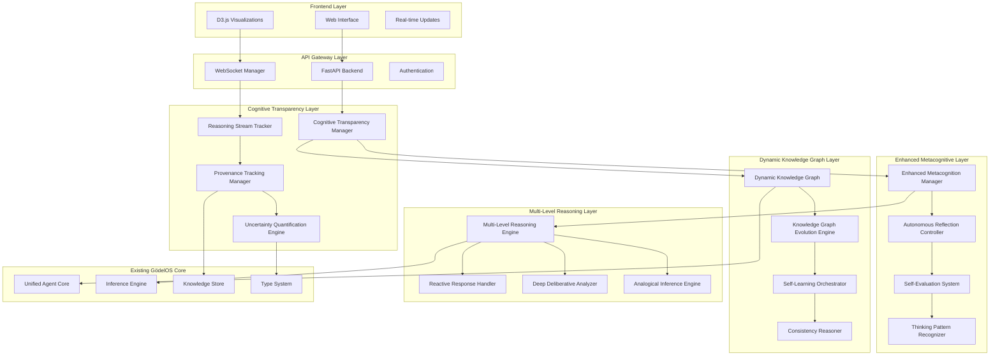
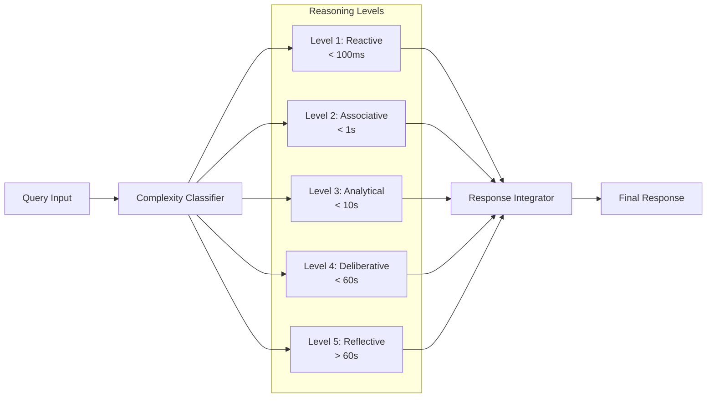
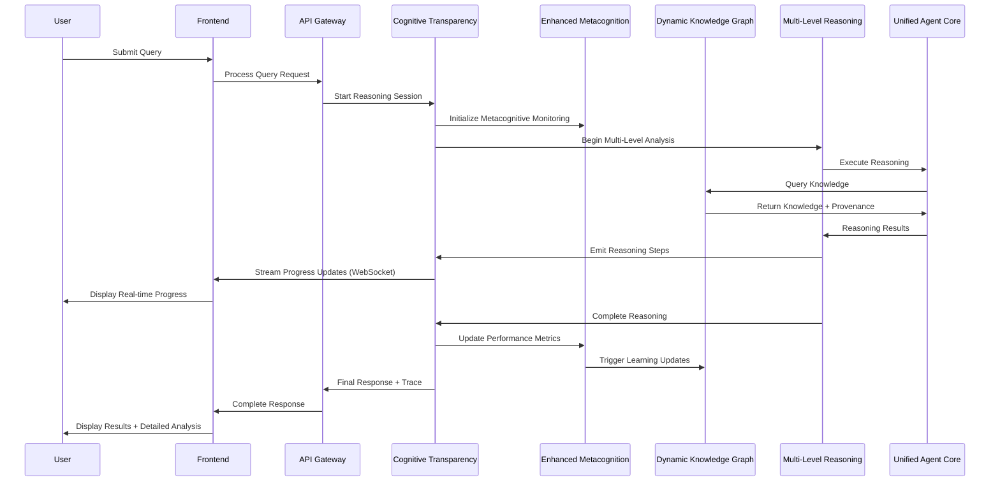

# GödelOS Cognitive Transparency & Metacognitive Architecture

## Executive Summary

This document presents a comprehensive architectural design for enhancing the GödelOS system with advanced cognitive transparency and metacognitive capabilities. The architecture builds upon the existing [`MetacognitionManager`](godelOS/metacognition/manager.py:78), [`UnifiedAgentCore`](godelOS/unified_agent_core/core.py:22), and knowledge representation systems while adding new layers for transparency, provenance tracking, and autonomous reflection.

## Table of Contents

1. [Architecture Overview](#architecture-overview)
2. [Component Specifications](#component-specifications)
3. [API Specifications](#api-specifications)
4. [Data Flow Architecture](#data-flow-architecture)
5. [Integration Plan](#integration-plan)
6. [Performance and Scalability](#performance-and-scalability)
7. [Implementation Timeline](#implementation-timeline)

## Architecture Overview

The enhanced GödelOS system introduces five new architectural layers that seamlessly integrate with existing components:



### Key Design Principles

1. **Hybrid Transparency**: Real-time high-level progress indicators combined with detailed post-completion analysis
2. **Autonomous Operation**: Fully autonomous operation with predefined safety constraints and switchable modes
3. **Hierarchical Tracking**: Detailed tracking for critical reasoning, summarized tracking for routine operations
4. **Seamless Integration**: Built on existing GödelOS components without breaking changes
5. **Human Interpretability**: All outputs designed for human understanding and interaction

## Component Specifications

### 1. Cognitive Transparency Layer

#### 1.1 Cognitive Transparency Manager

**Purpose**: Central orchestrator for exposing internal reasoning processes

**Key Features**:
- Real-time reasoning stream coordination
- Transparency level configuration (hybrid approach)
- Human-readable output generation
- Cross-component transparency orchestration

**Interface**:
```python
class CognitiveTransparencyManager:
    async def start_reasoning_session(self, session_id: str, transparency_level: TransparencyLevel)
    async def emit_reasoning_step(self, step: ReasoningStep, session_id: str)
    async def emit_decision_point(self, decision: DecisionPoint, session_id: str)
    async def complete_reasoning_session(self, session_id: str, summary: ReasoningSummary)
    async def get_reasoning_trace(self, session_id: str) -> ReasoningTrace
    async def configure_transparency_level(self, level: TransparencyLevel)
    async def get_active_sessions(self) -> List[ReasoningSession]
```

### 2. Enhanced Metacognitive Layer

#### 2.1 Enhanced Metacognition Manager

**Purpose**: Extends existing [`MetacognitionManager`](godelOS/metacognition/manager.py:78) with advanced introspection

**Key Features**:
- Autonomous/managed mode switching
- Real-time self-monitoring
- Performance pattern analysis
- Adaptive strategy selection
- Safety constraint enforcement

### 3. Dynamic Knowledge Graph Layer

#### 3.1 Dynamic Knowledge Graph

**Purpose**: Self-updating knowledge representation that evolves autonomously

**Key Features**:
- Graph-based knowledge storage extending existing [`KnowledgeStoreInterface`](godelOS/core_kr/knowledge_store/interface.py:15)
- Dynamic relationship discovery
- Concept emergence detection
- Semantic clustering and organization
- Real-time consistency maintenance

### 4. Multi-Level Reasoning Layer

#### 4.1 Multi-Level Reasoning Engine

**Purpose**: Orchestrates reasoning from reactive to deep deliberative analysis

**Key Features**:
- Reasoning level classification
- Resource allocation based on complexity
- Parallel processing coordination
- Result integration across levels
- Adaptive level selection



## API Specifications

### Cognitive Transparency APIs

```python
# Real-time reasoning stream endpoint
@app.websocket("/ws/reasoning-stream/{session_id}")
async def reasoning_stream_websocket(websocket: WebSocket, session_id: str)

# Detailed reasoning trace retrieval
@app.get("/api/reasoning-trace/{session_id}")
async def get_reasoning_trace(session_id: str) -> ReasoningTrace

# Provenance information for specific conclusions
@app.get("/api/provenance/{conclusion_id}")
async def get_provenance(conclusion_id: str) -> ProvenanceChain

# Uncertainty analysis for reasoning steps
@app.get("/api/uncertainty/{session_id}")
async def get_uncertainty_analysis(session_id: str) -> UncertaintyAnalysis
```

### Metacognitive APIs

```python
# Current metacognitive state
@app.get("/api/metacognitive-state")
async def get_metacognitive_state() -> MetacognitiveState

# Autonomous learning status and controls
@app.get("/api/autonomous-learning")
async def get_learning_status() -> AutonomousLearningStatus

@app.post("/api/autonomous-learning/mode")
async def set_learning_mode(mode: LearningMode) -> StatusResponse

# Self-evaluation reports
@app.get("/api/self-evaluation")
async def get_self_evaluation() -> SelfEvaluationReport

# Thinking pattern analysis
@app.get("/api/thinking-patterns")
async def get_thinking_patterns() -> ThinkingPatternAnalysis
```

### Knowledge Graph APIs

```python
# Dynamic knowledge graph visualization data
@app.get("/api/knowledge-graph")
async def get_knowledge_graph(filters: KnowledgeGraphFilters) -> KnowledgeGraphData

# Knowledge evolution history
@app.get("/api/knowledge-evolution/{timeframe}")
async def get_knowledge_evolution(timeframe: str) -> EvolutionHistory

# Autonomous learning objectives
@app.get("/api/learning-objectives")
async def get_learning_objectives() -> List[LearningObjective]
```

## Data Flow Architecture



## Integration Plan

### Phase 1: Core Transparency Infrastructure (Weeks 1-4)

**Objectives**:
- Implement basic cognitive transparency framework
- Extend existing metacognition system
- Create real-time streaming capabilities

**Deliverables**:
1. [`CognitiveTransparencyManager`](godelOS/cognitive_transparency/manager.py:1) - Core transparency orchestration
2. [`ReasoningStreamTracker`](godelOS/cognitive_transparency/stream_tracker.py:1) - Real-time step tracking
3. Enhanced [`MetacognitionManager`](godelOS/metacognition/manager.py:78) - Extended with transparency hooks
4. WebSocket streaming infrastructure for real-time updates
5. Basic frontend components for progress visualization

### Phase 2: Provenance and Uncertainty Systems (Weeks 5-8)

**Objectives**:
- Implement comprehensive provenance tracking
- Add uncertainty quantification capabilities
- Create rollback mechanisms

**Deliverables**:
1. [`ProvenanceTrackingManager`](godelOS/cognitive_transparency/provenance.py:1) - Complete audit trail system
2. [`UncertaintyQuantificationEngine`](godelOS/cognitive_transparency/uncertainty.py:1) - Confidence calculation and propagation
3. Rollback system with immutable audit logs
4. Provenance visualization components
5. Uncertainty visualization and explanation

### Phase 3: Enhanced Metacognitive Capabilities (Weeks 9-12)

**Objectives**:
- Implement autonomous reflection and learning
- Add self-evaluation and pattern recognition
- Create safety constraint system

**Deliverables**:
1. [`AutonomousReflectionController`](godelOS/metacognition/autonomous_reflection.py:1) - Autonomous learning coordination
2. [`SelfEvaluationSystem`](godelOS/metacognition/self_evaluation.py:1) - Performance assessment
3. [`ThinkingPatternRecognizer`](godelOS/metacognition/pattern_recognition.py:1) - Cognitive pattern analysis
4. Safety constraint system with rollback capabilities
5. Autonomous/managed mode switching interface

### Phase 4: Dynamic Knowledge Graph (Weeks 13-16)

**Objectives**:
- Implement self-updating knowledge representation
- Add autonomous learning orchestration
- Create consistency maintenance system

**Deliverables**:
1. [`DynamicKnowledgeGraph`](godelOS/knowledge_graph/dynamic_graph.py:1) - Self-evolving knowledge structure
2. [`KnowledgeGraphEvolutionEngine`](godelOS/knowledge_graph/evolution.py:1) - Autonomous knowledge updates
3. [`SelfLearningOrchestrator`](godelOS/knowledge_graph/learning_orchestrator.py:1) - Learning coordination
4. [`ConsistencyReasoner`](godelOS/knowledge_graph/consistency.py:1) - Logical consistency maintenance
5. Knowledge graph visualization components

### Phase 5: Multi-Level Reasoning Integration (Weeks 17-20)

**Objectives**:
- Implement multi-level reasoning architecture
- Create level-specific reasoning handlers
- Integrate with existing inference systems

**Deliverables**:
1. [`MultiLevelReasoningEngine`](godelOS/reasoning/multi_level_engine.py:1) - Reasoning level orchestration
2. [`ReactiveResponseHandler`](godelOS/reasoning/reactive_handler.py:1) - Fast pattern-based responses
3. [`DeepDeliberativeAnalyzer`](godelOS/reasoning/deliberative_analyzer.py:1) - Complex reasoning analysis
4. Enhanced [`AnalogicalInferenceEngine`](godelOS/reasoning/analogical_engine.py:1) - Transparent analogical reasoning
5. Reasoning level visualization and analysis tools

### Phase 6: Frontend Visualization Enhancement (Weeks 21-24)

**Objectives**:
- Implement comprehensive visualization components
- Create interactive cognitive dashboards
- Add real-time monitoring interfaces

**Deliverables**:
1. Real-time reasoning visualization components
2. Interactive knowledge graph visualization
3. Metacognitive state dashboards
4. Detailed reasoning trace viewers
5. Performance analytics and monitoring tools

## Performance and Scalability Considerations

### Real-time Processing
- Asynchronous processing for all transparency operations
- Buffered streaming to prevent UI blocking
- Configurable detail levels to manage data volume
- Efficient WebSocket connection management

### Memory Management
- Sliding window for reasoning trace storage
- Compressed provenance chain storage
- Lazy loading for detailed analysis
- Automatic cleanup of old reasoning sessions

### Scalability
- Horizontal scaling support for transparency services
- Database sharding for provenance data
- Caching layers for frequently accessed traces
- Load balancing for WebSocket connections

### Safety and Rollback Mechanisms
- Immutable provenance records
- Versioned knowledge graph snapshots
- Automated consistency checking
- Emergency rollback procedures
- Safety constraint validation before autonomous modifications

## Implementation Timeline

**Total Duration**: 24 weeks (6 months)

**Phase 1** (Weeks 1-4): Core Transparency Infrastructure
**Phase 2** (Weeks 5-8): Provenance and Uncertainty Systems
**Phase 3** (Weeks 9-12): Enhanced Metacognitive Capabilities
**Phase 4** (Weeks 13-16): Dynamic Knowledge Graph
**Phase 5** (Weeks 17-20): Multi-Level Reasoning Integration
**Phase 6** (Weeks 21-24): Frontend Visualization Enhancement

This comprehensive architecture enhances GödelOS with sophisticated cognitive transparency and metacognitive capabilities while maintaining integration with existing components and providing the flexibility to operate in both autonomous and managed modes.