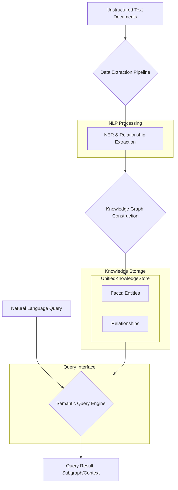

# Knowledge Pipeline Architectural Plan

## Part 1: Architectural Overview & Data Flow

The new pipeline will be a modular system integrated into the existing `godelOS` architecture. It will ingest unstructured text documents, process them using a Transformer-based NLP model to extract named entities and their relationships, and then construct a knowledge graph within the `UnifiedKnowledgeStore`. A semantic search-based query engine will allow for natural language queries against this graph. The entire process will be designed for batch processing and will include robust logging and testing.

Here is a Mermaid diagram illustrating the proposed data flow:



## Part 2: Core Component Implementation

### Step 2.1: Knowledge Store Extension

To represent the extracted relationships, we will extend the existing knowledge store interfaces.

*   **Modify `godelOS/unified_agent_core/knowledge_store/interfaces.py`:**
    *   Add `RELATIONSHIP` to the `KnowledgeType` enum.
    *   Create a new dataclass `Relationship` that inherits from `Knowledge`. It will store the source entity, target entity, and the relation type.

    ```python
    # In KnowledgeType enum
    RELATIONSHIP = "relationship"

    # New dataclass
    @dataclass
    class Relationship(Knowledge):
        """Class representing a relationship between two knowledge items."""
        type: KnowledgeType = KnowledgeType.RELATIONSHIP
        source_id: str = ""
        target_id: str = ""
        relation_type: str = ""
        content: Dict[str, Any] = field(default_factory=dict) # To store the original sentence/context
    ```

### Step 2.2: Data Extraction Pipeline

A new module, `godelOS/knowledge_extraction`, will house the core extraction logic.

*   **Create `godelOS/knowledge_extraction/pipeline.py`:**
    *   This file will contain a `DataExtractionPipeline` class responsible for orchestrating the extraction process.
*   **Create `godelOS/knowledge_extraction/nlp_processor.py`:**
    *   This file will contain an `NlpProcessor` class.
    *   **NER:** We will use a `spaCy` transformer pipeline (`en_core_web_trf`) for robust Named Entity Recognition.
    *   **Advanced Relationship Extraction:** We will use a pre-trained model from the Hugging Face Hub that is specifically fine-tuned for relation extraction (e.g., a model trained on `TACRED` or `WikiRelations`). The `NlpProcessor` will first identify entities with `spaCy`, and then for each pair of entities in a sentence, it will use the Hugging Face model to predict the relationship between them.

### Step 2.3: Knowledge Graph Construction

*   **Create `godelOS/knowledge_extraction/graph_builder.py`:**
    *   This file will contain a `KnowledgeGraphBuilder` class.
    *   This class will take the output from the `NlpProcessor` (entities and relationships).
    *   It will create `Fact` objects for each unique entity and `Relationship` objects for each identified relation.
    *   These objects will be stored in the `UnifiedKnowledgeStore`.

## Part 3: Semantic Query Engine

### Step 3.1: Vector Embeddings

*   We will use a sentence-transformer model (e.g., `all-MiniLM-L6-v2`) to generate vector embeddings for each `Fact` and `Relationship`'s content.

### Step 3.2: Vector Store Integration

*   **Recommendation:** We will use `FAISS` (Facebook AI Similarity Search) for its efficiency.
*   A new module `godelOS/semantic_search` will be created.
*   **Create `godelOS/semantic_search/vector_store.py`:** This will contain a `VectorStore` class that wraps `FAISS` and provides methods to add and search for vectors.

### Step 3.3: Natural Language Query Processor

*   **Create `godelOS/semantic_search/query_engine.py`:**
    *   This will contain a `QueryEngine` class.
    *   It will take a natural language query, generate an embedding for it, and use the `VectorStore` to find the most relevant `Fact` or `Relationship` items.
    *   It will then retrieve a subgraph from the `UnifiedKnowledgeStore` centered around the top search results.

## Part 4: Testing

*   **Unit Tests:**
    *   Create `tests/knowledge_extraction/` with tests for the `NlpProcessor` and `KnowledgeGraphBuilder`.
    *   Create `tests/semantic_search/` with tests for the `QueryEngine` and `VectorStore`.
*   **Integration Test:**
    *   Create a new test file `tests/test_knowledge_pipeline.py` to test the entire flow from text ingestion to querying.

## Part 5: Logging and Metrics

*   We will integrate logging throughout the pipeline using Python's built-in `logging` module.
*   **Key metrics to log:**
    *   `documents_processed`: Counter
    *   `entities_extracted`: Counter
    *   `relationships_extracted`: Counter
    *   `document_processing_time_seconds`: Histogram
    *   `query_latency_seconds`: Histogram