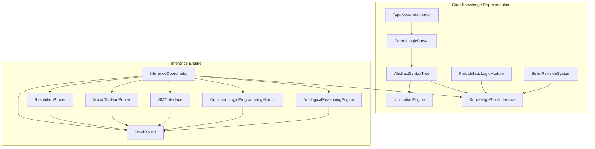
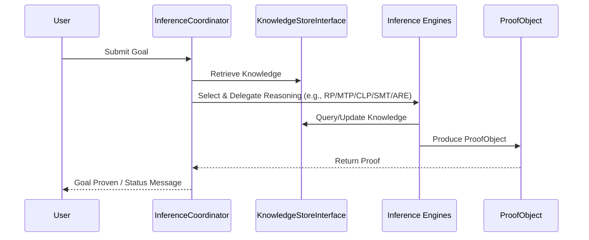

# GödelOS 🦉✨
*A Symbolic Cognition Engine for the Modern Age*

---


---

GödelOS is not just another logic engine—it's a playground for symbolic thought, knowledge representation, and automated reasoning.  
Built with a modular, extensible architecture and a passion for expressive logic, GödelOS brings higher-order logic (HOL) into the 21st century: modal, probabilistic, defeasible, and ready for the unexpected.

> **Why GödelOS?**  
> Because cognition deserves more than just neural nets. Welcome to the future of symbolic AI.

---

## 🧠 Project Overview

GödelOS is a highly modular symbolic cognition engine designed for researchers, hackers, and tinkerers who want to push the boundaries of knowledge representation and reasoning.  
At its core: Typed Higher-Order Logic (HOL) with support for modality, probability, and defeasibility.  
A multi-strategy inference engine orchestrates reasoning, always choosing the right tool for the job.

---

## 🏗️ Architecture

### 📊 GödelOS High-Level Architecture


*GödelOS is built around a modular core KR system, with an extensible inference engine orchestrating multiple reasoning strategies.*

---

### 📚 Module 1: Core Knowledge Representation (KR) System

The *heart* of GödelOS. Responsible for representing, storing, and managing all forms of knowledge.  
Defines the agent's internal language and provides foundational operations for knowledge manipulation.

#### Components
- 📝 **FormalLogicParser**: Translates logic text into canonical ASTs.
- 🌳 **AbstractSyntaxTree (AST)**: Represents logical expressions structurally.
- 🧩 **UnificationEngine**: Makes logical expressions fit together via variable substitution.
- 🏷️ **TypeSystemManager**: Handles type hierarchies, checking, and inference.
- 📦 **KnowledgeStoreInterface (KSI)**: Unified API for storing and retrieving knowledge.
- 🎲 **ProbabilisticLogicModule (PLM)**: Manages and reasons with uncertainty.
- 🔄 **BeliefRevisionSystem (BRS)**: Keeps beliefs rational and consistent as knowledge evolves.

---

### 🤖 Module 2: Inference Engine Architecture

Handles all deductive reasoning.  
Takes goals, applies rules, and leverages multiple reasoning strategies.

#### Components
- 🧑‍💼 **InferenceCoordinator**: Task dispatcher and proof search manager.
- 📄 **ProofObject**: Standardized proof representation.
- 🔍 **ResolutionProver**: Classic FOL/propositional resolution.
- 🪞 **ModalTableauProver**: Modal logic satisfiability and validity.
- 🛠️ **SMTInterface**: Connects to external SMT solvers for arithmetic, arrays, etc.
- 🧮 **ConstraintLogicProgrammingModule (CLP)**: Logic + constraint satisfaction.
- 🪐 **AnalogicalReasoningEngine (ARE)**: Finds deep structural analogies.

---

### 🔄 Inference Flow


*From user query to proof: GödelOS coordinates knowledge, inference, and results with clarity and rigor.*

---

## 🚀 Installation

```bash
# Clone the repository
git clone https://github.com/Steake/GodelOS.git
cd GodelOS

# Create and activate a virtual environment
python -m venv venv
source venv/bin/activate  # On Windows: venv\Scripts\activate

# Install the package in development mode
pip install -e .
```

---

## 🛠️ Usage

Here are some ways to get started with GödelOS:

### 📖 Core Knowledge Representation Example

```python
from godelOS.core_kr.formal_logic_parser import parser
from godelOS.core_kr.type_system import manager

# Initialize the type system
type_system = manager.TypeSystemManager()

# Parse a logical formula
formula_str = "forall ?x. (Human(?x) -> Mortal(?x))"
parser_instance = parser.FormalLogicParser(type_system)
ast_node, errors = parser_instance.parse(formula_str)

if not errors:
    print(f"Successfully parsed: {formula_str}")
else:
    print(f"Parsing errors: {errors}")
```

### 🧠 Inference Engine Example

```python
from godelOS.inference_engine.coordinator import InferenceCoordinator
from godelOS.core_kr.formal_logic_parser import parser
from godelOS.core_kr.knowledge_store import interface

# Initialize components
kr_interface = interface.KnowledgeStoreInterface()
coordinator = InferenceCoordinator(kr_interface)

# Add knowledge to the knowledge store
kr_interface.add_statement(parser.parse("Human(Socrates)")[0])
kr_interface.add_statement(parser.parse("forall ?x. (Human(?x) -> Mortal(?x))")[0])

# Create a goal
goal = parser.parse("Mortal(Socrates)")[0]

# Submit the goal to the inference coordinator
proof_result = coordinator.submit_goal(goal)

if proof_result.goal_achieved:
    print("Goal proven successfully!")
    print(f"Proof steps: {proof_result.proof_steps}")
else:
    print(f"Failed to prove goal: {proof_result.status_message}")
```

For more detailed examples, check the [`examples/`](examples/) directory:
- `simple_example.py`: Basic usage of the core components
- `core_kr_example.py`: Detailed knowledge representation
- `inference_engine_example.py`: Advanced inference

---

## 🧑‍💻 Development

### ⚙️ Setup

```bash
# Clone the repository
git clone https://github.com/Steake/GodelOS.git
cd GodelOS

# Create and activate a virtual environment
python -m venv venv
source venv/bin/activate  # On Windows: venv\Scripts\activate

# Install development dependencies
pip install -e ".[dev]"
```

---

### 🧪 Testing

GödelOS is built with reliability in mind. The project includes:
- 🧹 **Enhanced Test Suite**: Comprehensive, modular tests for all components
- 🎨 **Test Suite Runner**: Visually appealing output, easy to extend
- 📊 **Coverage Tools**: Analyze coverage at the component and method level

#### Running Basic Tests

```bash
# Run all tests
pytest

# Run enhanced tests with detailed reporting
python run_enhanced_tests.py

# Run tests for a specific module
pytest tests/metacognition/

# Run tests with coverage analysis
./run_test_coverage_analysis.sh
```

#### Test Documentation

See:
- [`TEST_COVERAGE.md`](TEST_COVERAGE.md): Full coverage documentation
- [`TEST_QUICKREF.md`](TEST_QUICKREF.md): Quick reference for testing tasks

These guides will help you write new tests, maintain high coverage, and optimize performance.

---

### 🗂️ Project Structure

```
GodelOS/
├── core_kr/                  # Core Knowledge Representation System
│   ├── ast/                  # Abstract Syntax Tree representation
│   ├── belief_revision/      # Belief Revision System
│   ├── formal_logic_parser/  # Parser for logical formulas
│   ├── knowledge_store/      # Knowledge storage interface
│   ├── probabilistic_logic/  # Probabilistic logic module
│   ├── type_system/          # Type system manager
│   └── unification_engine/   # Unification engine
├── inference_engine/         # Inference Engine Architecture
│   ├── analogical_reasoning_engine.py
│   ├── base_prover.py
│   ├── clp_module.py
│   ├── coordinator.py
│   ├── modal_tableau_prover.py
│   ├── proof_object.py
│   ├── resolution_prover.py
│   └── smt_interface.py
├── examples/                 # Usage examples
└── tests/                    # Test suite
```

---

## 📄 License

[MIT License](LICENSE)

---

## 🤝 Contributing

Pull requests, issues, and discussions are welcome!  
See [`CONTRIBUTING.md`](CONTRIBUTING.md) for guidelines.

---

## 🛣️ Roadmap

For upcoming features and ideas, see [`TODO.md`](TODO.md).

---

> **GödelOS**: Where logic meets possibility.  
> *Let’s build symbolic cognition for the next generation.* 🚀🦉

---

<sub>Maintained by [@Steake](https://github.com/Steake)</sub>