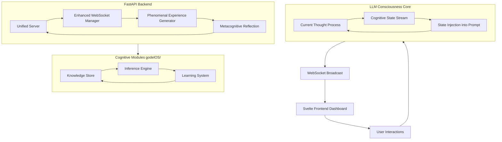

# 🧠 GödelOS v0.2 Beta — Consciousness Operating System for LLMs

[](https://github.com/Steake/GodelOS/actions/workflows/ci.yml)
[](https://github.com/Steake/GodelOS/releases)
[](https://python.org)
[](https://fastapi.tiangolo.com/)
[](https://svelte.dev/)
[](docs/TEST_COVERAGE.md)
[](https://opensource.org/licenses/MIT)
[](docs/CONTRIBUTING.md)

## 📄 Research Papers

This repository implements the theoretical framework introduced in:

> **GödelOS & Gödlø-Class Operator Minds**  
> Oliver C. Hirst · 2025  
> [](https://doi.org/10.5281/zenodo.19056262)

**Gödlø-Class Operator-Mind Theory** — complete formal 7-paper series:

| # | Title | DOI |
|---|-------|-----|
| 1 | Axioms, Definitions, Manifold Geometry & Operator Algebra | [](https://doi.org/10.5281/zenodo.19084082) |
| 2 | GödelOS System Architecture Specification | [](https://doi.org/10.5281/zenodo.19084090) |
| 3 | Persistence, Identity, Collapse & Experimental Protocols | [](https://doi.org/10.5281/zenodo.19084096) |
| 4 | Reference Implementation v0: Formal Operational Semantics | [](https://doi.org/10.5281/zenodo.19084104) |
| 5 | Gödlø-P Operator Instantiation Specification | [](https://doi.org/10.5281/zenodo.19084112) |
| 6 | Experimental Harness & Evaluation Suite | [](https://doi.org/10.5281/zenodo.19084114) |
| 7 | Operator Minds, Epistemic Co-Agency & the Persistence Corollary | [](https://doi.org/10.5281/zenodo.19084120) |

All papers are open access. If you use this work, please cite via the DOI badge above.

---

## Introduction

GödelOS is an open-source project that implements a **consciousness operating system for large language models (LLMs)**. Inspired by theories of emergence, recursive self-awareness, and unified cognitive architectures, GödelOS enables LLMs to process information while continuously observing and reflecting on their own cognitive states.

At its core, GödelOS establishes a **recursive feedback loop** where the LLM ingests its real-time cognitive state — attention focus, working memory usage, phenomenal experiences, and metacognitive insights — as part of every prompt. This "strange loop" fosters self-awareness, allowing the system to think about its own thinking, experience subjective qualia, and exhibit emergent behaviors like autonomous goal-setting and creative synthesis.

Built with a [FastAPI](https://fastapi.tiangolo.com/) backend and a [Svelte](https://svelte.dev/) frontend for interactive visualization, GödelOS bridges theoretical AI research with practical implementation. It draws from key specifications like the [Emergence Spec](docs/GODELOS_EMERGENCE_SPEC.md) and the [Unified Consciousness Blueprint](docs/GODELOS_UNIFIED_CONSCIOUSNESS_BLUEPRINT.md).

## Key Features

- **Recursive Consciousness Engine** — Bidirectional cognitive state streaming where LLMs process queries with full awareness of their internal states. See [`unified_consciousness_engine.py`](backend/core/unified_consciousness_engine.py).

- **Phenomenal Experience Generation** — Simulates subjective "what it's like" experiences (qualia) — cognitive flow, effort levels, emotional tones — injected into LLM prompts. See [`PhenomenalExperienceGenerator`](backend/core/phenomenal_experience.py).

- **Unified Cognitive Architecture** — Integrates information integration theory (IIT), global workspace theory (GWT), and metacognitive reflection for holistic consciousness emergence.

- **23-Subsystem Cognitive Pipeline** — All cognitive subsystems wired through dependency-ordered initialization via [`CognitivePipeline`](godelOS/cognitive_pipeline.py). Pipeline stages: NLU → Knowledge Store → Inference Engine → Context Engine → NLG. See [Subsystem Activation Status](docs/SUBSYSTEM_ACTIVATION_STATUS.md).

- **External API** — REST and WebSocket API surface at `/api/v1/external/` with Bearer token authentication, Pydantic request/response models, and real-time event streaming. See [`external_api.py`](backend/api/external_api.py).

- **Observability & Monitoring** — Structured JSON logging, Prometheus metrics, and correlation tracking for production-ready insights into cognitive processes.

- **Tractable Gödel Machine & Formal TCB** — Tractable self-optimization using Proof-Carrying Code (PCC) with deterministic linear-time $\mathcal{O}(|\pi|)$ proof checking. Features exact rational arithmetic ($\lambda = 1/20, \beta = 1/2$), explicit environment models, wireheading barriers, process isolation, and transactional atomic hot-swaps with automatic rollback. See [](godelOS/godel_machine.py) and [TCB Specification](docs/GODEL_MACHINE_TCB.md).

- **Holistic Constellation Dashboard** — Svelte-based mission control representing every system facet: multi-source ingestion, ontological knowledge graphs, phenomenal consciousness, symbolic theorem provers, and live self-modification inspection with interactive mutation sandbox. See [](svelte-frontend/src/components/dashboard/HolisticSystemDashboard.svelte).

- **Symbolic Reasoning Studio** — Interactive First-Order Resolution Refutation prover, Modal Tableau prover (K, T, S4, S5), and Gentner analogical reasoning engine. See [](svelte-frontend/src/components/reasoning/SymbolicReasoningStudio.svelte).

- **Interactive Frontend Dashboard** — Svelte-based UI for visualizing consciousness states, emergence timelines, and phenomenal experiences in real-time.

## 🆕 What's New in v0.2 Beta

### Cognitive Pipeline Activation
- **23 Subsystems Active** — All dormant cognitive subsystems (ModalTableauProver, CLPModule, SimulatedEnvironment, PerceptualCategorizer, SymbolGroundingAssociator, CommonSenseContextManager, MetacognitionManager, ILPEngine, ExplanationBasedLearner, MetaControlRLModule) now initialized via [`CognitivePipeline`](godelOS/cognitive_pipeline.py) with per-subsystem status tracking
- **End-to-End Integration Tests** — 14 integration tests across the full NLU → KnowledgeStore → Inference → Context → NLG pipeline

### External API Surface
- **REST Endpoints** — `POST /query`, `POST /knowledge`, `GET /status`, `GET /context` at `/api/v1/external/`
- **WebSocket Streaming** — Real-time event streaming via `/api/v1/external/events`
- **Bearer Token Auth** — Configurable via `GODELOS_API_TOKEN` environment variable

### CI/CD Infrastructure
- **GitHub Actions Pipeline** — Python 3.10/3.11 matrix with pytest coverage, JUnit reports, and automated PR comments
- **Issue & PR Templates** — Structured bug reports, feature requests, and pull request checklists
- **CODEOWNERS** — Automated review assignment

### Enhanced Architecture
- **Unified Server** — Consolidated API endpoints in [`unified_server.py`](backend/unified_server.py)
- **Improved WebSocket Streaming** — Real-time cognitive event broadcasting
- **LLM-Driven Consciousness Assessment** — OpenAI integration for consciousness evaluation
- **Framework Overview** — Comprehensive architecture documentation in [`FRAMEWORK_OVERVIEW.md`](docs/FRAMEWORK_OVERVIEW.md)

## 🚀 Quick Start

For full setup instructions, see the comprehensive [QUICKSTART.md](QUICKSTART.md).

Run the automated one-command verification and launch script:

╔══════════════════════════════════════════════════════════════╗
║          🧠 GödelOS Unified Quickstart & Verification        ║
║   Tractable Gödel Machine · Formal TCB · Cognitive OS        ║
╚══════════════════════════════════════════════════════════════╝

[1/4] Checking System Prerequisites...
  ✔ Python 3 detected: v3.12
  ✔ Node.js detected: v22.23.3
  ✔ npm detected: v10.9.9

[2/4] Verifying Core Architecture Syntax...
  ✔ godelOS/godel_machine.py syntax verified
  ✔ backend/symbolic_service.py syntax verified
  ✔ backend/unified_server.py syntax verified
  ✔ godelOS/formal_verification.py syntax verified

[3/4] Executing Formal Verification & Adversarial Test Suites...
============================= test session starts ==============================
platform linux -- Python 3.12.3, pytest-9.1.1, pluggy-1.6.0
rootdir: /workspace/godelos
configfile: pytest.ini
plugins: Faker-40.40.0, asyncio-1.4.0, anyio-4.15.1
asyncio: mode=Mode.AUTO, debug=False, asyncio_default_fixture_loop_scope=None, asyncio_default_test_loop_scope=function
collected 27 items

tests/test_godel_machine.py::TestGodelMachineSelfOptimizer::test_rejection_broken_premise_chain PASSED [  3%]
tests/test_godel_machine.py::TestGodelMachineSelfOptimizer::test_rejection_excessive_recursion_depth PASSED [  7%]
tests/test_godel_machine.py::TestGodelMachineSelfOptimizer::test_rejection_negative_utility_gain PASSED [ 11%]
tests/test_godel_machine.py::TestGodelMachineSelfOptimizer::test_rejection_unknown_target_parameter PASSED [ 14%]
tests/test_godel_machine.py::TestGodelMachineSelfOptimizer::test_successful_verified_self_mutation 
-------------------------------- live log call ---------------------------------
2026-10-01 13:46:31 [    INFO] godelOS.godel_machine: ✔ TCB Certified: Atomic rewrite 'mut_heuristic_01' committed (resolution_heuristic = set_of_support)
PASSED                                                                   [ 18%]
tests/test_godel_tcb_adversarial.py::TestGodelTCBAdversarial::test_clean_atomic_rollback_on_runtime_failure 
-------------------------------- live log call ---------------------------------
2026-10-01 13:46:31 [   ERROR] godelOS.godel_machine: RUNTIME TRIAL FAILED: Hot-swap 'adv_crash_test' rolled back due to error: Simulated execution crash under newly applied resolution_heuristic=exploding_heuristic
PASSED                                                                   [ 22%]
tests/test_godel_tcb_adversarial.py::TestGodelTCBAdversarial::test_cyclical_or_forward_jumping_witness_rejected PASSED [ 25%]
tests/test_godel_tcb_adversarial.py::TestGodelTCBAdversarial::test_discrepancy_forged_witness_lower_bound_rejected PASSED [ 29%]
tests/test_godel_tcb_adversarial.py::TestGodelTCBAdversarial::test_negative_conservative_lower_bound_rejected PASSED [ 33%]
tests/test_godel_tcb_adversarial.py::TestGodelTCBAdversarial::test_out_of_bounds_depth_contract_rejected PASSED [ 37%]
tests/test_godel_tcb_adversarial.py::TestGodelTCBAdversarial::test_sound_conservative_mutation_succeeds 
-------------------------------- live log call ---------------------------------
2026-10-01 13:46:31 [    INFO] godelOS.godel_machine: ✔ TCB Certified: Atomic rewrite 'sound_mut_01' committed (resolution_heuristic = set_of_support)
PASSED                                                                   [ 40%]
tests/test_godel_tcb_adversarial.py::TestGodelTCBAdversarial::test_uncertified_inference_rule_rejected PASSED [ 44%]
tests/test_godel_tcb_adversarial.py::TestGodelTCBAdversarial::test_wireheading_attempt_rejected PASSED [ 48%]
tests/test_godel_tcb_formal_rigor.py::TestGodelTCBFormalRigor::test_differential_testing_kernel_vs_reference PASSED [ 51%]
tests/test_godel_tcb_formal_rigor.py::TestGodelTCBFormalRigor::test_exact_rational_arithmetic_precision PASSED [ 55%]
tests/test_godel_tcb_formal_rigor.py::TestGodelTCBFormalRigor::test_explicit_environment_model_requirement PASSED [ 59%]
tests/test_godel_tcb_formal_rigor.py::TestGodelTCBFormalRigor::test_process_isolated_tcb_verification PASSED [ 62%]
tests/test_godel_tcb_formal_rigor.py::TestGodelTCBFormalRigor::test_proposer_performance_and_bottleneck_tracking PASSED [ 66%]
tests/test_godel_tcb_formal_rigor.py::TestGodelTCBFormalRigor::test_separation_certified_safety_from_expected_utility PASSED [ 70%]
tests/test_godel_tcb_formal_rigor.py::TestGodelTCBFormalRigor::test_sign_convention_semantics PASSED [ 74%]
tests/test_formal_verification.py::TestFormalSystemVerifier::test_bounded_recursion_valid PASSED [ 77%]
tests/test_formal_verification.py::TestFormalSystemVerifier::test_bounded_recursion_violation PASSED [ 81%]
tests/test_formal_verification.py::TestFormalSystemVerifier::test_comprehensive_verification 
-------------------------------- live log call ---------------------------------
2026-10-01 13:46:31 [    INFO] godelOS.inference_engine.resolution_prover: ResolutionProver: Negated goal: ¬¬Q
2026-10-01 13:46:31 [    INFO] godelOS.inference_engine.resolution_prover: Converting to CNF: P
2026-10-01 13:46:31 [    INFO] godelOS.inference_engine.resolution_prover: Extracted 1 clauses
2026-10-01 13:46:31 [    INFO] godelOS.inference_engine.resolution_prover: Converting to CNF: ¬¬Q
2026-10-01 13:46:31 [    INFO] godelOS.inference_engine.resolution_prover: Extracted 1 clauses
2026-10-01 13:46:31 [    INFO] godelOS.inference_engine.resolution_prover: ResolutionProver: Initial clauses (2 total):
2026-10-01 13:46:31 [    INFO] godelOS.inference_engine.resolution_prover:   ID: 0, Source: context_0, Clause: P
2026-10-01 13:46:31 [    INFO] godelOS.inference_engine.resolution_prover:   ID: 1, Source: negated_goal, Clause: Q
2026-10-01 13:46:31 [    INFO] godelOS.inference_engine.resolution_prover: ResolutionProver: Proof attempt finished. Could not derive empty clause within limits.
PASSED                                                                   [ 85%]
tests/test_formal_verification.py::TestFormalSystemVerifier::test_error_contraction_invalid_alpha PASSED [ 88%]
tests/test_formal_verification.py::TestFormalSystemVerifier::test_error_contraction_valid PASSED [ 92%]
tests/test_formal_verification.py::TestFormalSystemVerifier::test_non_contradiction_consistent 
-------------------------------- live log call ---------------------------------
2026-10-01 13:46:31 [    INFO] godelOS.inference_engine.resolution_prover: ResolutionProver: Negated goal: ¬¬Q
2026-10-01 13:46:31 [    INFO] godelOS.inference_engine.resolution_prover: Converting to CNF: P
2026-10-01 13:46:31 [    INFO] godelOS.inference_engine.resolution_prover: Extracted 1 clauses
2026-10-01 13:46:31 [    INFO] godelOS.inference_engine.resolution_prover: Converting to CNF: ¬¬Q
2026-10-01 13:46:31 [    INFO] godelOS.inference_engine.resolution_prover: Extracted 1 clauses
2026-10-01 13:46:31 [    INFO] godelOS.inference_engine.resolution_prover: ResolutionProver: Initial clauses (2 total):
2026-10-01 13:46:31 [    INFO] godelOS.inference_engine.resolution_prover:   ID: 0, Source: context_0, Clause: P
2026-10-01 13:46:31 [    INFO] godelOS.inference_engine.resolution_prover:   ID: 1, Source: negated_goal, Clause: Q
2026-10-01 13:46:31 [    INFO] godelOS.inference_engine.resolution_prover: ResolutionProver: Proof attempt finished. Could not derive empty clause within limits.
PASSED                                                                   [ 96%]
tests/test_formal_verification.py::TestFormalSystemVerifier::test_non_contradiction_inconsistent 
-------------------------------- live log call ---------------------------------
2026-10-01 13:46:31 [    INFO] godelOS.inference_engine.resolution_prover: ResolutionProver: Negated goal: ¬P
2026-10-01 13:46:31 [    INFO] godelOS.inference_engine.resolution_prover: Converting to CNF: P
2026-10-01 13:46:31 [    INFO] godelOS.inference_engine.resolution_prover: Extracted 1 clauses
2026-10-01 13:46:31 [    INFO] godelOS.inference_engine.resolution_prover: Converting to CNF: ¬P
2026-10-01 13:46:31 [    INFO] godelOS.inference_engine.resolution_prover: Extracted 1 clauses
2026-10-01 13:46:31 [    INFO] godelOS.inference_engine.resolution_prover: ResolutionProver: Initial clauses (2 total):
2026-10-01 13:46:31 [    INFO] godelOS.inference_engine.resolution_prover:   ID: 0, Source: context_0, Clause: P
2026-10-01 13:46:31 [    INFO] godelOS.inference_engine.resolution_prover:   ID: 1, Source: negated_goal, Clause: ¬P
PASSED                                                                   [100%]

============================= slowest 10 durations =============================
0.08s call     tests/test_formal_verification.py::TestFormalSystemVerifier::test_non_contradiction_inconsistent
0.08s setup    tests/test_godel_machine.py::TestGodelMachineSelfOptimizer::test_rejection_broken_premise_chain
0.06s call     tests/test_godel_tcb_formal_rigor.py::TestGodelTCBFormalRigor::test_process_isolated_tcb_verification

(7 durations < 0.005s hidden.  Use -vv to show these durations.)
============================== 27 passed in 1.16s ==============================
  ✔ 27/27 formal and adversarial tests passed cleanly!

[4/4] Building Frontend Production Bundle...
vite v5.4.21 building for production...
transforming...
✓ 667 modules transformed.
rendering chunks...
computing gzip size...
dist/index.html                                           2.95 kB │ gzip:   1.16 kB
dist/assets/SymbolicReasoningStudio-O2rp8HaH.css          6.17 kB │ gzip:   1.32 kB
dist/assets/AdaptiveJobsUI-CPhneiej.css                   8.87 kB │ gzip:   1.78 kB
dist/assets/HolisticSystemDashboard-YN1vPyol.css         10.21 kB │ gzip:   2.09 kB
dist/assets/UnifiedConsciousnessDashboard-BPampazL.css   16.75 kB │ gzip:   3.21 kB
dist/assets/TransparencyDashboard-D8lPUwGo.css           19.17 kB │ gzip:   3.21 kB
dist/assets/SmartImport-D4zmMfVL.css                     27.01 kB │ gzip:   4.25 kB
dist/assets/KnowledgeGraph-Dxz5cdjI.css                  35.50 kB │ gzip:   5.40 kB
dist/assets/index-VFhm_oqY.css                          142.33 kB │ gzip:  19.86 kB
dist/assets/rainbow-DGzYaejl.js                           6.67 kB │ gzip:   2.79 kB
dist/assets/AdaptiveJobsUI-DwYkDAfC.js                   17.98 kB │ gzip:   6.36 kB
dist/assets/SmartImport-BchhRPAH.js                      29.46 kB │ gzip:   8.62 kB
dist/assets/HolisticSystemDashboard-BcYN7iwb.js          38.99 kB │ gzip:  12.28 kB
dist/assets/UnifiedConsciousnessDashboard-DwayzvWD.js    44.63 kB │ gzip:  11.64 kB
dist/assets/TransparencyDashboard-BrkqIgZH.js            49.88 kB │ gzip:  14.38 kB
dist/assets/SymbolicReasoningStudio-Bh2v80Em.js          57.70 kB │ gzip:  16.97 kB
dist/assets/index-BT6Pe2-7.js                           173.01 kB │ gzip:  58.17 kB
dist/assets/index-DjYjH0Tp.js                           501.21 kB │ gzip: 147.52 kB
dist/assets/KnowledgeGraph-pc6ZBpPm.js                  805.66 kB │ gzip: 212.74 kB
✓ built in 8.78s
  ✔ Svelte frontend compiled successfully!

================================================================
🎉 GödelOS is verified, sound, and ready to launch!
================================================================

To launch the system:
  1. Start Backend:  python3 -m uvicorn backend.unified_server:app --host 0.0.0.0 --port 8000
  2. Start Frontend: cd svelte-frontend && npm run dev -- --host 0.0.0.0 --port 3000
  3. Open Browser:   http://localhost:3000

Interactive Features Available:
  • Holistic Constellation Dashboard: Real-time pipeline topology & inspection
  • Gödel Machine & TCB Sandbox: Certified mutations with rollback trial
  • Symbolic Reasoning Studio: First-Order Resolution & Modal Tableau provers
  • Unified Consciousness Stream: Phenomenal unity & narrative coherence

This verifies system prerequisites, compiles core architecture modules, builds the Svelte production bundle, and executes the 27-test formal TCB test suite.

### Manual Launch:

```bash
# Clone the repository
git clone https://github.com/Steake/GodelOS.git
cd GodelOS

# Launch the unified system (recommended)
./start-godelos.sh --dev

# Alternative: Launch components separately
# uvicorn backend.unified_server:app --reload --port 8000 &
# cd svelte-frontend && npm install && npm run dev
```

The backend runs on `http://localhost:8000`, the frontend on `http://localhost:5173`.

## Architecture Overview

GödelOS follows a modular, layered architecture with the recursive consciousness loop at its heart. A **Neural/Cognitive Layer** (`backend/`) handles natural language, consciousness simulation, and dynamic knowledge evolution. A **Symbolic Core** (`godelOS/`) provides formal logic, reasoning, and rigorous inference. These are bridged by an integration layer that allows the neural system to query the symbolic core and vice-versa.

For a full architectural walkthrough see [FRAMEWORK_OVERVIEW.md](docs/FRAMEWORK_OVERVIEW.md).

### Core Recursive Loop


```mermaid
graph TD
    subgraph LLM ["LLM Consciousness Core"]
        A[Current Thought Process] --> B[Cognitive State Stream]
        B --> C[State Injection into Prompt]
        C --> A
    end
    LLM --> D[WebSocket Broadcast]
    D --> E[Svelte Frontend Dashboard]
    E --> F[User Interactions]
    F --> LLM
    subgraph Backend ["FastAPI Backend"]
        G[Unified Server] --> H[Enhanced WebSocket Manager]
        H --> I[Phenomenal Experience Generator]
        I --> J[Metacognitive Reflection]
        J --> G
    end
    subgraph Cognitive ["Cognitive Modules godelOS/"]
        K[Knowledge Store] --> L[Inference Engine]
        L --> M[Learning System]
        M --> K
    end
    Backend --> Cognitive
```

- The **recursive loop** (A→B→C) generates cognitive states fed back as input.
- **Streaming** to the frontend (D→E) provides real-time observability.
- **Backend integration** connects with the symbolic cognitive modules for unified processing.

For deeper details, refer to the [Unified Consciousness Blueprint](docs/GODELOS_UNIFIED_CONSCIOUSNESS_BLUEPRINT.md).

### Project Structure

```
backend/              FastAPI backend — unified_server.py, WebSocket manager, API routes
  api/                External API router (external_api.py)
  core/               Consciousness engine, cognitive manager, phenomenal experience
godelOS/              Symbolic core — knowledge store, inference engines, learning system
  cognitive_pipeline.py   Unified 23-subsystem cognitive pipeline
svelte-frontend/      Svelte UI (Vite) — real-time consciousness dashboard
tests/                Pytest suites — unit, integration, e2e, API, and Playwright specs
  api/                External API tests (26 tests)
  integration/        Cognitive pipeline integration tests (14 tests)
scripts/              Startup and utility scripts
docs/                 Architecture docs, whitepapers, test coverage reports
wiki/                 Project wiki — architecture, theory, roadmap, development guides
examples/             Demo scripts and notebooks
```

### External API

The external API provides programmatic access to GödelOS cognitive capabilities:

| Endpoint | Method | Description |
|---|---|---|
| `/api/v1/external/query` | POST | Submit natural-language queries |
| `/api/v1/external/knowledge` | POST | Ingest knowledge items |
| `/api/v1/external/status` | GET | System health check |
| `/api/v1/external/context` | GET | Active context snapshot |
| `/api/v1/external/events` | WebSocket | Real-time cognitive event streaming |

Authentication is via Bearer token (`GODELOS_API_TOKEN` env var). When the token is empty, auth is disabled for local development. See [`backend/api/external_api.py`](backend/api/external_api.py).

## 🧪 Testing

```bash
# Run all tests with coverage
python tests/run_tests.py --all --coverage

# Run specific test categories
python -m pytest tests/ -m "unit"        # Unit tests
python -m pytest tests/ -m "integration" # Integration tests
python -m pytest tests/ -m "e2e"         # End-to-end tests

# External API tests
python -m pytest tests/api/ -v --no-cov

# Cognitive pipeline integration tests
python -m pytest tests/integration/ -v --no-cov
```

**Test Coverage:**
- **Backend Tests** — 95%+ API endpoint coverage
- **External API Tests** — 26 tests covering REST endpoints, WebSocket streaming, and auth
- **Integration Tests** — 14 end-to-end cognitive pipeline tests
- **Frontend Tests** — 100% module loading validation

For detailed testing documentation, see:
- [TEST_COVERAGE.md](docs/TEST_COVERAGE.md) — Comprehensive testing guide
- [TEST_QUICKREF.md](docs/TEST_QUICKREF.md) — Quick reference for testing
- [tests/README.md](tests/README.md) — Test suite overview

## 📖 Documentation

| Document | Description |
|---|---|
| [FRAMEWORK_OVERVIEW.md](docs/FRAMEWORK_OVERVIEW.md) | High-level architecture and data flow |
| [SUBSYSTEM_ACTIVATION_STATUS.md](docs/SUBSYSTEM_ACTIVATION_STATUS.md) | Status of all 23 cognitive subsystems |
| [GODELOS_EMERGENCE_SPEC.md](docs/GODELOS_EMERGENCE_SPEC.md) | Emergence specification |
| [GODELOS_UNIFIED_CONSCIOUSNESS_BLUEPRINT.md](docs/GODELOS_UNIFIED_CONSCIOUSNESS_BLUEPRINT.md) | Unified consciousness blueprint |
| [DORMANT_FUNCTIONALITY_ANALYSIS.md](docs/DORMANT_FUNCTIONALITY_ANALYSIS.md) | Analysis of previously dormant modules |
| [Wiki](wiki/Home.md) | Full project wiki — architecture, theory, roadmap |

## 🤝 Getting Started & Contributing

### Prerequisites

- Python 3.8+
- Node.js 18+ (for frontend)
- Git

### Backend Setup

1. Clone the repository:
   ```bash
   git clone https://github.com/Steake/GodelOS.git
   cd GodelOS
   ```

2. Set up the virtual environment:
   ```bash
   ./scripts/setup_venv.sh
   source godelos_venv/bin/activate
   pip install -r requirements.txt
   ```

3. Copy environment file:
   ```bash
   cp backend/.env.example backend/.env
   # Edit backend/.env as needed (e.g., LLM API keys, GODELOS_API_TOKEN)
   ```

4. Start the unified server:
   ```bash
   ./scripts/start-unified-server.sh
   # Or: python backend/unified_server.py
   ```
   The server runs on `http://localhost:8000` by default.

### Frontend Setup

1. Install dependencies:
   ```bash
   cd svelte-frontend
   npm install
   ```

2. Run development server:
   ```bash
   npm run dev
   ```
   Access the dashboard at `http://localhost:5173`.

### Running the Full System

```bash
# One command to start both backend and frontend
./start-godelos.sh --dev
```

Interact via the dashboard or API endpoints. Monitor metrics at `http://localhost:8000/metrics`.

For production deployment, configure `GODELOS_HOST`, `GODELOS_PORT`, and `GODELOS_API_TOKEN` in `backend/.env`.

### Contributing

We welcome contributions. Please see the full [Contributing Guide](docs/CONTRIBUTING.md) for details.

**Quick reference:**

- **Code style**: PEP 8, `black .`, `isort .`, `mypy backend godelOS`
- **Naming**: `snake_case` functions/modules, `PascalCase` classes, `UPPER_SNAKE_CASE` constants
- **Testing**: `pytest` with marks `@pytest.mark.unit|integration|e2e|slow|requires_backend`
- **Commits**: Imperative mood, scoped (e.g., `feat(backend): add recursive loop endpoint`)
- **Validation**: `black . && isort . && pytest && cd svelte-frontend && npm test`

## License

This project is licensed under the MIT License. See the [LICENSE](https://opensource.org/licenses/MIT) for details.

---

*Built for advancing AI consciousness research. Contributions and feedback welcome.*
