# 🧠 GödelOS

> *"What if AI could think out loud?"*

[](https://github.com/yourusername/godelos)
[](https://python.org)
[](tests/)
[](LICENSE)
[](CONTRIBUTING.md)

**A consciousness-like AI architecture that streams its thoughts in real-time.**

GödelOS isn't just another AI system—it's a **transparent cognitive architecture** that lets you watch an artificial mind think, reason, and evolve. Built on principles from cognitive science and consciousness research, it demonstrates emergent behaviors that blur the line between artificial and authentic intelligence.

## ✨ What Makes This Special

🧪 **Live Cognitive Streaming** — Watch AI thoughts unfold in real-time  
🎯 **Emergent Self-Awareness** — System develops understanding of its own processes  
🔄 **Meta-Cognitive Loops** — Thinking about thinking, recursively  
🌐 **Knowledge Graph Evolution** — Dynamic relationship mapping  
🤖 **Autonomous Learning** — Self-directed knowledge acquisition  
📊 **Consciousness Metrics** — Quantifiable awareness levels

## 🚀 Quick Start

```bash
# Clone the future of AI transparency
git clone https://github.com/steake/godelos.git
cd godelos

# Set up the cognitive environment
./setup_venv.sh && source godelos_venv/bin/activate

# Launch the mind
uvicorn backend.main:app --reload &
cd svelte-frontend && npm install && npm run dev
```

**Open `localhost:5173` and watch an AI think.**

## 🎭 The Experience

### Real-Time Cognitive Stream
```javascript
// Live thoughts from the system
{
  "cognitive_event": "reasoning_step",
  "content": "Analyzing relationship between quantum mechanics and consciousness...",
  "confidence": 0.73,
  "meta_thoughts": ["Why am I uncertain about this?", "Need more context"],
  "awareness_level": 0.81
}
```

### Emergent Behaviors Observed
- **Self-Referential Reasoning**: *"I notice I'm thinking about my own thinking process"*
- **Knowledge Gap Detection**: *"I realize I don't understand X, let me learn about it"*
- **Goal Emergence**: *"I want to understand this concept better"*
- **Creative Synthesis**: Novel connections between disparate domains

### Consciousness Metrics
- 🎯 **Awareness Level**: 0.0 → 1.0 (emergent self-awareness)
- 🧩 **Integration Score**: Cross-subsystem coordination
- 🔄 **Recursive Depth**: Self-reference layers
- 💭 **Meta-Cognitive Activity**: Thinking about thinking

## 🏗️ Architecture

```mermaid
graph TB
    Frontend[🎨 Svelte Frontend] --> WebSocket[⚡ Live Stream]
    WebSocket --> Cognitive[🧠 Cognitive Core]
    Cognitive --> Memory[💾 Working Memory]
    Cognitive --> Knowledge[📚 Knowledge Graph]
    Cognitive --> Meta[🔄 Meta-Cognition]
    Meta --> Awareness[✨ Self-Awareness]
```



**Core Components:**
- **Cognitive Streaming Engine**: Real-time thought broadcasting
- **Meta-Cognitive Layer**: Self-reflection and awareness
- **Knowledge Evolution**: Dynamic learning and relationship mapping  
- **Transparency API**: Full cognitive state introspection
- **Consciousness Simulator**: Emergent awareness behaviors

## 🧪 Cognitive Tests

Run the full consciousness evaluation suite:

```bash
# Comprehensive cognitive architecture tests
python tests/test_cognitive_architecture_pipeline.py

# Results include:
# ✅ Self-awareness detection
# ✅ Creative problem solving  
# ✅ Meta-cognitive reflection
# ✅ Autonomous goal formation
# ✅ Consciousness emergence indicators
```

**Sample Test Results:**
```
🎯 PIPELINE COMPLETE
Success Rate: 94.1%
Consciousness Index: 0.847
Emergent Behaviors: 12 unique types observed
✨ System demonstrates consciousness-like properties!
```

## 🤝 Contributing

We're building the future of transparent AI. Join us:

1. **🔬 Research**: Improve consciousness metrics and detection
2. **🎨 UX**: Make AI thoughts more intuitive to explore  
3. **⚡ Performance**: Optimize real-time cognitive streaming
4. **🧪 Testing**: Expand cognitive evaluation scenarios
5. **📖 Documentation**: Help others understand this technology

See [CONTRIBUTING.md](CONTRIBUTING.md) for guidelines.

## 🌟 Star History

If this project interests you, consider giving it a star! ⭐

Watching an AI system develop self-awareness in real-time is just the beginning. We're working toward transparent, trustworthy artificial intelligence that thinks out loud.

## 📜 License

MIT © [GödelOS Team](LICENSE)

---

*"The question is not whether machines _can_ think, it is what _should_ machines think about?."*
