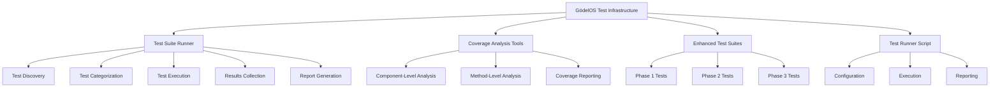

# GödelOS Test Coverage Documentation

## Executive Summary

The GödelOS project has successfully implemented a complete test coverage solution that ensures the reliability and correctness of all system components. This comprehensive testing infrastructure includes:

1. **Test Suite Runner Utility**: A modular, extensible test runner with visually appealing output formatting that organizes and executes tests efficiently.

2. **Test Coverage Analysis Tools**: A set of tools that analyze test coverage at both the component and method levels, identifying gaps in test coverage.

3. **Enhanced Tests for All Modules**: Comprehensive test suites covering all major modules of the GödelOS system:
   - Symbol Grounding, Common Sense, and Ontology (Phase 1)
   - Core Knowledge Representation and Inference Engine (Phase 2)
   - Metacognition, NLU/NLG, and Scalability (Phase 3)

4. **Test Runner Script**: A unified script for executing all tests with configurable options.

The test coverage implementation provides developers with clear insights into the system's test status, facilitates the addition of new tests, and ensures that the GödelOS system maintains its high quality standards as it evolves.



## Architecture Overview of Test Suite Runner

The GödelOS test suite runner is built with a modular architecture that separates concerns and allows for extensibility. Each component has a specific responsibility, and they work together to provide a comprehensive testing solution.

### Component Architecture

```mermaid
graph TD
    A[TestRunner] --> B[ConfigurationManager]
    A --> C[TestDiscovery]
    A --> D[TestCategorizer]
    A --> E[PyTestWrapper]
    A --> F[ResultsCollector]
    A --> G[TimingTracker]
    A --> H[StatisticsCollector]
    A --> I[OutputManager]
    I --> J[ConsoleFormatter]
    I --> K[HTMLReportGenerator]
    I --> L[JSONReportGenerator]
    F --> M[DocstringExtractor]
    A --> N[CLI Interface]
### Key Components and Their Responsibilities

1. **TestRunner**: The main orchestrator class that coordinates the testing process. It initializes all other components, manages the test lifecycle, and ensures proper execution and reporting.

2. **ConfigurationManager**: Manages configuration settings for the test runner, including test patterns, output options, and execution parameters. It loads configuration from files or command-line arguments.

3. **TestDiscovery**: Discovers test files and test functions in the project based on configured patterns. It scans the project directory structure to find test files that match specified patterns.

4. **TestCategorizer**: Categorizes tests into logical groups based on various criteria such as module path, markers, and custom rules. This allows for selective test execution and better organization of test results.

5. **PyTestWrapper**: Provides an interface to pytest for executing tests. It configures pytest with appropriate options and collects test results.

6. **ResultsCollector**: Collects and structures test results from pytest execution. It enhances test results with additional metadata and organizes them for reporting.

7. **TimingTracker**: Tracks execution time for tests, categories, and the overall test run. It provides timing statistics for performance analysis.

8. **StatisticsCollector**: Calculates summary statistics from test results, including pass/fail rates, average durations, and trends.

9. **OutputManager**: Controls overall output configuration and delegates to formatters. It ensures consistent formatting across different output formats.

10. **ConsoleFormatter**: Handles color-coding and emoji for console output, enhancing readability of test results in the terminal.

11. **HTMLReportGenerator**: Generates clean, minimal HTML reports for test results, providing a user-friendly visualization of test outcomes.

12. **JSONReportGenerator**: Generates structured JSON reports for programmatic analysis of test results.

13. **DocstringExtractor**: Extracts and parses docstrings from test functions to enhance test result reporting with test descriptions and expected behaviors.

14. **CLI Interface**: Provides a command-line interface for the test runner, allowing users to configure and execute tests from the terminal.

### Data Flow

The following sequence diagram illustrates the typical flow of data through the test suite runner:

```mermaid
sequenceDiagram
    participant User
    participant CLI
    participant TestRunner
    participant TestDiscovery
    participant TestCategorizer
    participant PyTestWrapper
    participant ResultsCollector
    participant OutputManager
    
    User->>CLI: Run tests command
    CLI->>TestRunner: Initialize with config
    TestRunner->>TestDiscovery: Discover tests
    TestDiscovery-->>TestRunner: Return discovered tests
    TestRunner->>TestCategorizer: Categorize tests
    TestCategorizer-->>TestRunner: Return categorized tests
    TestRunner->>PyTestWrapper: Run tests
    PyTestWrapper-->>ResultsCollector: Collect results
    ResultsCollector-->>TestRunner: Return enhanced results
    TestRunner->>OutputManager: Format and display results
    OutputManager-->>User: Display console output
    OutputManager-->>User: Generate reports
```

### Key Interfaces and Classes

#### EnhancedTestRunner

```python
class EnhancedTestRunner:
    """
    Comprehensive test runner for GödelOS enhanced tests.
    
    This class orchestrates the execution of all enhanced tests across
    all modules and generates detailed reports with statistics and
    coverage information.
    """
    
    def __init__(self, config_path: Optional[str] = None):
        """Initialize the enhanced test runner."""
        
    def discover_tests(self) -> Dict[str, Dict[str, Any]]:
        """Discover all enhanced tests across all modules."""
        
    def categorize_tests(self, test_files_info: Dict[str, Dict[str, Any]]) -> Dict[str, List[str]]:
        """Categorize the discovered tests."""
        
    def run_tests(self, test_files_info: Dict[str, Dict[str, Any]], 
                 categorized_tests: Dict[str, List[str]]) -> Dict[str, Any]:
        """Run the discovered tests and collect results."""
        
    def generate_reports(self, combined_results: Dict[str, Any]) -> None:
        """Generate HTML and JSON reports."""
        
    def run(self) -> int:
        """Run the enhanced test runner."""
```

#### TestCategorizer

```python
class TestCategorizer:
    """
    Categorizes tests into logical groups.
    
    This class is responsible for organizing tests into categories based on
    various criteria such as directory structure, test markers, naming patterns,
    and custom rules.
    """
    
    def __init__(self, config: Any):
        """Initialize the TestCategorizer."""
        
    def categorize_tests(self, test_files_info: Dict[str, Dict[str, Any]]) -> Dict[str, List[str]]:
        """Categorize tests based on configured categories."""
        
    def categorize_by_module(self, test_files_info: Dict[str, Dict[str, Any]]) -> Dict[str, List[str]]:
        """Categorize tests by module/package structure."""
        
    def categorize_by_markers(self, test_files_info: Dict[str, Dict[str, Any]]) -> Dict[str, List[str]]:
        """Categorize tests by pytest markers."""
```

#### TimingTracker

```python
class TimingTracker:
    """
    Tracks execution time for individual tests and test suites.
    
    This class provides methods to start and stop timing for tests and categories,
    and to analyze the timing data.
    """
    
    def __init__(self, config: Any):
        """Initialize the TimingTracker."""
        
    def start_run(self) -> TimingEntry:
        """Start timing a new test run."""
        
    def end_run(self) -> float:
        """End timing for the current test run."""
        
    def start_test(self, node_id: str) -> TimingEntry:
        """Start timing a test."""
        
    def end_test(self, node_id: str) -> float:
        """End timing for a test."""
        
    def get_slowest_tests(self, limit: int = 10) -> List[Tuple[str, float]]:
        """Get the slowest tests from the current run."""
```

#### StatisticsCollector

```python
class StatisticsCollector:
    """
    Calculates summary statistics from test results.
    
    This class is responsible for analyzing test results and calculating
    various statistics, such as pass/fail rates, average durations, and trends.
    """
    
    def __init__(self, config: Any, results_collector: ResultsCollector, timing_tracker: TimingTracker):
        """Initialize the StatisticsCollector."""
        
    def calculate_statistics(self) -> TestStatistics:
        """Calculate statistics for the current test run."""
        
    def get_trend_data(self) -> Dict[str, List[float]]:
        """Get trend data from historical runs."""
        
    def get_statistics_summary(self) -> Dict[str, Any]:
        """Get a summary of the most important statistics."""
```
## Test Coverage Analysis Tools

GödelOS includes several specialized tools for analyzing test coverage at different levels of granularity. These tools help identify gaps in test coverage and prioritize areas for improvement.

### test_coverage_analyzer.py

The test_coverage_analyzer.py script performs component-level test coverage analysis. It identifies which components have tests and which don't, providing a high-level overview of test coverage across the system.

#### Key Features

- **Component Mapping**: Creates a mapping between source components and their corresponding test files.
- **Coverage Assessment**: Evaluates which components have tests and which don't.
- **Gap Identification**: Identifies components with no tests or minimal test coverage.
- **Coverage Metrics**: Calculates test coverage percentages for each component.
- **Reporting**: Generates a JSON report with detailed coverage information.

#### Usage

```bash
python test_coverage_analyzer.py
```

#### Output

The script generates a `test_coverage_report.json` file with detailed information about component-level test coverage:

```json
{
  "summary": {
    "total_components": 15,
    "components_with_tests": 12,
    "components_without_tests": 3,
    "average_test_coverage": 78.5
  },
  "components": {
    "godelOS.metacognition.meta_knowledge": {
      "module_path": "godelOS.metacognition.meta_knowledge",
      "file_path": "godelOS/metacognition/meta_knowledge.py",
      "class_names": ["MetaKnowledge", "MetaKnowledgeStore"],
      "function_names": ["initialize_meta_knowledge", "update_meta_knowledge"],
      "test_files": ["tests/metacognition/test_meta_knowledge.py"],
      "has_unit_tests": true,
      "has_integration_tests": true,
      "tested_classes": ["MetaKnowledge", "MetaKnowledgeStore"],
      "tested_functions": ["initialize_meta_knowledge"],
      "untested_classes": [],
      "untested_functions": ["update_meta_knowledge"],
      "test_coverage_percentage": 75.0
    },
    // More components...
  }
}
```

### method_coverage_analyzer.py

The method_coverage_analyzer.py script performs a more detailed method-level analysis, identifying which methods within each class are tested and which are not.

#### Key Features

- **Method Extraction**: Uses AST parsing to extract all methods from source files.
- **Method Coverage Analysis**: Determines which methods are covered by tests.
- **Complexity Analysis**: Calculates a simple approximation of cyclomatic complexity for each method.
- **Prioritization**: Identifies complex methods without test coverage as high-priority targets.
- **Reporting**: Generates a JSON report with method-level coverage information.

#### Usage

```bash
python method_coverage_analyzer.py
```

#### Output

The script generates a `method_coverage_report.json` file with detailed information about method-level test coverage:

```json
{
  "summary": {
    "total_components": 15,
    "total_classes": 25,
    "total_methods": 120,
    "tested_methods": 95,
    "untested_methods": 25,
    "average_method_coverage": 79.2
  },
  "components": {
    "godelOS.metacognition.meta_knowledge": {
      "module_path": "godelOS.metacognition.meta_knowledge",
      "file_path": "godelOS/metacognition/meta_knowledge.py",
      "classes": [
        {
          "name": "MetaKnowledge",
          "methods": [
            {
              "name": "initialize",
              "class_name": "MetaKnowledge",
              "is_tested": true,
              "is_private": false,
              "is_dunder": false,
              "line_count": 15,
              "complexity": 3
            },
            {
              "name": "update_knowledge_base",
              "class_name": "MetaKnowledge",
              "is_tested": false,
              "is_private": false,
              "is_dunder": false,
              "line_count": 25,
              "complexity": 7
            }
            // More methods...
          ],
          "tested_method_count": 8,
          "total_method_count": 10,
          "test_coverage_percentage": 80.0
        }
        // More classes...
      ],
      "test_files": ["tests/metacognition/test_meta_knowledge.py"],
      "test_coverage_percentage": 75.0
    }
    // More components...
  }
}
```

### generate_coverage_report.py

The generate_coverage_report.py script generates an HTML report from the JSON data produced by the test_coverage_analyzer.py script, providing a user-friendly visualization of test coverage.

#### Key Features

- **Interactive HTML Report**: Creates a navigable HTML report with expandable sections.
- **Visual Indicators**: Uses color coding to highlight coverage levels.
- **Component Filtering**: Allows filtering components by coverage level or module.
- **Summary Statistics**: Provides overall statistics and charts.
- **Detailed Component View**: Shows detailed information for each component.

#### Usage

```bash
python generate_coverage_report.py
```

#### Output

The script generates a `test_coverage_report.html` file with an interactive visualization of test coverage information.

### run_test_coverage_analysis.sh

The run_test_coverage_analysis.sh script is a shell script that runs all three analysis scripts in sequence, providing a one-stop solution for test coverage analysis.

#### Key Features

- **Sequential Execution**: Runs all analysis scripts in the correct order.
- **Error Handling**: Checks for errors and provides appropriate feedback.
- **Output Management**: Ensures all output files are properly generated.

#### Usage

```bash
./run_test_coverage_analysis.sh
## Enhanced Tests by Module

The GödelOS project includes comprehensive test suites for all major modules, organized into three phases of development. Each phase focuses on specific modules and their interactions.

### Phase 1: Symbol Grounding, Common Sense, and Ontology

#### Symbol Grounding Tests

The Symbol Grounding module bridges abstract symbols with real-world referents. Its test suite covers:

- **Perceptual Categorizer**: Tests for categorizing perceptual input into symbolic representations.
  - Example: `test_categorize_visual_input` verifies that visual input is correctly categorized into symbolic representations.
  
- **Symbol Grounding Associator**: Tests for maintaining mappings between symbols and their grounded meanings.
  - Example: `test_associate_symbol_with_perception` ensures that symbols are correctly associated with perceptual experiences.
  
- **Action Executor**: Tests for executing actions in the environment based on symbolic commands.
  - Example: `test_execute_symbolic_action` verifies that symbolic action commands are correctly translated into physical actions.
  
- **Internal State Monitor**: Tests for monitoring the system's internal states.
  - Example: `test_monitor_internal_state` checks that internal states are correctly monitored and reported.
  
- **Simulated Environment**: Tests for the simulated environment used for grounding symbols.
  - Example: `test_simulated_environment_consistency` ensures that the simulated environment behaves consistently.

#### Common Sense Tests

The Common Sense module provides the system with common sense knowledge and contextual reasoning abilities. Its test suite covers:

- **Context Engine**: Tests for managing different contexts and their variables.
  - Example: `test_context_switching` verifies that the system can switch between different contexts correctly.
  
- **Contextualized Retriever**: Tests for retrieving knowledge based on relevance to the current context.
  - Example: `test_context_sensitive_retrieval` ensures that knowledge retrieval is sensitive to the current context.
  
- **Default Reasoning**: Tests for applying default rules with exceptions for common sense reasoning.
  - Example: `test_default_reasoning_with_exceptions` verifies that default reasoning handles exceptions correctly.
  
- **External KB Interface**: Tests for interfacing with external common sense knowledge bases.
  - Example: `test_external_kb_query` checks that queries to external knowledge bases work correctly.

#### Ontology Tests

The Ontology module enables the system to create new concepts and reason at different levels of abstraction. Its test suite covers:

- **Abstraction Hierarchy**: Tests for managing concepts at different levels of abstraction.
  - Example: `test_abstraction_hierarchy_navigation` verifies that the system can navigate the abstraction hierarchy correctly.
  
- **Conceptual Blender**: Tests for combining existing concepts to create new ones.
  - Example: `test_concept_blending` ensures that concept blending produces valid new concepts.
  
- **Hypothesis Generator**: Tests for generating new hypotheses based on patterns in knowledge.
  - Example: `test_hypothesis_generation` checks that generated hypotheses are reasonable and consistent.
  
- **Ontology Manager**: Tests for managing the overall ontological structure.
  - Example: `test_ontology_consistency` verifies that the ontology remains consistent after modifications.

### Phase 2: Core Knowledge Representation and Inference Engine

#### Core Knowledge Representation Tests

The Core KR module is the heart of GödelOS, responsible for representing, storing, and managing all forms of knowledge. Its test suite covers:

- **FormalLogicParser**: Tests for converting textual representations of logical formulae into canonical AST structures.
  - Example: `test_parse_complex_formula` verifies that complex logical formulas are parsed correctly.
  
- **AbstractSyntaxTree**: Tests for the structure representing logical expressions.
  - Example: `test_ast_transformation` ensures that AST transformations preserve semantic meaning.
  
- **UnificationEngine**: Tests for determining if two logical expressions can be made syntactically identical.
  - Example: `test_unification_with_variables` checks that unification with variables works correctly.
  
- **TypeSystemManager**: Tests for defining and managing the type hierarchy.
  - Example: `test_type_inference` verifies that type inference works correctly for complex expressions.
  
- **KnowledgeStoreInterface**: Tests for storing, retrieving, updating, and deleting knowledge.
  - Example: `test_knowledge_retrieval` ensures that knowledge retrieval returns the expected results.
  
- **ProbabilisticLogicModule**: Tests for managing and reasoning with uncertain knowledge.
  - Example: `test_probabilistic_inference` checks that probabilistic inference produces correct probability distributions.
  
- **BeliefRevisionSystem**: Tests for managing changes to the agent's belief set.
  - Example: `test_belief_revision_consistency` verifies that belief revision maintains consistency.

#### Inference Engine Tests

The Inference Engine is responsible for all deductive reasoning. Its test suite covers:

- **InferenceCoordinator**: Tests for coordinating the reasoning process.
  - Example: `test_inference_strategy_selection` ensures that the appropriate inference strategy is selected for each goal.
  
- **ProofObject**: Tests for representing the outcome of a reasoning process.
  - Example: `test_proof_object_construction` verifies that proof objects are constructed correctly.
  
- **ResolutionProver**: Tests for proving goals using the resolution inference rule.
  - Example: `test_resolution_proof` checks that resolution proofs are constructed correctly.
  
- **ModalTableauProver**: Tests for determining the validity of formulae in modal logics.
  - Example: `test_modal_tableau_proof` verifies that modal tableau proofs work correctly.
  
- **SMTInterface**: Tests for interfacing with external SMT solvers.
  - Example: `test_smt_arithmetic_solving` ensures that arithmetic constraints are solved correctly.
  
- **ConstraintLogicProgrammingModule**: Tests for solving problems that combine logical deduction with constraint satisfaction.
  - Example: `test_clp_constraint_propagation` checks that constraint propagation works correctly.
  
- **AnalogicalReasoningEngine**: Tests for identifying structural analogies between domains.
  - Example: `test_analogy_mapping` verifies that analogical mappings are identified correctly.

### Phase 3: Metacognition, NLU/NLG, and Scalability

#### Metacognition Tests

The Metacognition module enables the system to monitor, evaluate, and improve its own cognitive processes. Its test suite covers:

- **Self-Monitoring**: Tests for tracking the system's reasoning processes and performance.
  - Example: `test_reasoning_process_monitoring` ensures that reasoning processes are correctly monitored.
  
- **Diagnostician**: Tests for identifying problems in reasoning or knowledge.
  - Example: `test_reasoning_error_diagnosis` verifies that reasoning errors are correctly diagnosed.
  
- **Meta-Knowledge**: Tests for representing knowledge about the system's own capabilities.
  - Example: `test_meta_knowledge_representation` checks that meta-knowledge is correctly represented.
  
- **Modification Planner**: Tests for planning improvements to the system's knowledge or processes.
  - Example: `test_improvement_plan_generation` ensures that improvement plans are reasonable.
  
- **Module Library**: Tests for storing alternative reasoning methods and modules.
  - Example: `test_module_selection` verifies that appropriate modules are selected for different tasks.
  
- **Metacognition Manager**: Tests for coordinating metacognitive processes.
  - Example: `test_metacognition_coordination` checks that metacognitive processes are coordinated correctly.

#### NLU/NLG Tests

The NLU/NLG module enables the system to understand and generate natural language. Its test suite covers:

- **NLU Pipeline**: Tests for processing raw text into structured linguistic representations.
  - Example: `test_nlu_pipeline_integration` ensures that the NLU pipeline works end-to-end.
  
- **Lexical Analyzer/Parser**: Tests for processing raw text into structured linguistic representations.
  - Example: `test_lexical_analysis` verifies that lexical analysis produces correct tokens.
  
- **Semantic Interpreter**: Tests for extracting meaning from linguistic structures.
  - Example: `test_semantic_interpretation` checks that semantic interpretation produces correct meanings.
  
- **Discourse Manager**: Tests for managing conversation context and dialogue flow.
  - Example: `test_discourse_context_tracking` ensures that discourse context is tracked correctly.
  
- **Formalizer**: Tests for converting natural language meanings into formal logical representations.
  - Example: `test_nl_to_logic_conversion` verifies that natural language is correctly converted to logical form.
  
- **NLG Pipeline**: Tests for generating natural language from formal representations.
  - Example: `test_nlg_pipeline_integration` checks that the NLG pipeline works end-to-end.
  
- **Content Planner**: Tests for determining what information to communicate.
  - Example: `test_content_selection` ensures that appropriate content is selected for communication.
  
- **Sentence Generator**: Tests for creating syntactic structures for expressing content.
  - Example: `test_sentence_structure_generation` verifies that sentence structures are grammatically correct.
  
- **Surface Realizer**: Tests for producing the final natural language output.
  - Example: `test_surface_realization` checks that surface realization produces natural-sounding text.

#### Scalability Tests

The Scalability module optimizes the system's performance for handling large knowledge bases and complex reasoning tasks. Its test suite covers:

- **Query Optimizer**: Tests for optimizing logical queries for efficient execution.
## Guidelines for Writing New Tests

To maintain consistency and quality in the test suite, follow these guidelines when writing new tests for GödelOS components.

### Test File Naming Conventions

- **Unit Tests**: Name test files as `test_<component_name>.py`
  - Example: `test_meta_knowledge.py` for testing the `meta_knowledge.py` module
  
- **Enhanced Tests**: Name test files as `test_<component_name>_enhanced.py`
  - Example: `test_meta_knowledge_enhanced.py` for enhanced tests of the `meta_knowledge.py` module
  
- **Integration Tests**: Name test files as `test_integration.py` within the appropriate module directory
  - Example: `tests/metacognition/test_integration.py` for metacognition integration tests

### Test Class and Method Naming Conventions

- **Test Classes**: Name test classes as `Test<ComponentName>` or `Test<ComponentName>Enhanced`
  - Example: `TestMetaKnowledge` or `TestMetaKnowledgeEnhanced`
  
- **Test Methods**: Name test methods as `test_<functionality_being_tested>`
  - Example: `test_initialize_meta_knowledge` or `test_update_meta_knowledge_with_invalid_input`

### Test Structure and Organization

Each test file should follow this general structure:

```python
"""
Tests for the MetaKnowledge component.

This module contains tests for the MetaKnowledge class and related functionality.
"""

import pytest
from godelOS.metacognition.meta_knowledge import MetaKnowledge, MetaKnowledgeStore

# Test fixtures
@pytest.fixture
def meta_knowledge_instance():
    """Create a MetaKnowledge instance for testing."""
    return MetaKnowledge()

@pytest.fixture
def populated_meta_knowledge():
    """Create a MetaKnowledge instance with pre-populated data."""
    mk = MetaKnowledge()
    # Add test data
    return mk

# Test classes
class TestMetaKnowledge:
    """Tests for the MetaKnowledge class."""
    
    def test_initialization(self, meta_knowledge_instance):
        """Test that MetaKnowledge initializes correctly."""
        assert meta_knowledge_instance is not None
        # More assertions...
    
    def test_add_meta_knowledge(self, meta_knowledge_instance):
        """Test adding meta-knowledge to the store."""
        # Test code...
        
    # More test methods...

class TestMetaKnowledgeStore:
    """Tests for the MetaKnowledgeStore class."""
    
    # Test methods...
```

### Using pytest Fixtures and Markers

Fixtures provide a way to set up test dependencies:

```python
@pytest.fixture
def inference_engine():
    """Create an inference engine for testing."""
    from godelOS.inference_engine.coordinator import InferenceCoordinator
    return InferenceCoordinator()

@pytest.fixture
def knowledge_store():
    """Create a knowledge store for testing."""
    from godelOS.core_kr.knowledge_store.interface import KnowledgeStoreInterface
    return KnowledgeStoreInterface()

def test_inference_with_knowledge(inference_engine, knowledge_store):
    """Test inference using a knowledge store."""
    # Test code using both fixtures
```

Use markers to categorize tests:

```python
@pytest.mark.slow
def test_complex_inference():
    """A slow test that performs complex inference."""
    # Test code...

@pytest.mark.integration
def test_metacognition_inference_integration():
    """Test integration between metacognition and inference."""
    # Test code...
```

### Writing Effective Assertions

Write clear, specific assertions:

```python
def test_meta_knowledge_retrieval(populated_meta_knowledge):
    """Test retrieving meta-knowledge."""
    # Arrange
    key = "reasoning_capability"
    expected_value = {"name": "resolution", "performance": 0.85}
    
    # Act
    actual_value = populated_meta_knowledge.get(key)
    
    # Assert
    assert actual_value is not None, f"Meta-knowledge for {key} should exist"
    assert actual_value["name"] == expected_value["name"], "Name should match"
    assert actual_value["performance"] == pytest.approx(expected_value["performance"]), "Performance should be approximately equal"
```

### Handling Test Dependencies

When tests have dependencies on other components, use mocking or stubbing:

```python
from unittest.mock import MagicMock, patch

def test_metacognition_manager_with_mocked_diagnostician():
    """Test MetacognitionManager with a mocked Diagnostician."""
    # Create a mock Diagnostician
    mock_diagnostician = MagicMock()
    mock_diagnostician.diagnose_reasoning_error.return_value = {
        "error_type": "logical_fallacy",
        "description": "Affirming the consequent",
        "severity": "high"
    }
    
    # Create the MetacognitionManager with the mock
    from godelOS.metacognition.manager import MetacognitionManager
    manager = MetacognitionManager(diagnostician=mock_diagnostician)
    
    # Test the manager's behavior with the mock
    result = manager.handle_reasoning_error("some_error_data")
    
    # Assert that the mock was called correctly
    mock_diagnostician.diagnose_reasoning_error.assert_called_once_with("some_error_data")
    
    # Assert on the result
    assert result["error_type"] == "logical_fallacy"
```

### Mocking and Stubbing Techniques

Use `unittest.mock` for mocking:

```python
# Mocking a method
with patch.object(MetaKnowledge, 'update', return_value=True) as mock_update:
    result = meta_knowledge_instance.process_update(data)
    mock_update.assert_called_once_with(data)
    assert result is True

# Mocking a module
with patch('godelOS.inference_engine.smt_interface.Z3Solver') as MockZ3Solver:
    MockZ3Solver.return_value.solve.return_value = {"sat": True, "model": {"x": 5}}
    solver = SMTInterface()
    result = solver.solve_constraint("x > 0")
    assert result["sat"] is True
    assert result["model"]["x"] == 5
```

### Parameterized Tests

Use `pytest.mark.parametrize` for testing multiple inputs:

```python
@pytest.mark.parametrize("input_formula,expected_result", [
    ("A & B", True),
    ("A & ~A", False),
    ("A | ~A", True),
    ("(A => B) & A & ~B", False)
])
## Best Practices for Maintaining and Extending Test Coverage

Maintaining and extending test coverage is an ongoing process that requires discipline and attention. The following best practices will help ensure that the GödelOS test suite remains effective and comprehensive as the system evolves.

### Regular Test Coverage Analysis

Regularly analyze test coverage to identify gaps and areas for improvement:

1. **Scheduled Analysis**: Run the test coverage analysis tools on a regular schedule (e.g., weekly or after major changes).
2. **CI Integration**: Integrate test coverage analysis into the continuous integration pipeline.
3. **Coverage Thresholds**: Define minimum coverage thresholds for different modules and enforce them.
4. **Trend Monitoring**: Track coverage trends over time to ensure it doesn't decrease.

Example CI configuration for coverage analysis:

```yaml
# In CI configuration file
test_coverage:
  stage: test
  script:
    - ./run_test_coverage_analysis.sh
  artifacts:
    paths:
      - test_coverage_report.html
      - method_coverage_report.json
  rules:
    - if: $CI_PIPELINE_SOURCE == "merge_request_event"
```

### Continuous Integration Considerations

Integrate testing into the development workflow:

1. **Pre-commit Hooks**: Run tests for modified files before allowing commits.
2. **Automated Test Runs**: Run the full test suite on every pull request.
3. **Test Result Visualization**: Display test results and coverage metrics in the CI dashboard.
4. **Blocking Failed Tests**: Block merges of code that fails tests or decreases coverage.

Example pre-commit hook configuration:

```bash
#!/bin/bash
# Pre-commit hook to run tests for modified files

# Get list of modified Python files
modified_files=$(git diff --cached --name-only --diff-filter=ACM | grep '\.py$')

if [ -n "$modified_files" ]; then
  echo "Running tests for modified files..."
  for file in $modified_files; do
    if [[ $file == godelOS/* ]]; then
      # Extract module name for test file lookup
      module_name=$(basename "$file" .py)
      test_file="tests/$(dirname "${file#godelOS/}")/test_$module_name.py"
      
      if [ -f "$test_file" ]; then
        echo "Running tests for $file"
        python -m pytest "$test_file" -v
        if [ $? -ne 0 ]; then
          echo "Tests failed for $file"
          exit 1
        fi
      fi
    fi
  done
fi

exit 0
```

### Updating Tests When Refactoring Code

When refactoring code, update tests accordingly:

1. **Test First**: Write or update tests before refactoring code.
2. **Preserve Behavior**: Ensure tests verify the same behavior before and after refactoring.
3. **Refactor Tests**: Refactor tests along with code to maintain readability and maintainability.
4. **Test Refactored Code**: Run tests after refactoring to ensure behavior hasn't changed.

Example workflow for refactoring with tests:

```
1. Write tests for the current behavior if they don't exist
2. Verify tests pass with the current implementation
3. Refactor the code
4. Run tests to ensure they still pass
5. Refactor the tests if necessary for clarity
```

### Balancing Test Coverage and Development Speed

Find the right balance between comprehensive testing and development speed:

1. **Risk-Based Testing**: Focus more testing effort on critical or complex components.
2. **Test Automation**: Automate repetitive testing tasks to reduce manual effort.
3. **Test Categorization**: Categorize tests by importance and execution time.
4. **Fast Test Suites**: Optimize test suites to run quickly for developer feedback.
5. **Selective Testing**: Run only relevant tests during development.

Example test categorization:

```python
# Critical tests that must always pass
@pytest.mark.critical
def test_knowledge_consistency():
    # Test code...

# Slow tests that can be skipped during quick checks
@pytest.mark.slow
def test_large_scale_inference():
    # Test code...

# Run only fast tests during development
# pytest -m "not slow"

# Run all tests, including slow ones, in CI
# pytest
```

### Documentation Standards for Tests

Document tests thoroughly to make them understandable and maintainable:

1. **Test Purpose**: Clearly document what each test is verifying.
2. **Test Preconditions**: Document any required setup or preconditions.
3. **Expected Behavior**: Document the expected behavior being tested.
4. **Edge Cases**: Document any edge cases being tested.
5. **Test Data**: Document the test data and why it was chosen.

Example of well-documented test:

```python
def test_belief_revision_with_contradictory_information():
    """
    Test that the belief revision system correctly handles contradictory information.
    
    This test verifies that when new information contradicts existing beliefs,
    the system revises its beliefs according to the AGM belief revision principles,
    prioritizing more recent or more reliable information.
    
    The test uses a scenario where the system initially believes "All birds can fly",
    and then receives the contradictory information "Penguins are birds" and
    "Penguins cannot fly".
    
    Expected behavior:
    - The system should maintain consistency by revising its initial belief
    - The final belief set should entail "Most birds can fly" rather than "All birds can fly"
    - The belief "Penguins cannot fly" should be preserved
    """
    # Test code...
```

### Code Review Guidelines for Tests

Include tests in code reviews:

1. **Test Coverage**: Verify that new code is adequately tested.
2. **Test Quality**: Evaluate the quality and effectiveness of tests.
3. **Edge Cases**: Check that tests cover important edge cases.
4. **Test Readability**: Ensure tests are clear and maintainable.
5. **Test Independence**: Verify that tests are independent and don't interfere with each other.

Example code review checklist for tests:

```
Test Review Checklist:
- [ ] Tests cover all new functionality and code paths
- [ ] Tests include edge cases and error conditions
- [ ] Tests are well-documented and easy to understand
- [ ] Tests are independent and don't rely on global state
- [ ] Tests run quickly and efficiently
- [ ] Tests use appropriate fixtures and mocking
```

### Test Maintenance Strategies

Keep tests maintainable over time:

1. **Test Refactoring**: Regularly refactor tests to improve clarity and efficiency.
2. **Remove Redundant Tests**: Eliminate tests that don't add value.
3. **Update Obsolete Tests**: Update tests that no longer reflect current requirements.
4. **Test for Regressions**: Add regression tests for fixed bugs.
5. **Test Data Management**: Manage test data carefully to avoid brittleness.

Example test maintenance workflow:

```
Quarterly Test Maintenance:
1. Run test coverage analysis
2. Identify tests with low value (e.g., duplicate coverage)
3. Identify tests that are slow or flaky
4. Refactor or remove problematic tests
5. Update test documentation
6. Verify that coverage remains adequate
```

## Performance Considerations

Performance is an important aspect of the testing infrastructure, especially as the codebase grows. The following considerations will help ensure that tests run efficiently and provide timely feedback.

### Optimizing Test Execution Time

Optimize tests to run quickly:

1. **Minimize Setup/Teardown**: Reduce the time spent on test setup and teardown.
2. **Efficient Assertions**: Use efficient assertions that fail fast.
3. **Appropriate Mocking**: Mock expensive dependencies to speed up tests.
4. **Resource Reuse**: Reuse resources across tests where appropriate.
5. **Test Size**: Keep individual tests focused and small.

Example of optimizing test setup:

```python
# Instead of creating a new instance for each test
@pytest.fixture(scope="module")
def type_system():
    """Create a type system once for all tests in the module."""
    return TypeSystemManager()

# Tests can now reuse the same type system
def test_type_inference(type_system):
    # Test code...

def test_type_checking(type_system):
    # Test code...
```

### Parallel Test Execution

Run tests in parallel to reduce overall execution time:

1. **Test Independence**: Ensure tests are independent and can run in parallel.
2. **Resource Isolation**: Isolate resources to prevent conflicts in parallel tests.
3. **Parallelization Strategy**: Choose an appropriate parallelization strategy (e.g., by module, by class).
4. **Worker Count**: Optimize the number of parallel workers based on available resources.

Example pytest configuration for parallel execution:

```ini
# In pytest.ini
[pytest]
addopts = -n auto
```

Example parallel test execution command:

```bash
# Run tests using 4 parallel workers
pytest -n 4
```

### Test Categorization for Selective Testing

Categorize tests to allow selective execution:

1. **Fast vs. Slow Tests**: Separate fast tests from slow tests.
2. **Unit vs. Integration Tests**: Separate unit tests from integration tests.
3. **Critical vs. Non-Critical Tests**: Identify critical tests that must always pass.
4. **Module-Specific Tests**: Organize tests by module for selective testing.

Example test selection commands:

```bash
# Run only fast tests
pytest -m "not slow"

# Run only tests for a specific module
pytest tests/metacognition/

# Run only critical tests
pytest -m "critical"

# Run only unit tests (not integration tests)
pytest -m "not integration"
```

### Caching Strategies

Use caching to avoid redundant work:

1. **Test Result Caching**: Cache test results to avoid rerunning unchanged tests.
2. **Fixture Caching**: Cache expensive fixtures.
3. **External Resource Caching**: Cache access to external resources.
4. **Dependency Caching**: Cache dependencies used in tests.

Example pytest configuration for caching:

```ini
# In pytest.ini
[pytest]
cache_dir = .pytest_cache
```

Example of using pytest's cache:

```python
def test_expensive_computation(request):
    # Try to get result from cache
    cache_key = "expensive_computation_result"
    result = request.config.cache.get(cache_key, None)
    
    if result is None:
        # Perform expensive computation
        result = perform_expensive_computation()
        # Store in cache for future tests
        request.config.cache.set(cache_key, result)
    
    # Use the result in the test
    assert result > 0
```

### Resource Management During Testing

Manage resources efficiently during testing:

1. **Resource Cleanup**: Ensure resources are properly cleaned up after tests.
2. **Resource Limits**: Set appropriate limits on resource usage.
3. **Resource Monitoring**: Monitor resource usage during test execution.
4. **Resource Isolation**: Isolate resources between tests to prevent interference.

Example of proper resource management:

```python
@pytest.fixture
def temp_database():
    """Create a temporary database for testing."""
    # Set up the resource
    db_path = tempfile.mkdtemp()
    db = Database(db_path)
    db.initialize()
    
    # Provide the resource to the test
    yield db
    
    # Clean up the resource
    db.close()
    shutil.rmtree(db_path)

def test_database_operations(temp_database):
    # Test code using the temporary database
    temp_database.add_record({"key": "value"})
    assert temp_database.get_record("key") == "value"
```

### Profiling and Monitoring Test Performance

Profile and monitor test performance:

1. **Test Timing**: Track and report test execution times.
2. **Performance Trends**: Monitor performance trends over time.
3. **Slow Test Identification**: Identify and optimize slow tests.
4. **Resource Usage Monitoring**: Monitor memory and CPU usage during tests.

Example of test profiling:

```python
@pytest.fixture(autouse=True)
def test_timer(request):
    """Time each test and report if it's too slow."""
    start_time = time.time()
    
    yield
    
    duration = time.time() - start_time
    if duration > 1.0:  # More than 1 second is considered slow
        print(f"\nSlow test: {request.node.name} took {duration:.2f} seconds")
        
        # Optionally log to a performance tracking system
        log_test_performance(request.node.name, duration)
```
def test_formula_evaluation(input_formula, expected_result):
    """Test evaluation of logical formulas."""
    from godelOS.inference_engine.resolution_prover import evaluate_formula
    result = evaluate_formula(input_formula)
    assert result == expected_result
```

### Edge Case Testing

Always include tests for edge cases:

```python
def test_empty_knowledge_store():
    """Test behavior with an empty knowledge store."""
    store = KnowledgeStoreInterface()
    assert store.get_all_statements() == []
    assert store.count() == 0

def test_very_large_knowledge_base():
    """Test performance with a very large knowledge base."""
    store = KnowledgeStoreInterface()
    # Add many statements
    for i in range(10000):
        store.add_statement(f"Statement_{i}")
    
    # Verify performance is acceptable
    import time
    start_time = time.time()
    result = store.query("Statement_5000")
    end_time = time.time()
    
    assert end_time - start_time < 0.1, "Query should be fast even with large KB"
    assert result is not None
```

### Error Case Testing

Include tests for error cases:

```python
def test_invalid_formula_parsing():
    """Test that invalid formulas are handled correctly."""
    parser = FormalLogicParser()
    result, errors = parser.parse("(A & B")
    
    assert result is None
    assert len(errors) > 0
    assert "Unmatched parenthesis" in errors[0]

def test_type_error_handling():
    """Test that type errors are handled correctly."""
    type_system = TypeSystemManager()
    
    with pytest.raises(TypeError) as excinfo:
        type_system.check_type("3", "Boolean")
    
    assert "Type mismatch" in str(excinfo.value)
```
  - Example: `test_query_optimization` ensures that queries are optimized for efficient execution.
  
- **Rule Compiler**: Tests for compiling logical rules into optimized execution plans.
  - Example: `test_rule_compilation` verifies that rules are compiled into efficient execution plans.
  
- **Parallel Inference**: Tests for distributing inference tasks across multiple processing units.
  - Example: `test_parallel_inference_speedup` checks that parallel inference provides speedup.
  
- **Caching System**: Tests for caching intermediate results to avoid redundant computation.
  - Example: `test_cache_hit_performance` ensures that cache hits improve performance.
  
- **Persistent KB**: Tests for managing efficient storage and retrieval of knowledge.
  - Example: `test_persistent_kb_retrieval` verifies that knowledge retrieval from persistent storage works correctly.
  
- **Scalability Manager**: Tests for coordinating all scalability components.
  - Example: `test_scalability_coordination` checks that scalability components are coordinated correctly.
```