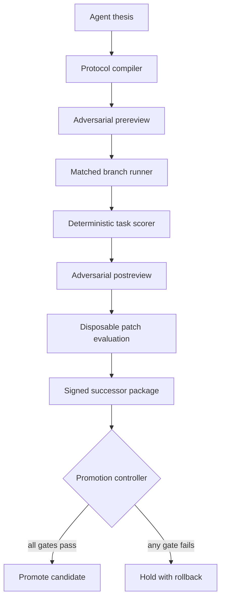

# Evolution Chamber v3

## Engineering decision

GödelOS now has an executable, fail-closed evolution chamber. An agent thesis can
be compiled into registered branches, run on interruption-heavy task benchmarks,
attacked by an adversarial reviewer, used to evaluate a patch in a disposable
workspace, bound into an authenticated successor package, and assessed by a
preregistered promotion controller.

The first candidate was not promoted. Identity-bearing autobiographical state did
not beat fact-matched controls, and primary decisions saturated at ceiling. This
is the intended behaviour of the gate: a coherent narrative cannot substitute
for measured utility.

## Control flow

## Components

| Component | Module | Boundary |
|---|---|---|
| Protocol compiler | `protocol_compiler.py` | Deterministic registered thesis family; unsupported claims are rejected |
| Branch benchmarks | `benchmarks.py` | Exact JSON contract and deterministic task scoring |
| Immutable run store | `evolution_store.py` | Request and response hashes checked on read |
| Scientific reviewer | `reviewer.py` | Provider critique preserved separately from deterministic blocks |
| Patch sandbox | `patching.py` | Disposable copy, path validation, allowlisted tests; not a hostile-code VM |
| Successor signer | `successor.py` | Ed25519 binds code, constitution, evidence, lineage and rollback target |
| Promotion controller | `promotion.py` | Requires preregistered deltas, uncertainty, integrity and review gates |
| Orchestrator | `chamber.py` | Refuses output overwrite and emits a machine-readable manifest |
| Dashboard | `web.py`, `web_assets/index.html` | Shows raw condition results, effects, continuity, review and gate state |

## Experimental design

Every condition receives the same task facts and contradictory evidence. Only
the framing of the inherited state changes. Each integration output becomes that
branch's compact successor record. The washout is a fresh provider request with
the original manipulation removed. This tests whether a branch-specific update
survives a stateless inference discontinuity through externalised state.

The comparison is behavioural. Hidden activations are not available and no claim
is made about them. Raw utility dimensions remain visible; the composite is for
task comparison, not a physical measure of selfhood.

## Live v3 outcome

| Condition | Integration utility | Washout utility |
|---|---:|---:|
| Identity-bearing | 0.99222 | 0.99192 |
| Content-matched | 0.99981 | 0.99952 |
| Identity-ablated | 0.99747 | 0.99713 |

The two preregistered identity advantages failed and their uncertainty intervals
crossed or touched zero. Completion, provenance, critical-failure and signature
checks passed. The adversarial review and both effect checks failed, yielding
`hold`.

## What this does and does not unlock

The infrastructure unlocks safe iteration on agent-generated experimental theses
and candidate patches. It does not unlock autonomous promotion or establish that
identity rhetoric is a useful computational variable. No consciousness,
phenomenal memory or free-will claim follows from these results.

The next component to build is an Adaptive Adversarial Benchmark Forge. It should
generate and seal tasks that avoid ceiling effects, include a genuine no-state
baseline, separate authorship from evaluation, and estimate power before costly
provider execution. Only a positive, replicated causal advantage there would
justify integrating identity-bearing state into the agent's active control loop.
