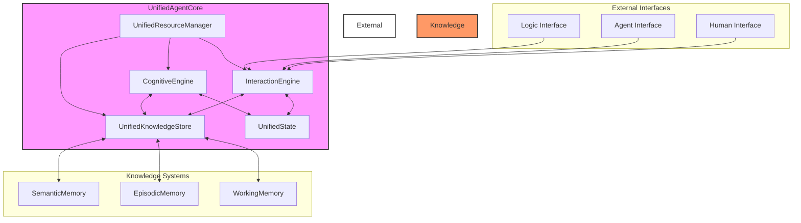
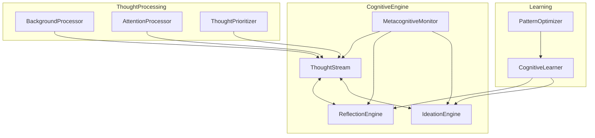
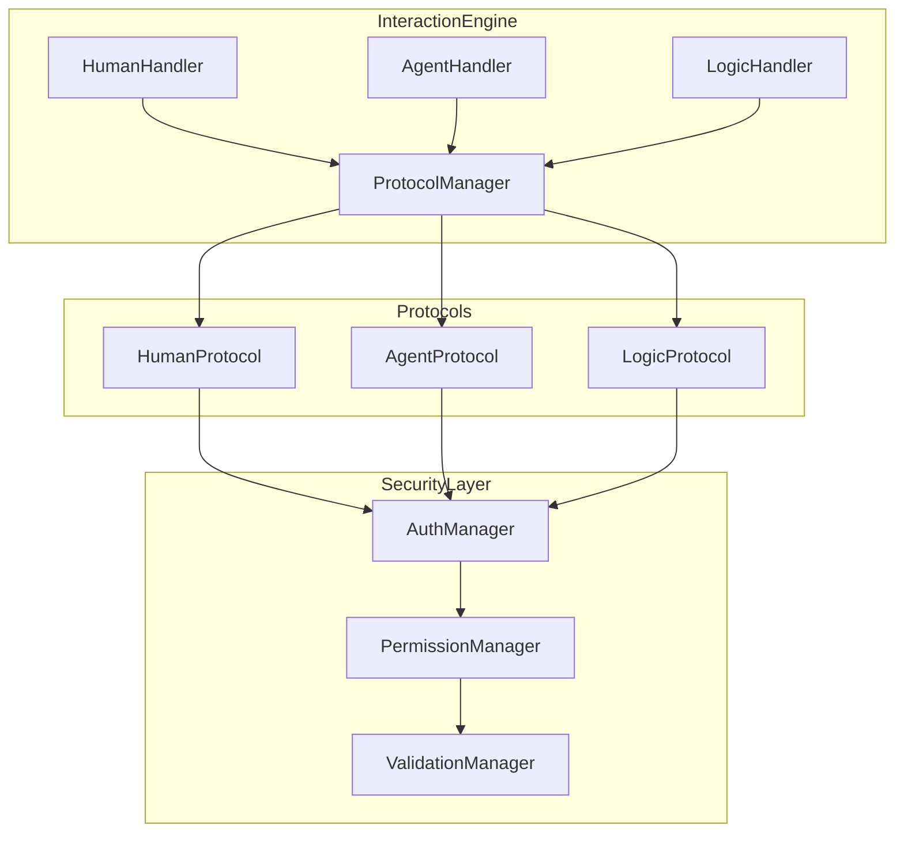
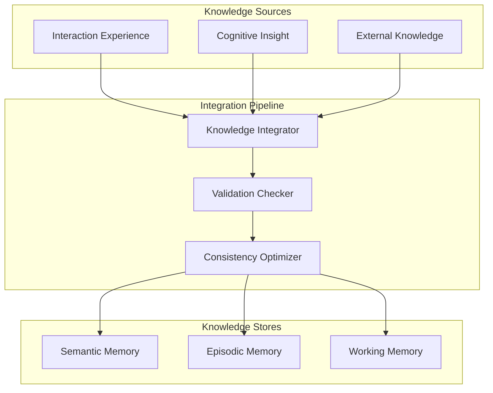
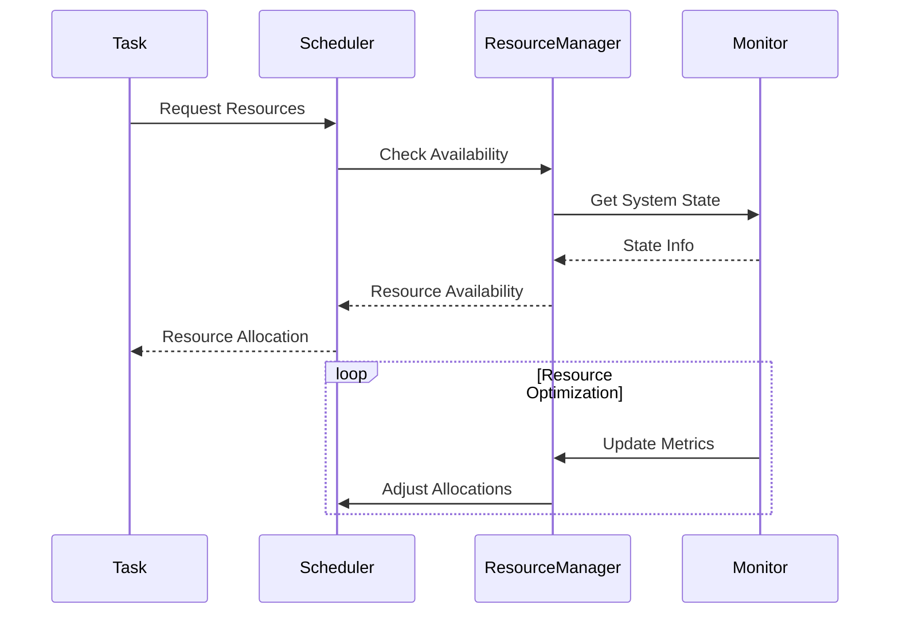
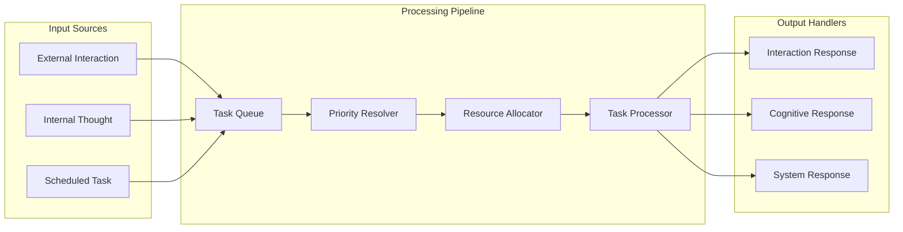
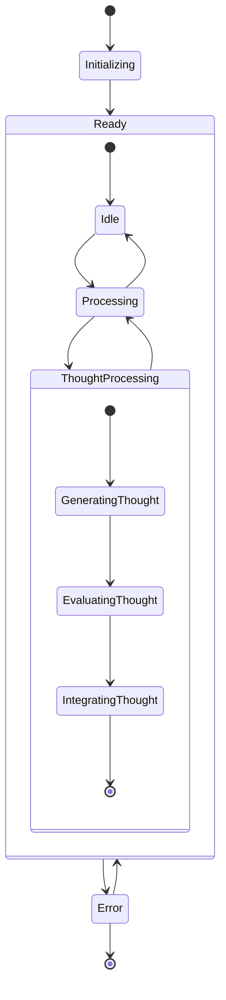

# GodelOS Architecture Update Specification: Integrating Cognition and LLM Interaction
**Version: 1.0.1**  
**Date: 2025-05-22 00:04:34 UTC**  
**Author: Steake**

---

## Table of Contents
1. [System Overview](#1-system-overview)
2. [Integrated Processing Systems](#2-integrated-processing-systems)
3. [Unified Knowledge Management](#3-unified-knowledge-management)
4. [Resource Management](#4-resource-management)
5. [Interaction and Cognitive Integration](#5-interaction-and-cognitive-integration)
6. [Adaptive Learning and Improvement](#6-adaptive-learning-and-improvement)
7. [Security and Access Control](#7-security-and-access-control)
8. [Monitoring and Diagnostics](#8-monitoring-and-diagnostics)
9. [Implementation Guidelines](#9-implementation-guidelines)

---

## 1. System Overview

The unified GodelOS architecture provides a framework for agent interactions and cognitive processing, enabling both reactive (interaction-based) and proactive (thought-based) behaviors within a single coherent system. The design ensures seamless integration between LLM interaction, asynchronous self-reflection, ideation, and formal logic operations for agents.

### 1.1 Architecture Overview Diagram


---

## 2. Integrated Processing Systems

### 2.1 CognitiveEngine

#### 2.1.1 CognitiveEngine Detail Diagram


#### 2.1.2 CognitiveEngine Implementation
```python
class CognitiveEngine:
    def __init__(self):
        self.thought_stream = ThoughtStream()
        self.reflection_engine = ReflectionEngine()
        self.ideation_engine = IdeationEngine()
        self.metacognitive_monitor = MetacognitiveMonitor()
        self.background_processor = BackgroundProcessor()
        self.attention_manager = AttentionManager()
        
    async def initialize(self):
        await self.thought_stream.initialize()
        await self.reflection_engine.initialize()
        await self.ideation_engine.initialize()
        await self.metacognitive_monitor.start()
        
    async def process_thoughts(self):
        cognitive_load = await self.metacognitive_monitor.get_cognitive_load()
        attention_focus = await self.attention_manager.get_current_focus()
        
        if cognitive_load.can_process_background():
            await self.process_background_thoughts()
        
        priority_thoughts = await self.thought_stream.get_priority_thoughts(
            max_thoughts=self.config.max_concurrent_thoughts
        )
        for thought in priority_thoughts:
            await self.process_single_thought(thought, attention_focus)
            
    async def process_single_thought(self, thought: Thought, attention_focus: AttentionFocus):
        try:
            reflection = await self.reflection_engine.reflect(thought=thought, context=self.current_context)
            if reflection.should_ideate:
                new_ideas = await self.ideation_engine.generate_ideas(
                    thought=thought, reflection=reflection, context=self.current_context
                )
                await self.thought_stream.integrate_ideas(new_ideas)
            await self.metacognitive_monitor.update_state(
                thought=thought, reflection=reflection, attention_focus=attention_focus
            )
        except CognitiveProcessingError as e:
            await self.handle_cognitive_error(e, thought)
```

#### 2.1.3 ThoughtStream Implementation
```python
class ThoughtStream:
    def __init__(self):
        self.active_thoughts = AsyncPriorityQueue()
        self.thought_history = ThoughtHistory()
        self.thought_patterns = PatternRecognizer()
        
    async def add_thought(self, thought: Thought, priority: Optional[float] = None):
        if priority is not None:
            thought.priority = priority
        patterns = await self.thought_patterns.analyze(thought)
        if patterns:
            thought.metadata['patterns'] = patterns
        await self.active_thoughts.put((thought.priority, thought))
        await self.thought_history.record(thought)
        
    async def get_priority_thoughts(self, max_thoughts: int = 10) -> List[Thought]:
        thoughts = []
        while len(thoughts) < max_thoughts and not self.active_thoughts.empty():
            priority, thought = await self.active_thoughts.get()
            thoughts.append(thought)
        return thoughts
    
    async def integrate_ideas(self, ideas: List[Idea]):
        for idea in ideas:
            thought = await self.convert_idea_to_thought(idea)
            await self.add_thought(thought)
```

### 2.2 InteractionEngine

#### 2.2.1 InteractionEngine Detail Diagram


#### 2.2.2 InteractionEngine Implementation
```python
class InteractionEngine:
    def __init__(self):
        self.human_handler = HumanInteractionHandler()
        self.agent_handler = AgentInteractionHandler()
        self.logic_handler = LogicInteractionHandler()
        self.protocol_manager = ProtocolManager()
        self.security_layer = SecurityLayer()
        self.interaction_queue = AsyncPriorityQueue()
        
    async def initialize(self):
        await self.human_handler.initialize()
        await self.agent_handler.initialize()
        await self.logic_handler.initialize()
        await self.protocol_manager.initialize()
        await self.security_layer.initialize()
        
    async def process_pending(self):
        while not self.interaction_queue.empty():
            priority, interaction = await self.interaction_queue.get()
            try:
                await self.process_interaction(interaction)
            except InteractionError as e:
                await self.handle_interaction_error(e, interaction)
                
    async def process_interaction(self, interaction: Interaction) -> Response:
        if not await self.security_layer.validate(interaction):
            raise SecurityValidationError(f"Security validation failed for {interaction.id}")
        handler = self._get_handler(interaction.type)
        if not handler:
            raise NoHandlerError(f"No handler for interaction type {interaction.type}")
        protocol = await self.protocol_manager.get_protocol(interaction.type)
        validated_interaction = await protocol.validate(interaction)
        result = await handler.handle(validated_interaction)
        await self.record_interaction(interaction, result)
        return result
```

---

## 3. Unified Knowledge Management

### 3.1 Knowledge Integration Flow


### 3.2 UnifiedKnowledgeStore Implementation
```python
class UnifiedKnowledgeStore:
    def __init__(self):
        self.semantic_memory = SemanticMemoryStore()
        self.episodic_memory = EpisodicMemoryStore()
        self.working_memory = WorkingMemoryStore()
        self.knowledge_integrator = KnowledgeIntegrator()
        
    async def initialize(self):
        await self.semantic_memory.initialize()
        await self.episodic_memory.initialize()
        await self.working_memory.initialize()
        await self.knowledge_integrator.initialize()
        
    async def store_experience(self, experience: Experience):
        await self.knowledge_integrator.integrate_experience(experience)
        
    async def retrieve_relevant_knowledge(self, context: UnifiedContext) -> Knowledge:
        return await self.knowledge_integrator.query(context)
```

---

## 4. Resource Management

### 4.1 Resource Management Flow


### 4.2 UnifiedResourceManager Implementation
```python
class UnifiedResourceManager:
    def __init__(self, config: ResourceConfig):
        self.compute_allocator = ComputeResourceAllocator()
        self.memory_manager = MemoryManager()
        self.attention_manager = AttentionManager()
        self.priority_scheduler = PriorityScheduler()
        
    async def allocate_resources(self, tasks: List[UnifiedTask]) -> ResourceAllocation:
        return await self.priority_scheduler.schedule(tasks)
        
    async def optimize(self):
        await self.compute_allocator.optimize()
        await self.memory_manager.optimize()
        await self.attention_manager.optimize()
```

### 4.3 UnifiedTaskScheduler Implementation
```python
class UnifiedTaskScheduler:
    def __init__(self):
        self.task_queue = UnifiedPriorityQueue()
        self.scheduling_policy = AdaptiveSchedulingPolicy()
        self.task_monitor = TaskPerformanceMonitor()
        
    async def schedule_task(self, task: UnifiedTask, priority: Priority):
        await self.task_queue.put((priority, task))
```

### 4.4 Task Processing Pipeline


---

## 5. Interaction and Cognitive Integration

### 5.1 SharedContext Definition
```python
@dataclass
class SharedContext:
    interaction_context: InteractionContext
    cognitive_context: CognitiveContext
    global_state: GlobalState
    active_goals: List[Goal]
    attention_focus: AttentionFocus
    resource_state: ResourceState
```

### 5.2 UnifiedTask Definition
```python
@dataclass
class UnifiedTask:
    id: str
    type: TaskType  # INTERACTION, COGNITIVE, or HYBRID
    priority: Priority
    resource_requirements: ResourceRequirements
    dependencies: List[str]
    deadline: Optional[datetime]
    context: SharedContext
```

---

## 6. Adaptive Learning and Improvement

### 6.1 UnifiedLearningManager Implementation
```python
class UnifiedLearningManager:
    def __init__(self):
        self.interaction_learner = InteractionLearner()
        self.cognitive_learner = CognitiveLearner()
        self.performance_tracker = PerformanceTracker()
        self.strategy_optimizer = StrategyOptimizer()
        
    async def learn_from_experience(self, experience: UnifiedExperience) -> LearningResult:
        await self.interaction_learner.learn(experience)
        await self.cognitive_learner.learn(experience)
        await self.performance_tracker.track(experience)
        
    async def optimize_strategies(self) -> StrategyOptimization:
        await self.strategy_optimizer.optimize()
```

---

## 7. Security and Access Control

### 7.1 UnifiedSecurityManager Implementation
```python
class UnifiedSecurityManager:
    def __init__(self):
        self.authentication_manager = AuthenticationManager()
        self.permission_manager = PermissionManager()
        self.security_monitor = SecurityMonitor()
        
    async def validate_operation(self, operation: UnifiedOperation) -> ValidationResult:
        auth = await self.authentication_manager.authenticate(operation)
        perm = await self.permission_manager.check_permission(operation)
        if not (auth and perm):
            raise SecurityException("Authentication or Permission failed")
        return ValidationResult(success=True)
```

---

## 8. Monitoring and Diagnostics

### 8.1 UnifiedMonitoringSystem Implementation
```python
class UnifiedMonitoringSystem:
    def __init__(self):
        self.performance_monitor = PerformanceMonitor()
        self.health_checker = HealthChecker()
        self.diagnostic_tools = DiagnosticTools()
        self.telemetry_collector = TelemetryCollector()
        
    async def start(self):
        await self.performance_monitor.start()
        await self.health_checker.start()
        await self.diagnostic_tools.initialize()
        await self.telemetry_collector.start()
        
    async def check_health(self) -> SystemHealth:
        return await self.health_checker.check()
        
    async def log_error(self, error: Exception):
        await self.diagnostic_tools.log_error(error)
```

---

## 9. Implementation Guidelines

1. **Initialization Sequence**
   - Initialize all core subsystems.
   - Start monitoring/telemetry.
   - Begin unified agent processing loop.

2. **Processing Priority**
   - Critical interactions (HIGH)
   - Time-sensitive cognitive tasks (HIGH)
   - Normal interactions (MEDIUM)
   - Background cognitive processing (LOW)
   - System maintenance tasks (LOW)

3. **Resource Allocation Strategy**
   - Dynamic allocation based on task priority.
   - Guaranteed minimum for critical systems.
   - Adaptive reallocation based on load.

4. **Error Handling**
   - Graceful degradation under constraints.
   - Automatic recovery.
   - Error propagation and logging.

---

## 10. State Management Flow (Reference)


---

**End of GodelOS Architecture Update Specification: Integrating Cognition and LLM Interaction**