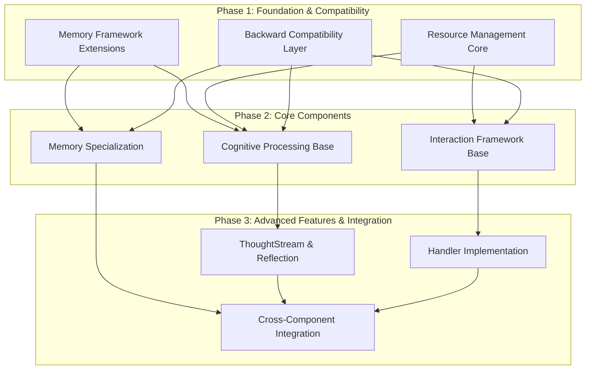
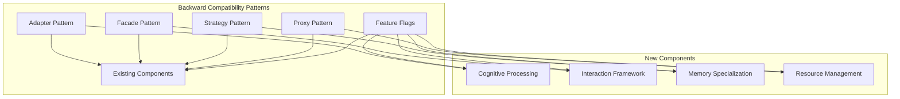
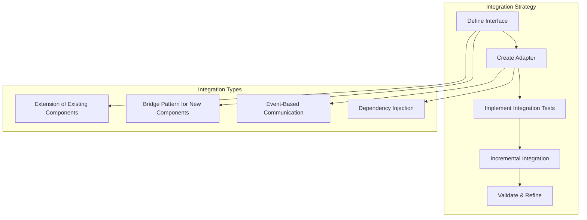
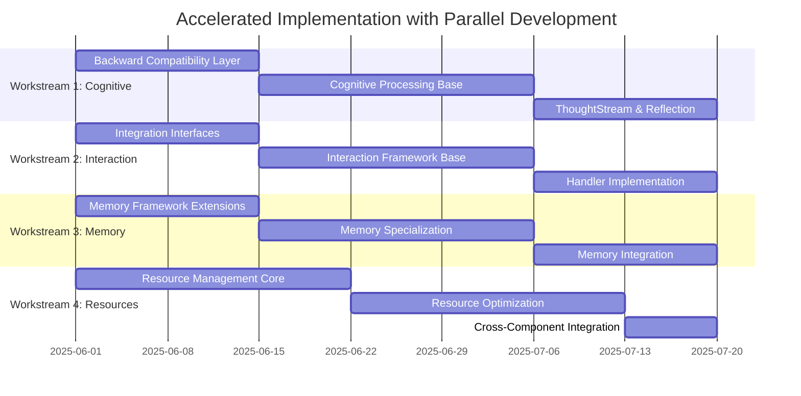
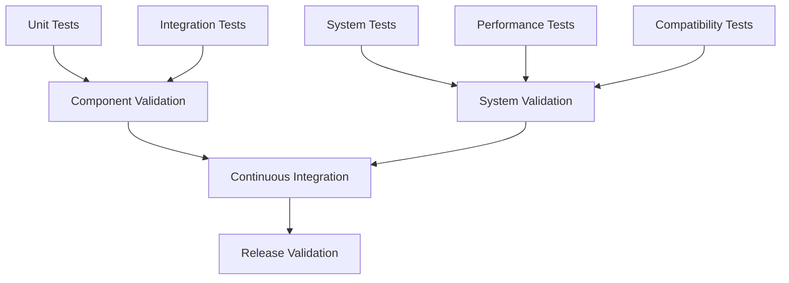
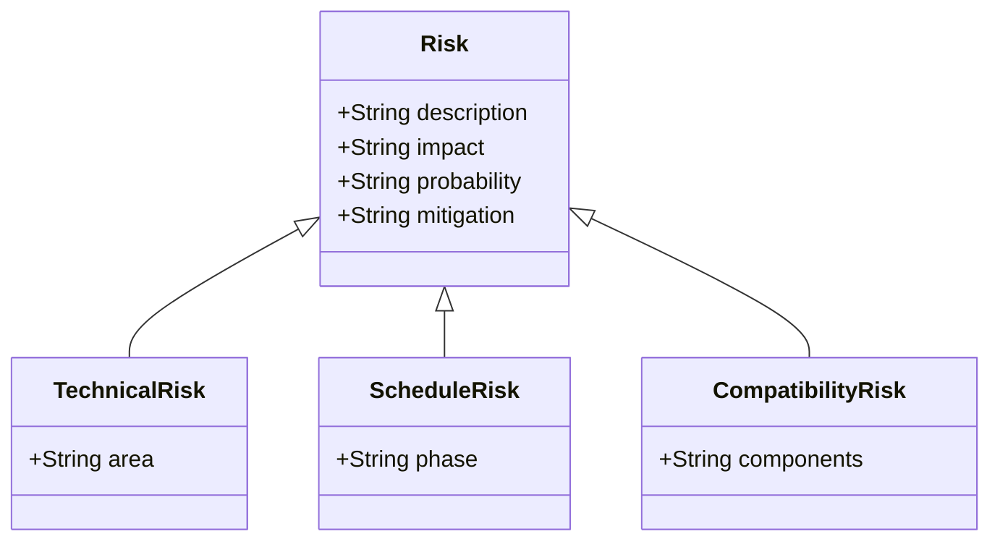
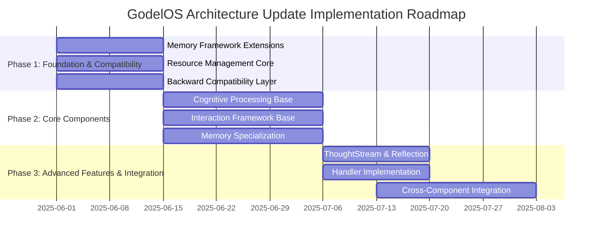

# GodelOS Architecture Update: Implementation Plan

## 1. Implementation Approach Overview

The implementation approach is designed for rapid deployment while maintaining backward compatibility with critical existing components, particularly the MetacognitionManager and KnowledgeStore. The plan follows a hybrid approach - extending existing components where possible while creating new modules where needed, with a feature-driven implementation priority.



## 2. Accelerated Implementation Plan

### Phase 1: Foundation & Compatibility (Weeks 1-2)

**Objective:** Establish foundational components and ensure backward compatibility.

#### Deliverables:

1. **Memory Framework Extensions**
   - Extend existing knowledge store interfaces to support specialized memory types
   - Create base classes for memory specialization
   - Implement memory context management

2. **Resource Management Core**
   - Implement UnifiedResourceManager base structure
   - Create ComputeResourceAllocator and MemoryManager components
   - Develop resource monitoring interfaces

3. **Backward Compatibility Layer**
   - Create adapter interfaces for MetacognitionManager integration
   - Implement KnowledgeStore compatibility wrappers
   - Develop feature flags for gradual adoption
   - Create compatibility test suite

#### Milestones:
- Memory framework can support different memory types
- Resource allocation and monitoring is functional
- All existing tests pass with new components
- Backward compatibility verified with critical components

#### Backward Compatibility Strategy:
- **MetacognitionManager Compatibility:**
  - Implement adapter pattern to connect new cognitive components
  - Create facade for unified access to both old and new functionality
  - Use strategy pattern to gradually shift processing to new components
  - Maintain identical public API while extending internal capabilities

- **KnowledgeStore Compatibility:**
  - Extend rather than replace existing interfaces
  - Implement specialized stores as decorators on existing stores
  - Create proxy objects for transparent access to new memory types
  - Ensure all existing query patterns continue to work

### Phase 2: Core Components (Weeks 3-5)

**Objective:** Implement the core functionality of each major component with parallel development.

#### Deliverables:

1. **Cognitive Processing Base**
   - Implement CognitiveEngine framework
   - Create basic ThoughtStream data structures
   - Develop AttentionManager and BackgroundProcessor

2. **Interaction Framework Base**
   - Extend CommonSenseContextManager with interaction capabilities
   - Implement ProtocolManager for standardized communication
   - Create security layer for interaction validation

3. **Memory Specialization**
   - Implement SemanticMemory specialized store
   - Develop EpisodicMemory with temporal capabilities
   - Create WorkingMemory with priority-based management

#### Milestones:
- Basic cognitive processing pipeline is functional
- Interaction framework can handle different types of interactions
- Specialized memory stores can store and retrieve appropriate data
- Integration with existing components is verified

### Phase 3: Advanced Features & Integration (Weeks 6-8)

**Objective:** Implement advanced features and integrate all components.

#### Deliverables:

1. **ThoughtStream & Reflection**
   - Complete ThoughtStream with priority queuing
   - Implement ReflectionEngine with self-analysis capabilities
   - Develop IdeationEngine with creative generation

2. **Handler Implementation**
   - Implement HumanHandler with natural language processing
   - Develop AgentHandler for agent-to-agent communication
   - Create LogicHandler for formal logic operations

3. **Cross-Component Integration**
   - Complete integration between cognitive and interaction systems
   - Finalize memory integration with all components
   - Implement comprehensive resource management
   - Optimize performance and resource usage
   - Implement UnifiedState for global state tracking

#### Milestones:
- Full cognitive processing cycle is operational
- All handler types can process appropriate interactions
- All components work together as a unified system
- System performance meets efficiency requirements
- Architecture update is complete and validated

## 3. Component Prioritization

```mermaid
quadrantChart
    title Component Priority Matrix
    x-axis Low Impact --> High Impact
    y-axis Low Urgency --> High Urgency
    quadrant-1 "Schedule for Later Phases"
    quadrant-2 "Critical Path Components"
    quadrant-3 "Nice to Have"
    quadrant-4 "Quick Wins"
    "ThoughtStream": [0.8, 0.7]
    "ReflectionEngine": [0.7, 0.6]
    "IdeationEngine": [0.6, 0.5]
    "HumanHandler": [0.9, 0.8]
    "AgentHandler": [0.7, 0.7]
    "LogicHandler": [0.6, 0.6]
    "SemanticMemory": [0.9, 0.9]
    "EpisodicMemory": [0.8, 0.8]
    "WorkingMemory": [0.9, 0.7]
    "UnifiedResourceManager": [0.7, 0.9]
    "BackwardCompatibilityLayer": [1.0, 1.0]
    "UnifiedState": [0.9, 0.8]
```

### Priority Rationale:

1. **Highest Priority (Critical Path)**
   - BackwardCompatibilityLayer: Essential for maintaining system stability
   - SemanticMemory and EpisodicMemory: Fundamental to knowledge representation
   - HumanHandler: Essential for system interaction
   - UnifiedState: Core component for system coherence

2. **High Priority (Important Features)**
   - WorkingMemory: Enables efficient cognitive processing
   - ThoughtStream: Central to cognitive architecture
   - UnifiedResourceManager: Needed for efficient operation
   - AgentHandler: Enables agent communication

3. **Medium Priority (Supporting Components)**
   - ReflectionEngine: Enhances cognitive capabilities
   - LogicHandler: Supports formal reasoning
   - IdeationEngine: Provides creative capabilities

## 4. Integration Strategies

### 4.1 Backward Compatibility Strategy



#### MetacognitionManager Compatibility

1. **API Preservation**
   - Maintain all existing public methods and signatures
   - Extend functionality without breaking existing calls
   - Implement versioned APIs where necessary

2. **Adapter Implementation**
   - Create adapters for ThoughtStream to connect with existing monitoring
   - Implement adapters for ReflectionEngine to work with diagnostician
   - Develop adapters for IdeationEngine to integrate with modification planner

3. **Gradual Transition Strategy**
   - Use feature flags to enable new functionality incrementally
   - Implement A/B processing for critical paths
   - Create monitoring to compare old vs. new implementation results

#### KnowledgeStore Compatibility

1. **Interface Extension**
   - Extend existing interfaces rather than replace them
   - Add new methods for specialized memory operations
   - Maintain backward compatibility in all query operations

2. **Storage Abstraction**
   - Create abstraction layer between specialized memories and storage
   - Implement proxy objects for transparent access to new memory types
   - Ensure consistent behavior across memory types

3. **Data Migration Strategy**
   - Implement on-demand migration for existing knowledge
   - Create indexing for efficient cross-memory retrieval
   - Develop fallback mechanisms for compatibility edge cases

### 4.2 Component Integration Approach



### 4.3 Specific Integration Strategies

1. **Cognitive Processing Integration**
   - Extend MetacognitionManager to incorporate ThoughtStream
   - Use adapter pattern to connect ReflectionEngine with existing SelfMonitoringModule
   - Implement event-based communication between IdeationEngine and other components
   - Create extension points in existing metacognition cycle

2. **Interaction Framework Integration**
   - Build handlers on top of CommonSenseContextManager
   - Implement protocol adapters for different interaction types
   - Use dependency injection to provide handlers with required components
   - Create a facade for unified access to interaction capabilities

3. **Memory Specialization Integration**
   - Extend existing KnowledgeStoreInterface for specialized memory types
   - Implement bridge pattern between memory types and storage backends
   - Create composite pattern for cross-memory operations
   - Use decorator pattern to add specialized behaviors to base memory operations

4. **Resource Management Integration**
   - Implement observer pattern for resource monitoring
   - Create strategy pattern for different resource allocation algorithms
   - Use facade pattern to provide unified resource management interface
   - Implement adapter pattern for existing resource-intensive components

## 5. Parallel Development Strategy

To accelerate implementation, we'll use a parallel development approach with multiple workstreams:



### Parallel Development Approach:

1. **Team Structure**
   - Organize into specialized teams for each workstream
   - Establish clear interfaces between workstreams
   - Create integration team to coordinate across workstreams

2. **Development Practices**
   - Use feature branches for isolated development
   - Implement continuous integration with comprehensive tests
   - Conduct regular integration meetings to resolve dependencies

3. **Dependency Management**
   - Identify and prioritize cross-team dependencies
   - Create mock implementations for components under development
   - Use interface-first development to enable parallel work

## 6. Testing Strategy



### 6.1 Testing Levels

1. **Unit Testing**
   - Test individual classes and methods
   - Mock dependencies to isolate components
   - Achieve high code coverage (target: 90%+)
   - Implement property-based testing for complex algorithms

2. **Integration Testing**
   - Test interaction between components
   - Verify correct communication patterns
   - Test with realistic data flows
   - Validate component boundaries

3. **System Testing**
   - End-to-end testing of complete features
   - Validate system behavior against requirements
   - Test error handling and recovery
   - Verify cross-component functionality

4. **Performance Testing**
   - Benchmark resource usage
   - Test system under load
   - Verify memory management
   - Validate scalability

5. **Compatibility Testing**
   - Verify backward compatibility with existing components
   - Run existing test suites against new implementation
   - Test with existing client code
   - Validate data migration and access patterns

### 6.2 Testing Approach for Key Components

1. **Cognitive Processing Testing**
   - Unit test individual cognitive components
   - Test thought prioritization algorithms
   - Validate reflection capabilities with predefined scenarios
   - Benchmark cognitive processing performance

2. **Interaction Framework Testing**
   - Test protocol validation and transformation
   - Validate handler behavior with mock interactions
   - Test security and permission enforcement
   - Verify correct routing of interactions

3. **Memory Specialization Testing**
   - Test memory storage and retrieval operations
   - Validate consistency across memory types
   - Test memory consolidation processes
   - Benchmark memory performance under load

4. **Resource Management Testing**
   - Test resource allocation algorithms
   - Validate resource monitoring accuracy
   - Test resource optimization strategies
   - Verify resource constraint enforcement

5. **Backward Compatibility Testing**
   - Test existing API calls with new implementations
   - Verify data access patterns continue to work
   - Validate behavior consistency with existing components
   - Test feature flag functionality

## 7. Risk Management

### 7.1 Potential Risks and Mitigation Strategies



#### Compatibility Risks

| Risk | Impact | Probability | Mitigation Strategy |
|------|--------|-------------|---------------------|
| Breaking changes to MetacognitionManager API | High | Medium | Create comprehensive adapter layer, implement extensive compatibility tests, phase implementation gradually |
| Data inconsistency between memory types | High | Medium | Create data validation layer, implement consistency checks, provide fallback to original implementation |
| Performance regression due to compatibility layers | Medium | High | Optimize critical paths, implement caching strategies, conduct performance testing early |
| Unexpected side effects in existing functionality | High | Medium | Create isolated test environments, implement feature flags, conduct extensive regression testing |

#### Technical Risks

| Risk | Impact | Probability | Mitigation Strategy |
|------|--------|-------------|---------------------|
| Performance bottlenecks in cognitive processing | High | Medium | Implement incremental performance testing, design for parallelization, use profiling tools |
| Memory leaks in specialized memory components | High | Medium | Implement memory monitoring, use automated leak detection, conduct stress testing |
| Concurrency issues in resource management | High | High | Use thread-safe designs, implement deadlock detection, use proven concurrency patterns |
| Complexity of integration between components | Medium | High | Create clear interfaces, implement comprehensive integration tests, use dependency injection |

#### Schedule Risks

| Risk | Impact | Probability | Mitigation Strategy |
|------|--------|-------------|---------------------|
| Underestimation of backward compatibility complexity | High | High | Allocate buffer time, prioritize compatibility work, create detailed compatibility test plan |
| Dependencies between parallel workstreams | Medium | High | Identify dependencies early, create interface contracts, implement mock implementations |
| Resource availability constraints | Medium | Low | Cross-train team members, document implementation details, use modular design |
| Scope creep | High | Medium | Clearly define requirements, implement change management process, prioritize features |

### 7.2 Contingency Planning

1. **Compatibility Contingencies**
   - Prepare rollback mechanisms for each integration point
   - Implement feature flags to disable problematic features
   - Create compatibility shims for critical functionality

2. **Technical Contingencies**
   - Design simplified implementations for complex components
   - Prepare performance optimization strategies for critical paths
   - Create fallback mechanisms for advanced features

3. **Schedule Contingencies**
   - Identify minimum viable product features
   - Prepare for phased releases if necessary
   - Create prioritized feature list for potential scope reduction

## 8. Implementation Roadmap



## 9. Key Decision Points

Throughout the implementation, several key decision points will require evaluation:

1. **Backward Compatibility Decisions**
   - How to handle edge cases in existing API usage
   - When to deprecate legacy interfaces
   - How to manage feature flag transitions

2. **Memory Architecture Decisions**
   - Whether to use a unified storage backend or specialized backends for each memory type
   - How to handle memory consolidation between different memory types
   - Storage format and indexing strategies for optimal retrieval

3. **Cognitive Processing Decisions**
   - Synchronous vs. asynchronous thought processing
   - Priority determination algorithms for thought streams
   - Balance between reflection depth and performance

4. **Interaction Framework Decisions**
   - Protocol standardization vs. flexibility
   - Security model implementation details
   - Error handling and recovery strategies

5. **Resource Management Decisions**
   - Static vs. dynamic resource allocation
   - Preemptive vs. cooperative resource scheduling
   - Monitoring granularity and overhead balance

## 10. Success Criteria

The implementation will be considered successful when:

1. All identified gaps in the architecture have been addressed
2. The system demonstrates improved cognitive capabilities through ThoughtStream, ReflectionEngine, and IdeationEngine
3. The Interaction Framework successfully handles human, agent, and logic interactions
4. Memory specialization provides appropriate storage and retrieval for different knowledge types
5. Resource management efficiently allocates system resources
6. All existing functionality continues to work correctly
7. Backward compatibility is maintained with MetacognitionManager and KnowledgeStore
8. All tests pass with at least 90% code coverage
9. System performance meets or exceeds baseline metrics
10. The architecture is well-documented and maintainable