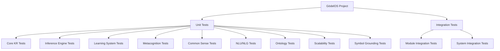
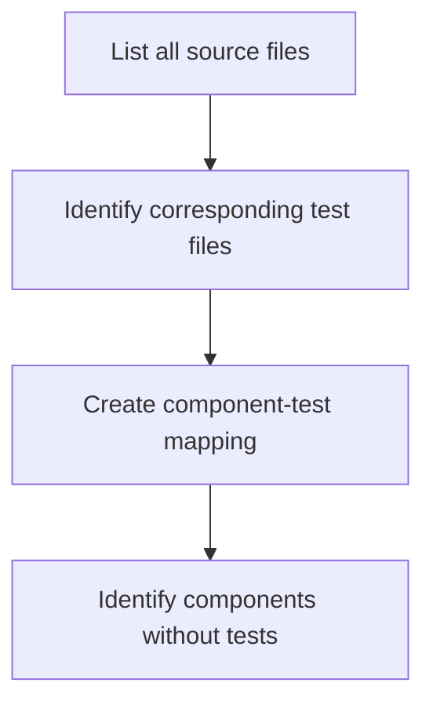
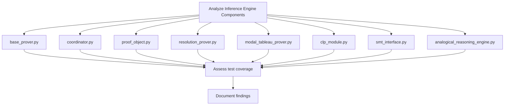
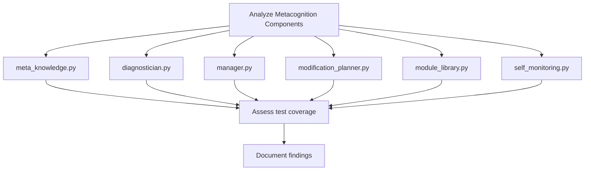
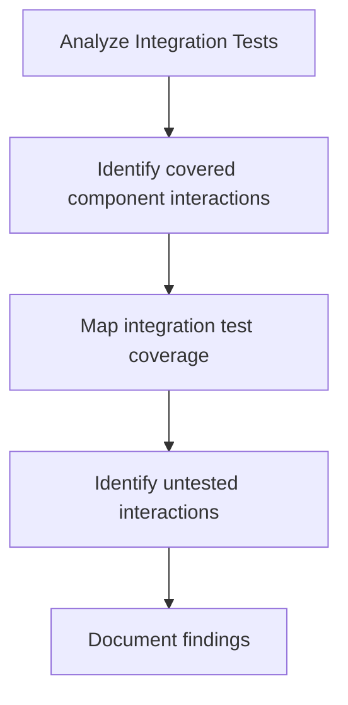
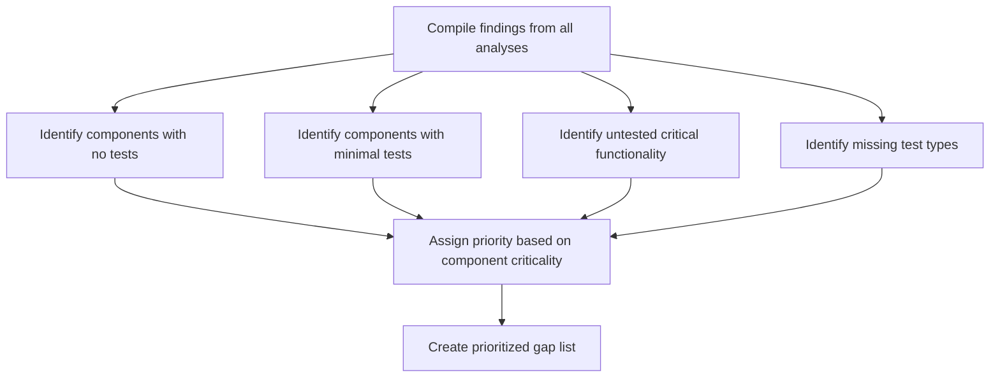
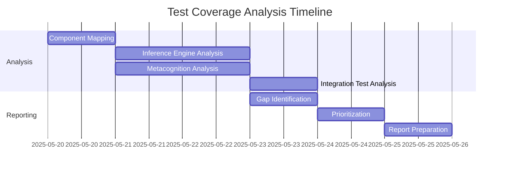

# Test Coverage Analysis Plan for GödelOS

## 1. Overview of Current Test Structure

The GödelOS project has a well-organized test structure that mirrors the module structure of the source code. Tests are categorized into logical groups such as core_kr, inference, learning, common_sense, metacognition, etc. The project includes both unit tests for individual components and integration tests for testing interactions between components.

## 2. Analysis Methodology

The following approach will be used to analyze test coverage:

1. **Component Mapping**: Create a comprehensive map of all source components and their corresponding test files
2. **Coverage Assessment**: For each component, assess:
   - Existence of basic unit tests
   - Functionality coverage (which methods/features are tested)
   - Edge case coverage
   - Error handling coverage
   - Integration test coverage
3. **Gap Identification**: Identify components with:
   - No tests
   - Minimal tests
   - Missing test types (unit, integration, etc.)
   - Untested critical functionality
4. **Priority Assignment**: Assign priorities to identified gaps based on:
   - Component criticality to system functionality
   - Complexity of untested code
   - Potential impact of failures

## 3. Detailed Analysis Steps

### 3.1 Component Mapping

1. Generate a complete list of source files in the project
2. For each source file, identify corresponding test files
3. Create a mapping between components and their tests
4. Identify components that lack corresponding test files

### 3.2 Coverage Assessment for Inference Engine

For each component:
1. Review source code to identify key functionality
2. Examine corresponding test files
3. Assess which methods and features are tested
4. Identify untested functionality
5. Evaluate edge case and error handling coverage
6. Document findings in a structured format

### 3.3 Coverage Assessment for Metacognition

For each component:
1. Review source code to identify key functionality
2. Examine corresponding test files
3. Assess which methods and features are tested
4. Identify untested functionality
5. Evaluate edge case and error handling coverage
6. Document findings in a structured format

### 3.4 Integration Test Analysis

1. Review all integration test files
2. Identify which component interactions are tested
3. Create a map of integration test coverage
4. Identify critical component interactions that lack tests
5. Document findings in a structured format

### 3.5 Gap Identification and Prioritization

1. Compile findings from all previous analyses
2. Identify components with no tests
3. Identify components with minimal test coverage
4. Identify untested critical functionality
5. Identify missing test types (unit, integration, etc.)
6. Assign priorities based on component criticality and potential impact
7. Create a prioritized list of test coverage gaps

## 4. Deliverables

The analysis will produce the following deliverables:

1. **Component-Test Mapping**: A comprehensive mapping between source components and their corresponding test files
2. **Coverage Assessment**: Detailed assessment of test coverage for each component
3. **Gap Analysis**: Identification of components with insufficient test coverage
4. **Prioritized Recommendations**: A prioritized list of recommendations for improving test coverage
5. **Test Coverage Report**: A comprehensive report summarizing the findings and recommendations

## 5. Implementation Timeline

1. Component Mapping: 1 day
2. Inference Engine Analysis: 2 days
3. Metacognition Analysis: 2 days
4. Integration Test Analysis: 1 day
5. Gap Identification: 1 day
6. Prioritization: 1 day
7. Report Preparation: 1 day

Total estimated time: 9 days

## 6. Tools and Resources

1. **Code Analysis Tools**: 
   - Static code analysis tools to identify code complexity
   - Test coverage tools to measure quantitative coverage
2. **Documentation Resources**:
   - Project documentation
   - Module specifications
   - System architecture diagrams
3. **Expertise Required**:
   - Knowledge of Python testing frameworks
   - Understanding of GödelOS architecture
   - Experience with test coverage analysis

## 7. Focus Areas

As requested, the analysis will focus particularly on:

1. **Metacognition Components**:
   - meta_knowledge.py
   - diagnostician.py
   - manager.py
   - modification_planner.py
   - module_library.py
   - self_monitoring.py

2. **Inference Engine Components**:
   - base_prover.py
   - coordinator.py
   - proof_object.py
   - resolution_prover.py
   - modal_tableau_prover.py
   - clp_module.py
   - smt_interface.py
   - analogical_reasoning_engine.py

These components are critical to the system's functionality and will be prioritized in the analysis.