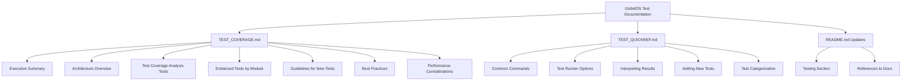
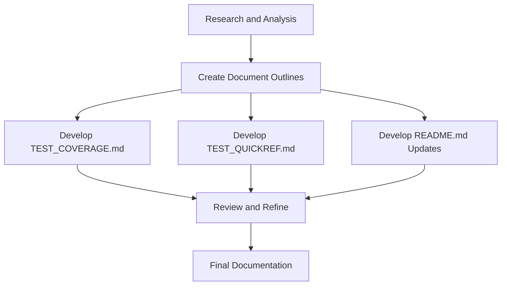

# Detailed Plan for GödelOS Test Coverage Documentation

This plan outlines the structure and content for each of the three deliverables: TEST_COVERAGE.md, TEST_QUICKREF.md, and updates to README.md.

## Documentation Overview

## 1. TEST_COVERAGE.md

This will be the comprehensive documentation file that provides detailed information about the test coverage implementation.

### Structure and Content

#### 1.1 Executive Summary
- Brief overview of the test coverage implementation
- Key features and benefits
- High-level architecture diagram
- Summary of test coverage metrics and achievements

#### 1.2 Architecture Overview of Test Suite Runner
- Detailed explanation of the test suite runner architecture
- Component diagram showing relationships between:
  - TestRunner
  - ConfigurationManager
  - TestDiscovery
  - TestCategorizer
  - PyTestWrapper
  - ResultsCollector
  - TimingTracker
  - StatisticsCollector
  - OutputManager
  - Formatters (Console, HTML, JSON)
- Explanation of data flow through the system
- Key interfaces and classes

#### 1.3 Test Coverage Analysis Tools
- Description of test_coverage_analyzer.py
  - Purpose and functionality
  - Component-level analysis capabilities
  - Output format and interpretation
- Description of method_coverage_analyzer.py
  - Purpose and functionality
  - Method-level analysis capabilities
  - Output format and interpretation
- Description of generate_coverage_report.py
  - HTML report generation
  - Visualization features
- Description of run_test_coverage_analysis.sh
  - Automation of the analysis process
  - Usage instructions

#### 1.4 Enhanced Tests by Module
- Summary of enhanced tests for each module, organized by phase:
  - Phase 1: Symbol Grounding, Common Sense, and Ontology
    - Symbol Grounding tests
    - Common Sense tests
    - Ontology tests
  - Phase 2: Core Knowledge Representation and Inference Engine
    - Core KR tests
    - Inference Engine tests
  - Phase 3: Metacognition, NLU/NLG, and Scalability
    - Metacognition tests
    - NLU/NLG tests
    - Scalability tests
- For each module:
  - Key components tested
  - Test coverage metrics
  - Types of tests (unit, integration, etc.)
  - Examples of test patterns used

#### 1.5 Guidelines for Writing New Tests
- Test file naming conventions
- Test class and method naming conventions
- Test structure and organization
- Using pytest fixtures and markers
- Writing effective assertions
- Handling test dependencies
- Mocking and stubbing techniques
- Parameterized tests
- Edge case testing
- Error case testing

#### 1.6 Best Practices for Maintaining and Extending Test Coverage
- Regular test coverage analysis
- Continuous integration considerations
- Updating tests when refactoring code
- Balancing test coverage and development speed
- Documentation standards for tests
- Code review guidelines for tests
- Test maintenance strategies

#### 1.7 Performance Considerations
- Optimizing test execution time
- Parallel test execution
- Test categorization for selective testing
- Caching strategies
- Resource management during testing
- Profiling and monitoring test performance

## 2. TEST_QUICKREF.md

This will be a concise reference guide that provides quick access to common testing commands and procedures.

### Structure and Content

#### 2.1 Common Commands for Running Tests
- Basic test execution commands
- Running specific test categories
- Running tests for specific modules
- Running tests with different verbosity levels
- Generating test reports

#### 2.2 Test Runner Options and Examples
- Configuration options
- Command-line arguments
- Environment variables
- Examples of common usage patterns
- Examples with different output formats

#### 2.3 Interpreting Test Results and Reports
- Understanding console output
- Reading HTML reports
- Analyzing JSON reports
- Interpreting test coverage metrics
- Troubleshooting common test failures

#### 2.4 Adding New Tests to the System
- Quick guide to creating new test files
- Template for test classes and methods
- Required imports and setup
- Common fixtures and utilities
- Example of a complete test file

#### 2.5 Test Categorization Guide
- Available test categories
- How to assign tests to categories
- Using pytest markers
- Creating custom categories
- Benefits of proper categorization

## 3. README.md Updates

### Structure and Content

#### 3.1 Testing Section
- Brief overview of the testing approach
- Key features of the test infrastructure
- Test coverage summary
- How to run tests

#### 3.2 References to Documentation
- Links to TEST_COVERAGE.md and TEST_QUICKREF.md
- Brief description of what each document contains
- When to use each document

## Implementation Approach

### Step 1: Research and Analysis (Completed)
- Analyze existing test infrastructure
- Understand test runner architecture
- Review test coverage analysis tools
- Examine enhanced tests for all modules

### Step 2: Create Document Outlines
- Develop detailed outlines for each document
- Ensure comprehensive coverage of all required topics
- Establish consistent structure and terminology

### Step 3: Develop TEST_COVERAGE.md
- Write comprehensive documentation following the outlined structure
- Include diagrams, code examples, and explanations
- Ensure thorough coverage of all aspects of the test infrastructure

### Step 4: Develop TEST_QUICKREF.md
- Create concise, practical reference guide
- Focus on common tasks and commands
- Include clear examples for each scenario

### Step 5: Develop README.md Updates
- Create a testing section for the main README
- Add appropriate references to the new documentation
- Ensure consistency with existing README content

### Step 6: Review and Refine
- Review all documentation for accuracy and completeness
- Ensure consistent terminology and formatting
- Verify that all requirements are met

### Step 7: Final Documentation
- Deliver final versions of all three documents
- Ensure proper formatting and organization
- Verify cross-references between documents