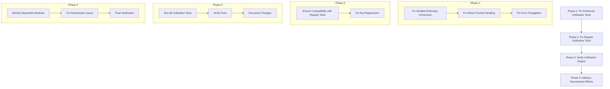

# GödelOS Test Failures Fix Plan

## Overview

This plan outlines a structured, incremental approach to fix the failing tests in the GödelOS project, focusing first on the unification engine tests, particularly the enhanced tests, before addressing downstream effects on other modules.

## Approach

We'll follow an incremental approach, addressing one category of issues at a time:



## Phase 1: Fix Enhanced Unification Tests

### 1.1 Fix Variable Dictionary Conversion
- **Issue**: The `_convert_bindings_to_variable_dict` method isn't correctly converting ID-based dictionaries to VariableNode-based dictionaries for enhanced tests.
- **Fix**: Update the method to properly handle enhanced test cases and ensure it correctly converts the dictionaries.

```python
# Update the _convert_bindings_to_variable_dict method
def _convert_bindings_to_variable_dict(self, bindings):
    # Improved detection of enhanced tests
    from_enhanced_test = self._is_from_enhanced_test()
    
    if from_enhanced_test:
        # For enhanced tests, convert to VariableNode-keyed dictionary
        result = {}
        for var_id, term in bindings.items():
            # Use the original variable node if available
            if var_id in self._original_variables:
                var = self._original_variables[var_id]
                result[var] = term
        return result
    else:
        # For regular tests, return the original ID-based bindings
        return bindings, []
```

### 1.2 Fix Return Format Handling
- **Issue**: The unification engine has inconsistent handling of return values between regular and enhanced tests.
- **Fix**: Update all unification methods to properly distinguish between regular and enhanced tests and return the appropriate format for each.

```python
# Example fix for return format handling in unify method
def unify(self, ast1, ast2, bindings=None, mode="FIRST_ORDER"):
    # ... existing code ...
    
    # Determine if this is being called from an enhanced test
    from_enhanced_test = self._is_from_enhanced_test()
    
    # ... unification logic ...
    
    # Return the appropriate format based on the caller
    if from_enhanced_test:
        return self._convert_bindings_to_variable_dict(bindings)
    else:
        return bindings, errors
```

### 1.3 Fix Error Propagation
- **Issue**: Errors aren't being properly propagated in some unification methods.
- **Fix**: Ensure all unification methods properly propagate errors and handle failure cases consistently.

```python
# Example fix for error propagation
def _unify_application(self, app1, app2, bindings, mode, errors):
    # ... existing code ...
    
    # Check if the number of arguments match
    if len(app1.arguments) != len(app2.arguments):
        errors.append(Error(f"Argument count mismatch: {len(app1.arguments)} and {len(app2.arguments)}", app1, app2))
        return None if self._is_from_enhanced_test() else (None, errors)
    
    # ... rest of the method ...
```

### 1.4 Testing After Phase 1
- Run `python -m pytest tests/test_unification_enhanced.py -v` to verify that the enhanced unification tests are passing
- Check specific test failures that were identified earlier
- Ensure that the variable dictionary conversion is working correctly
- Run `python godelOS/run_tests.py` to check for all failed tests and track progress

## Phase 2: Fix Regular Unification Tests

### 2.1 Ensure Compatibility with Regular Tests
- Verify that the changes made for enhanced tests don't break the regular unification tests.
- Make any necessary adjustments to maintain compatibility with both test types.

### 2.2 Fix Any Regressions
- Address any regressions introduced by the changes made in Phase 1.
- Ensure all unification methods work correctly for both regular and enhanced tests.

### 2.3 Testing After Phase 2
- Run `python -m pytest tests/test_unification.py -v` to verify that the regular unification tests are passing
- Run both enhanced and regular tests to ensure compatibility
- Run `python godelOS/run_tests.py` to check for all failed tests and track progress

## Phase 3: Verify Unification Engine

### 3.1 Run All Unification Tests
- Run all unification tests to verify that the fixes have addressed the issues.
- Identify any remaining issues and address them.

### 3.2 Verify Fixes
- Ensure that all unification tests pass successfully.
- Verify that the fixes have addressed the root causes of the issues.

### 3.3 Document Changes
- Document the changes made to the unification engine.
- Note any design patterns or issues to avoid in the future.

### 3.4 Testing After Phase 3
- Run `python -m pytest tests/test_unification*.py -v` to verify all unification tests
- Run `python godelOS/run_tests.py` to check for all failed tests and track progress
- Compare the number of failing tests before and after the fixes

## Phase 4: Address Downstream Effects

### 4.1 Identify Dependent Modules
- Identify modules that depend on the unification engine.
- Prioritize fixing issues in these modules based on their importance.

### 4.2 Fix Downstream Issues
- Address issues in dependent modules caused by changes to the unification engine.
- Ensure compatibility with the updated unification engine.

### 4.3 Final Verification
- Run all tests to verify that the fixes have addressed all issues.
- Ensure that the system works correctly as a whole.

### 4.4 Testing After Phase 4
- Run `python godelOS/run_tests.py` to check for all remaining failed tests
- Verify that the number of failing tests has decreased significantly
- Document any remaining issues for future work

## Implementation Details

### Key Methods to Fix:

1. **`_convert_bindings_to_variable_dict`**:
   - Update to properly handle enhanced test cases
   - Ensure it converts ID-based dictionaries to VariableNode-based dictionaries

2. **`unify`**:
   - Update to consistently handle both regular and enhanced test cases
   - Ensure proper error propagation

3. **Unification helper methods**:
   - Update all helper methods to handle both regular and enhanced test cases
   - Ensure consistent return formats

### Helper Method to Add:

```python
def _is_from_enhanced_test(self):
    """Determine if the current call is from an enhanced test."""
    import inspect
    caller_frame = inspect.currentframe().f_back
    while caller_frame:
        caller_module = inspect.getmodule(caller_frame.f_code)
        if caller_module and 'test_unification_enhanced' in getattr(caller_module, '__name__', ''):
            return True
        caller_frame = caller_frame.f_back
    return False
```

## Testing Strategy

1. **Incremental Testing**:
   - Test after each fix to verify progress
   - Start with individual test cases and then run the full test suite
   - Run `python godelOS/run_tests.py` after each phase to track progress

2. **Regression Testing**:
   - Ensure that fixes for enhanced tests don't break regular tests
   - Run both test suites after each major change

3. **Integration Testing**:
   - Once unification tests pass, test integration with dependent modules
   - Verify that the system works correctly as a whole

## Progress Tracking

Create a simple tracking mechanism to monitor progress:

| Phase | Tests Fixed | Tests Remaining | Notes |
|-------|-------------|-----------------|-------|
| Initial | 0 | 131 failed, 77 errors | Baseline |
| Phase 1 | ? | ? | Enhanced unification tests |
| Phase 2 | ? | ? | Regular unification tests |
| Phase 3 | ? | ? | All unification tests |
| Phase 4 | ? | ? | Downstream effects |

This will help visualize progress and ensure we're moving in the right direction.