# Comprehensive Test Plan for GödelOS

## 1. Overall Testing Strategy and Approach

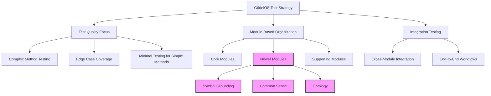

### 1.1 Guiding Principles

1. **Quality over Quantity**: Focus on thorough testing of complex methods rather than achieving arbitrary coverage percentages
2. **Complexity-Based Prioritization**: Allocate more testing resources to methods with high cyclomatic complexity
3. **Edge Case Coverage**: Ensure tests cover boundary conditions and edge cases, especially for complex methods
4. **Integration Focus**: Emphasize testing of integration points between modules
5. **Minimal Redundancy**: Apply minimal testing to simple methods (getters/setters) to avoid test bloat

### 1.2 Test Types and Their Application

| Test Type | Primary Application | Secondary Application |
|-----------|---------------------|------------------------|
| Unit Tests | Complex methods with high cyclomatic complexity | Public API methods |
| Integration Tests | Module boundaries and interactions | End-to-end workflows |
| Property-Based Tests | Methods with complex input domains | Data transformation functions |
| Parameterized Tests | Methods with multiple execution paths | Configuration-dependent behavior |
| Mock-Based Tests | External dependencies | Complex internal dependencies |

### 1.3 Test Documentation Standards

1. **Test Naming**: `test_[method_name]_[scenario_being_tested]_[expected_outcome]`
2. **Test Docstrings**: Include purpose, test setup, expected outcome, and any special considerations
3. **Test Organization**: Group tests by class/component and functionality
4. **Test Fixtures**: Document purpose and usage of fixtures

## 2. Module-Specific Test Plans

### 2.1 Symbol Grounding Module (Priority: High)

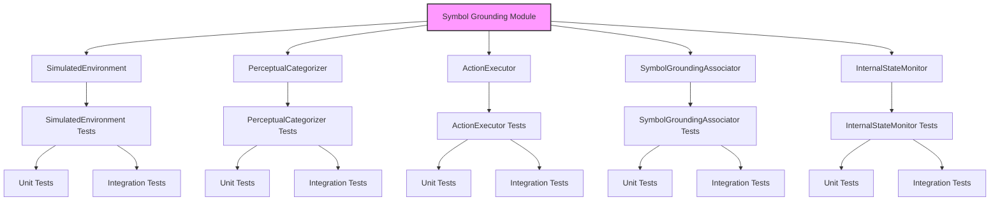

#### 2.1.1 SimulatedEnvironment Component

**Complex Methods to Test:**
- Environment initialization with different configurations
- State transitions based on actions
- Perception generation
- Environment reset and state management

**Test Cases:**
1. **Environment Initialization**
   - Test with valid configurations
   - Test with invalid configurations (should fail gracefully)
   - Test with boundary cases (empty environment, maximum size)

2. **State Transitions**
   - Test state changes after valid actions
   - Test state preservation after invalid actions
   - Test complex action sequences
   - Test concurrent actions (if supported)

3. **Perception Generation**
   - Test accuracy of perceptions based on environment state
   - Test perception filtering based on agent capabilities
   - Test perception noise models (if applicable)
   - Test perception consistency across multiple queries

4. **Integration with ActionExecutor**
   - Test action execution workflow
   - Test feedback mechanisms
   - Test error handling

#### 2.1.2 PerceptualCategorizer Component

**Complex Methods to Test:**
- Categorization of raw perceptions
- Feature extraction
- Category learning and adaptation
- Ambiguity resolution

**Test Cases:**
1. **Perception Categorization**
   - Test categorization of clear-cut perceptions
   - Test categorization of ambiguous perceptions
   - Test categorization with missing features
   - Test categorization with noise

2. **Feature Extraction**
   - Test extraction from different perception types
   - Test with varying levels of detail
   - Test with corrupted perceptions

3. **Category Learning**
   - Test learning from examples
   - Test adaptation to new examples
   - Test stability with conflicting examples
   - Test forgetting mechanisms (if applicable)

4. **Integration with SymbolGroundingAssociator**
   - Test symbol association with categories
   - Test bidirectional lookup

#### 2.1.3 ActionExecutor Component

**Complex Methods to Test:**
- Action translation from symbolic to physical
- Action validation
- Action execution and monitoring
- Feedback processing

**Test Cases:**
1. **Action Translation**
   - Test translation of simple actions
   - Test translation of complex actions
   - Test translation of parameterized actions
   - Test translation failures

2. **Action Validation**
   - Test validation of possible actions
   - Test validation of impossible actions
   - Test validation with preconditions
   - Test validation in edge-case environments

3. **Action Execution**
   - Test successful execution
   - Test partial execution
   - Test failed execution
   - Test execution monitoring

4. **Integration with SimulatedEnvironment**
   - Test action effects on environment
   - Test environment feedback processing

#### 2.1.4 SymbolGroundingAssociator Component

**Complex Methods to Test:**
- Symbol-to-perception mapping
- Perception-to-symbol mapping
- Association learning
- Association strength management

**Test Cases:**
1. **Symbol-to-Perception Mapping**
   - Test direct mappings
   - Test one-to-many mappings
   - Test with unknown symbols
   - Test with context dependency

2. **Perception-to-Symbol Mapping**
   - Test direct mappings
   - Test many-to-one mappings
   - Test with unknown perceptions
   - Test with ambiguous perceptions

3. **Association Learning**
   - Test learning from examples
   - Test reinforcement of existing associations
   - Test weakening of contradicted associations
   - Test conflict resolution

4. **Integration Testing**
   - Test with PerceptualCategorizer
   - Test with ActionExecutor
   - Test end-to-end symbol grounding workflow

#### 2.1.5 InternalStateMonitor Component

**Complex Methods to Test:**
- Internal state tracking
- State change detection
- State analysis and reporting
- Anomaly detection

**Test Cases:**
1. **State Tracking**
   - Test tracking of simple states
   - Test tracking of complex states
   - Test tracking with rapid changes
   - Test tracking with concurrent changes

2. **Change Detection**
   - Test detection of significant changes
   - Test filtering of noise
   - Test detection thresholds
   - Test detection latency

3. **State Analysis**
   - Test basic analytics
   - Test trend detection
   - Test correlation analysis
   - Test anomaly detection

4. **Integration Testing**
   - Test with other Symbol Grounding components
   - Test with Metacognition module

### 2.2 Common Sense Module (Priority: High)

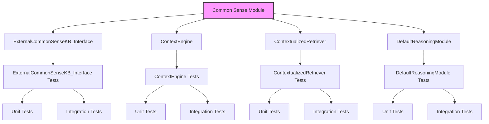

#### 2.2.1 ExternalCommonSenseKB_Interface Component

**Complex Methods to Test:**
- External KB connection and query
- Knowledge translation and normalization
- Caching and optimization
- Error handling and fallback

**Test Cases:**
1. **External KB Connection**
   - Test successful connections
   - Test connection failures
   - Test authentication
   - Test timeout handling

2. **Knowledge Translation**
   - Test translation of simple facts
   - Test translation of complex structures
   - Test normalization of inconsistent formats
   - Test handling of unsupported formats

3. **Caching Mechanisms**
   - Test cache hits and misses
   - Test cache invalidation
   - Test cache size management
   - Test cache persistence (if applicable)

4. **Integration Testing**
   - Test with ContextualizedRetriever
   - Test with DefaultReasoningModule
   - Test with mock external KBs

#### 2.2.2 ContextEngine Component

**Complex Methods to Test:**
- Context creation and management
- Context activation and deactivation
- Context merging and splitting
- Context relevance determination

**Test Cases:**
1. **Context Management**
   - Test creation of simple contexts
   - Test creation of complex contexts
   - Test context updates
   - Test context deletion

2. **Context Activation**
   - Test single context activation
   - Test multiple context activation
   - Test activation priorities
   - Test activation conflicts

3. **Context Operations**
   - Test context merging
   - Test context splitting
   - Test context inheritance
   - Test context constraints

4. **Integration Testing**
   - Test with ContextualizedRetriever
   - Test with core_kr module
   - Test with inference_engine module

#### 2.2.3 ContextualizedRetriever Component

**Complex Methods to Test:**
- Context-aware knowledge retrieval
- Relevance scoring
- Query expansion
- Result ranking and filtering

**Test Cases:**
1. **Knowledge Retrieval**
   - Test retrieval with simple contexts
   - Test retrieval with complex contexts
   - Test retrieval with multiple active contexts
   - Test retrieval with conflicting contexts

2. **Relevance Scoring**
   - Test scoring of directly relevant facts
   - Test scoring of indirectly relevant facts
   - Test scoring with different metrics
   - Test scoring with varying relevance thresholds

3. **Query Processing**
   - Test query expansion
   - Test query refinement
   - Test query transformation
   - Test query optimization

4. **Integration Testing**
   - Test with ContextEngine
   - Test with ExternalCommonSenseKB_Interface
   - Test with core_kr module

#### 2.2.4 DefaultReasoningModule Component

**Complex Methods to Test:**
- Default rule application
- Non-monotonic reasoning
- Conflict resolution
- Belief revision

**Test Cases:**
1. **Default Rule Application**
   - Test application of simple defaults
   - Test application of complex defaults
   - Test application with exceptions
   - Test application with priorities

2. **Non-monotonic Reasoning**
   - Test belief retraction
   - Test belief update
   - Test reasoning with incomplete information
   - Test reasoning with changing information

3. **Conflict Resolution**
   - Test resolution of simple conflicts
   - Test resolution of complex conflicts
   - Test resolution strategies
   - Test unresolvable conflicts

4. **Integration Testing**
   - Test with ContextEngine
   - Test with inference_engine module
   - Test with core_kr module

### 2.3 Ontology Module (Priority: High)

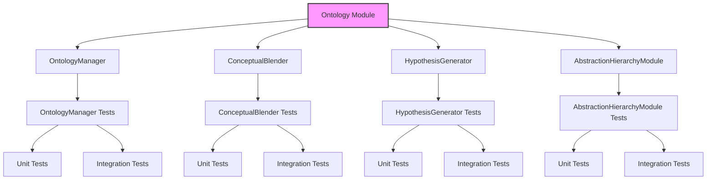

#### 2.3.1 OntologyManager Component

**Complex Methods to Test:**
- Ontology loading and parsing
- Concept definition and management
- Relationship management
- Ontology querying and traversal

**Test Cases:**
1. **Ontology Management**
   - Test loading valid ontologies
   - Test loading invalid ontologies
   - Test ontology merging
   - Test ontology versioning

2. **Concept Management**
   - Test concept creation
   - Test concept modification
   - Test concept deletion
   - Test concept relationships

3. **Ontology Querying**
   - Test simple queries
   - Test complex queries
   - Test query optimization
   - Test query caching

4. **Integration Testing**
   - Test with AbstractionHierarchyModule
   - Test with core_kr module
   - Test with common_sense module

#### 2.3.2 ConceptualBlender Component

**Complex Methods to Test:**
- Concept selection for blending
- Blending operations
- Blend evaluation
- Novel concept integration

**Test Cases:**
1. **Concept Selection**
   - Test selection of compatible concepts
   - Test selection of diverse concepts
   - Test selection based on goals
   - Test selection constraints

2. **Blending Operations**
   - Test simple property inheritance
   - Test complex structure blending
   - Test conflict resolution during blending
   - Test emergent properties

3. **Blend Evaluation**
   - Test coherence evaluation
   - Test novelty evaluation
   - Test utility evaluation
   - Test integration potential

4. **Integration Testing**
   - Test with OntologyManager
   - Test with HypothesisGenerator
   - Test with core_kr module

#### 2.3.3 HypothesisGenerator Component

**Complex Methods to Test:**
- Hypothesis generation
- Hypothesis evaluation
- Hypothesis refinement
- Hypothesis testing

**Test Cases:**
1. **Hypothesis Generation**
   - Test generation from observations
   - Test generation from anomalies
   - Test generation from goals
   - Test generation constraints

2. **Hypothesis Evaluation**
   - Test consistency checking
   - Test explanatory power
   - Test simplicity metrics
   - Test novelty assessment

3. **Hypothesis Refinement**
   - Test refinement based on feedback
   - Test refinement based on new data
   - Test refinement based on constraints
   - Test refinement strategies

4. **Integration Testing**
   - Test with ConceptualBlender
   - Test with inference_engine module
   - Test with core_kr module

#### 2.3.4 AbstractionHierarchyModule Component

**Complex Methods to Test:**
- Abstraction creation
- Abstraction hierarchy management
- Abstraction-based reasoning
- Abstraction refinement

**Test Cases:**
1. **Abstraction Creation**
   - Test creation from examples
   - Test creation from properties
   - Test creation from functions
   - Test creation constraints

2. **Hierarchy Management**
   - Test hierarchy construction
   - Test hierarchy modification
   - Test hierarchy traversal
   - Test hierarchy optimization

3. **Abstraction-Based Reasoning**
   - Test reasoning at different abstraction levels
   - Test abstraction selection for problems
   - Test abstraction transfer
   - Test abstraction refinement during reasoning

4. **Integration Testing**
   - Test with OntologyManager
   - Test with inference_engine module
   - Test with core_kr module

### 2.4 Core Knowledge Representation (core_kr) Module

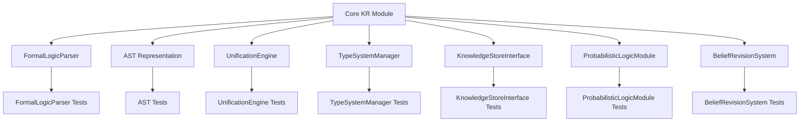

**Integration Test Focus:**
- Integration with Inference Engine
- Integration with Common Sense module
- Integration with Ontology module
- Integration with Symbol Grounding module

**Complex Methods to Prioritize:**
- UnificationEngine: Higher-order unification
- TypeSystemManager: Type inference and checking
- KnowledgeStoreInterface: Query optimization
- ProbabilisticLogicModule: Inference algorithms
- BeliefRevisionSystem: Belief revision operations

### 2.5 Inference Engine Module

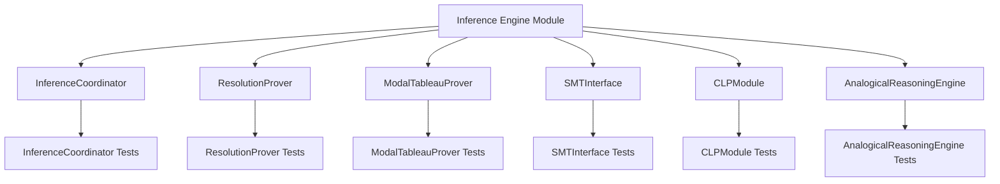

**Integration Test Focus:**
- Integration with Core KR module
- Integration with Metacognition module
- Integration with Learning System
- End-to-end reasoning workflows

**Complex Methods to Prioritize:**
- InferenceCoordinator: Strategy selection
- ModalTableauProver: Modal logic reasoning
- SMTInterface: SMT solver integration
- CLPModule: Constraint solving
- AnalogicalReasoningEngine: Analogy mapping

### 2.6 Metacognition Module

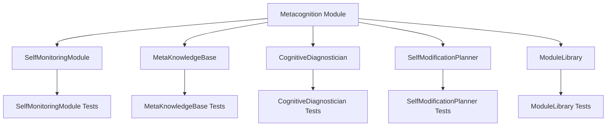

**Integration Test Focus:**
- Integration with Inference Engine
- Integration with Core KR module
- Integration with Learning System
- Self-monitoring workflows

**Complex Methods to Prioritize:**
- CognitiveDiagnostician: Diagnostic algorithms
- SelfModificationPlanner: Planning algorithms
- MetaKnowledgeBase: Meta-knowledge management
- ModuleLibrary: Module activation and coordination

### 2.7 NLU/NLG Module

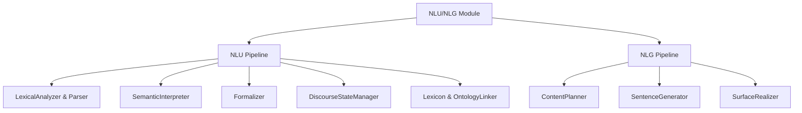

**Integration Test Focus:**
- Integration with Core KR module
- Integration with Ontology module
- Integration with Common Sense module
- End-to-end NLU/NLG workflows

**Complex Methods to Prioritize:**
- SemanticInterpreter: Semantic analysis
- Formalizer: Natural language to logic conversion
- DiscourseStateManager: Context management
- ContentPlanner: Content selection and organization

### 2.8 Scalability Module

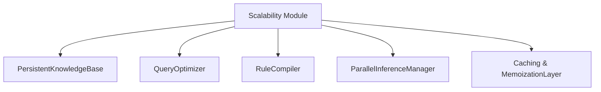

**Integration Test Focus:**
- Integration with Core KR module
- Integration with Inference Engine
- Performance testing with large knowledge bases
- Stress testing with complex queries

**Complex Methods to Prioritize:**
- QueryOptimizer: Query optimization algorithms
- RuleCompiler: Rule compilation strategies
- ParallelInferenceManager: Parallelization strategies
- Caching & MemoizationLayer: Cache management

## 3. Integration Testing Strategy

### 3.1 Module Integration Test Matrix

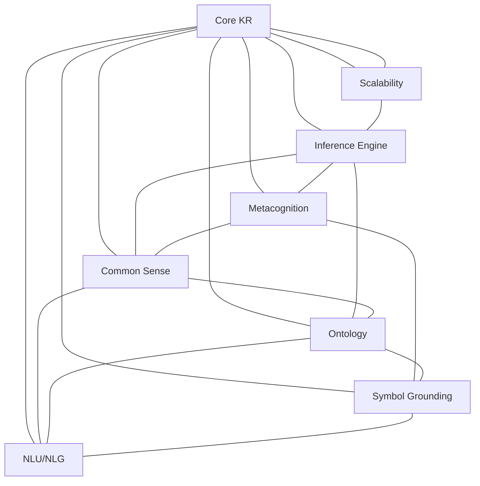

### 3.2 Key Integration Test Scenarios

1. **Knowledge Representation and Reasoning**
   - Test Core KR with Inference Engine
   - Test knowledge storage and retrieval
   - Test complex reasoning tasks

2. **Metacognitive Monitoring and Control**
   - Test Metacognition with Inference Engine
   - Test self-monitoring during reasoning
   - Test strategy selection and adaptation

3. **Common Sense and Contextual Reasoning**
   - Test Common Sense with Core KR
   - Test context-aware knowledge retrieval
   - Test default reasoning with exceptions

4. **Ontological Reasoning and Creativity**
   - Test Ontology with Core KR
   - Test concept blending and hypothesis generation
   - Test abstraction-based reasoning

5. **Symbol Grounding and Perception**
   - Test Symbol Grounding with Core KR
   - Test perception categorization and symbol association
   - Test action execution and feedback

6. **Natural Language Understanding and Generation**
   - Test NLU/NLG with Core KR
   - Test natural language to logic conversion
   - Test logic to natural language generation

7. **Scalability and Performance**
   - Test Scalability with Core KR and Inference Engine
   - Test performance with large knowledge bases
   - Test parallel inference and caching

## 4. Test Implementation Guidelines

### 4.1 Test Structure and Organization

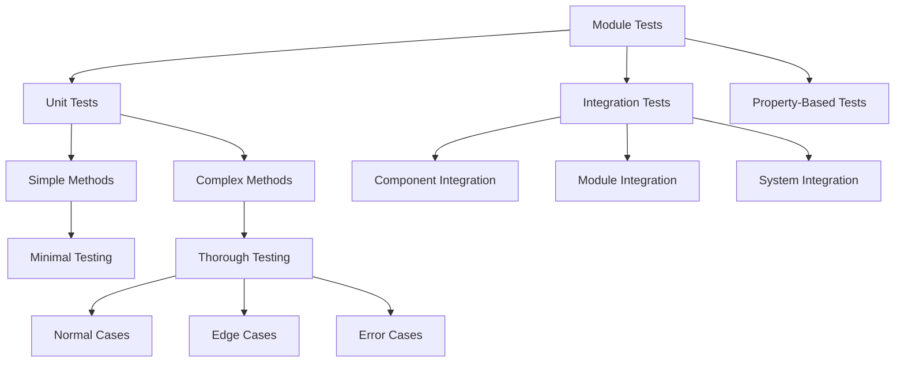

### 4.2 Test Documentation Template

```python
def test_method_name_scenario_expected_outcome():
    """
    Test that [method_name] correctly handles [scenario] and returns [expected_outcome].
    
    This test verifies that:
    1. [specific aspect being tested]
    2. [another specific aspect being tested]
    3. [etc.]
    
    Edge cases tested:
    - [edge case 1]
    - [edge case 2]
    
    Dependencies:
    - [dependency 1]
    - [dependency 2]
    """
    # Test setup
    ...
    
    # Test execution
    ...
    
    # Assertions
    ...
```

### 4.3 Mock and Fixture Guidelines

1. **Mocking Strategy**
   - Mock external dependencies
   - Mock complex internal dependencies when testing in isolation
   - Use realistic mocks that simulate actual behavior
   - Document mock behavior and assumptions

2. **Fixture Strategy**
   - Create reusable fixtures for common test scenarios
   - Parameterize fixtures for testing multiple cases
   - Document fixture purpose and usage
   - Ensure fixtures are isolated from each other

### 4.4 Test Coverage Metrics and Targets

While focusing on quality over quantity, we'll still track the following metrics to ensure comprehensive testing:

1. **Method Coverage**: Percentage of methods with at least one test
   - Target: 100% for public API methods
   - Target: 90% for internal methods

2. **Branch Coverage**: Percentage of code branches executed by tests
   - Target: 85% for complex methods
   - Target: 70% for overall codebase

3. **Cyclomatic Complexity Coverage**: Ensure methods with higher complexity have proportionally more tests
   - Methods with complexity > 10: At least 5 test cases
   - Methods with complexity 5-10: At least 3 test cases
   - Methods with complexity < 5: At least 1 test case

## 5. Implementation Plan and Timeline

### 5.1 Implementation Phases

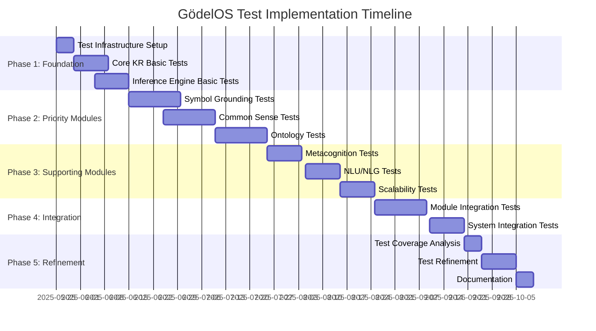

### 5.2 Resource Allocation

1. **Phase 1: Foundation** (15 days)
   - 1 senior developer for test infrastructure
   - 2 developers for Core KR and Inference Engine tests

2. **Phase 2: Priority Modules** (45 days)
   - 3 developers for Symbol Grounding, Common Sense, and Ontology tests
   - 1 QA engineer for test review and validation

3. **Phase 3: Supporting Modules** (30 days)
   - 2 developers for Metacognition, NLU/NLG, and Scalability tests
   - 1 QA engineer for test review and validation

4. **Phase 4: Integration** (25 days)
   - 3 developers for module and system integration tests
   - 1 QA engineer for test review and validation

5. **Phase 5: Refinement** (20 days)
   - 2 developers for test refinement
   - 1 technical writer for documentation

### 5.3 Risk Management

| Risk | Impact | Probability | Mitigation |
|------|--------|------------|------------|
| Complex components difficult to test | High | Medium | Break down into smaller testable units, use more mocks |
| Integration tests too slow | Medium | High | Optimize test fixtures, parallelize tests, use selective testing |
| Test maintenance burden | Medium | Medium | Establish clear test documentation standards, use parameterized tests |
| Test flakiness | High | Medium | Implement retry mechanisms, isolate tests, avoid timing dependencies |
| Incomplete edge case coverage | High | Medium | Use property-based testing, systematic edge case identification |

## 6. Conclusion and Next Steps

This comprehensive test plan provides a roadmap for achieving high-quality test coverage across all GödelOS modules, with special focus on the newer modules (Symbol Grounding, Common Sense, and Ontology) and complex methods throughout the system. The plan emphasizes:

1. **Quality over quantity** in test design
2. **Thorough testing of complex methods** with high cyclomatic complexity
3. **Comprehensive integration testing** between modules
4. **Clear documentation and organization** of tests
5. **Phased implementation** with priority on newer modules

The next steps are to:
1. Set up the test infrastructure
2. Begin implementation according to the phased timeline
3. Regularly review progress and adjust priorities as needed
4. Measure and report on test coverage and quality metrics