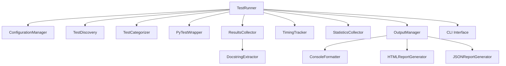
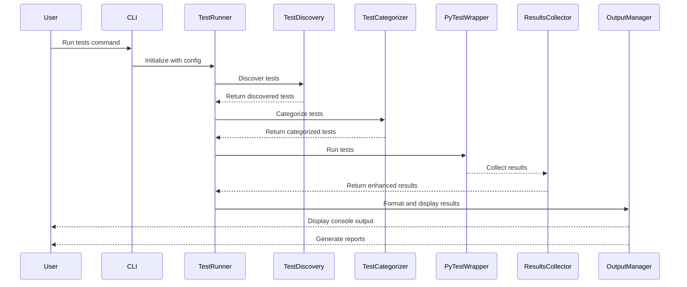

# Test Suite Runner Architecture Design

## 1. Overall System Architecture

The enhanced test suite runner will maintain the existing modular architecture while adding new components and enhancing existing ones. The system will be organized around these key components:



### Key Components and Their Responsibilities:

1. **TestRunner**: The main orchestrator class that coordinates the testing process
2. **ConfigurationManager**: Manages configuration for the test runner
3. **TestDiscovery**: Discovers test files and test functions in the project
4. **TestCategorizer**: Categorizes tests into logical groups
5. **PyTestWrapper**: Interface to pytest for executing tests
6. **ResultsCollector**: Collects and structures test results
7. **TimingTracker**: Tracks execution time for tests
8. **StatisticsCollector**: Calculates summary statistics from test results
9. **OutputManager**: Controls overall output configuration and delegates to formatters
10. **ConsoleFormatter**: Handles color-coding and emoji for console output (enhanced for better readability)
11. **HTMLReportGenerator**: New component for generating clean, minimal HTML reports
12. **JSONReportGenerator**: Enhanced for more complete test information
13. **DocstringExtractor**: New component for better extraction and display of test docstrings
14. **CLI Interface**: Command-line interface for the test runner

## 2. Component Interaction and Data Flow

The following diagram illustrates the interaction between components and the flow of data through the system:



## 3. Key Interfaces and Classes

### TestRunner (Enhanced)
```python
class TestRunner:
    """Main orchestrator class for the test runner."""
    
    def __init__(self, config_path=None, cli_args=None)
    def discover_tests() -> Dict[str, Dict[str, Any]]
    def categorize_tests() -> Dict[str, List[str]]
    def run_tests(categories=None) -> Dict[str, Dict[str, TestResult]]
    def run_specific_tests(node_ids) -> Dict[str, TestResult]
    def run_by_pattern(pattern) -> Dict[str, TestResult]
    def get_test_summary() -> Dict[str, Any]
    def get_failed_tests() -> Dict[str, TestResult]
    def rerun_failed_tests() -> Dict[str, TestResult]
    def get_config() -> TestRunnerConfig
    def update_config(updates) -> TestRunnerConfig
```

### EnhancedTestResult (Enhanced)
```python
@dataclass
class EnhancedTestResult(TestResult):
    """Enhanced data class representing a test result with additional metadata."""
    
    # Test metadata
    module_name: Optional[str] = None
    class_name: Optional[str] = None
    function_name: Optional[str] = None
    category: Optional[str] = None
    tags: List[str] = field(default_factory=list)
    
    # Timing information
    start_time: Optional[datetime] = None
    end_time: Optional[datetime] = None
    
    # Historical data
    previous_outcomes: List[str] = field(default_factory=list)
    previous_durations: List[float] = field(default_factory=list)
    
    # Additional test data
    parameters: Dict[str, Any] = field(default_factory=dict)
    
    # Docstring information (new)
    docstring: Optional[str] = None
    parsed_docstring: Dict[str, str] = field(default_factory=dict)  # Purpose, expected behavior, edge cases
    
    # Test phases (new)
    setup_time: Optional[float] = None
    execution_time: Optional[float] = None
    teardown_time: Optional[float] = None
```

### HTMLReportGenerator (New)
```python
class HTMLReportGenerator:
    """Generates clean, minimal HTML reports for test results."""
    
    def __init__(self, config)
    def format_text(text, status=None, error=False) -> str
    def generate_report(results, summary, output_path=None) -> str
    def format_test_result(result) -> str
    def format_summary(summary) -> str
    def format_category_results(category, results) -> str
```

### DocstringExtractor (New)
```python
class DocstringExtractor:
    """Extracts and parses docstrings from test functions."""
    
    def extract_docstring(func) -> str
    def parse_docstring(docstring) -> Dict[str, str]
    def enhance_result_with_docstring(result) -> EnhancedTestResult
```

### ConsoleFormatter (Enhanced)
```python
class ConsoleFormatter:
    """Handles color-coding and emoji for console output with improved readability."""
    
    def __init__(self, config)
    def format_text(text, status=None, error=False, phase=None) -> str
    def format_phase_header(phase_name) -> str  # New method for phase separation
    def format_test_details(result) -> str  # Enhanced for better docstring display
    def start_progress(total)
    def update_progress(current, status=None)
    def finish_progress()
```

## 4. Configuration Options

The existing configuration system will be enhanced with new options:

```python
@dataclass
class TestRunnerConfig:
    """Data class representing the configuration for the test runner."""
    
    # Test discovery patterns
    test_patterns: List[str] = field(default_factory=lambda: ["test_*.py"])
    test_dirs: List[str] = field(default_factory=lambda: ["tests"])
    
    # Test categorization
    categories: Dict[str, List[str]] = field(default_factory=dict)
    
    # Test execution options
    parallel: bool = False
    max_workers: int = 1
    timeout: int = 300  # seconds
    
    # Output options
    verbose: bool = False
    output_dir: Optional[str] = None
    output_level: str = "NORMAL"  # MINIMAL, NORMAL, VERBOSE, DEBUG
    use_colors: bool = True
    use_emoji: bool = True
    
    # Results collection options
    results_dir: Optional[str] = None
    store_results: bool = False
    
    # Timing options
    detailed_timing: bool = False
    timing_history_limit: int = 10
    
    # Statistics options
    num_slowest_tests: int = 10
    num_most_failing_tests: int = 10
    statistics_history_limit: int = 10
    
    # Report options (new)
    generate_html_report: bool = False
    html_report_path: Optional[str] = None
    generate_json_report: bool = False
    json_report_path: Optional[str] = None
    
    # Display options (new)
    show_docstrings: bool = True
    show_phase_separation: bool = True
    terminal_width: int = 80
    
    # Additional pytest arguments
    pytest_args: List[str] = field(default_factory=list)
    
    # Custom options
    custom_options: Dict[str, Any] = field(default_factory=dict)
```

## 5. Extension Points for Future Enhancements

The architecture includes several extension points for future enhancements:

1. **Formatter Registry**: The OutputManager can register additional formatters for different output formats
2. **Custom Test Discovery**: The TestDiscovery component can be extended to support additional discovery methods
3. **Plugin System**: A future enhancement could include a plugin system for extending functionality
4. **Custom Reporters**: Additional report generators can be added for different formats
5. **Custom Test Result Processors**: Additional processors can be added to analyze and transform test results

## 6. Implementation Plan

The implementation will focus on enhancing the existing components while maintaining backward compatibility:

1. **Phase 1: Core Enhancements**
   - Enhance ConsoleFormatter for better readability and phase separation
   - Add DocstringExtractor component
   - Update EnhancedTestResult with new fields

2. **Phase 2: Report Generation**
   - Implement HTMLReportGenerator
   - Enhance JSONReportGenerator

3. **Phase 3: Integration and Testing**
   - Integrate new components with TestRunner
   - Update CLI interface
   - Comprehensive testing

## 7. Key Benefits of the Enhanced Architecture

1. **Improved Readability**: Clear separation between test phases and better formatting
2. **Better Documentation Display**: Enhanced extraction and display of test docstrings
3. **Flexible Reporting**: Multiple report formats (console, HTML, JSON)
4. **Maintainability**: Modular design with clear separation of concerns
5. **Extensibility**: Easy to add new formatters, reporters, and processors